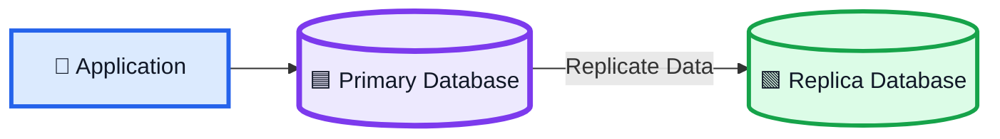
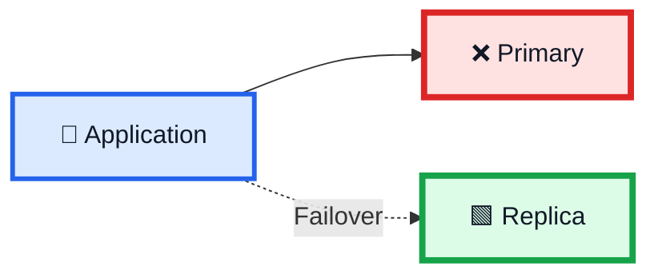
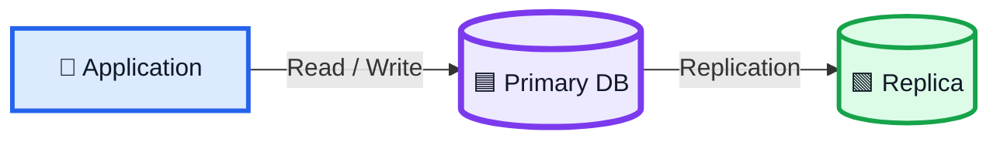
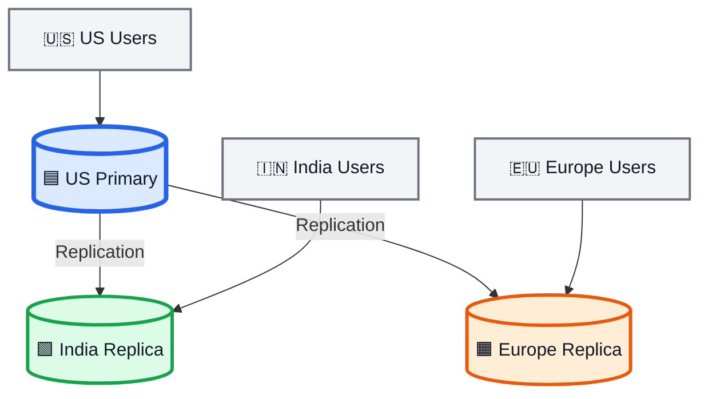
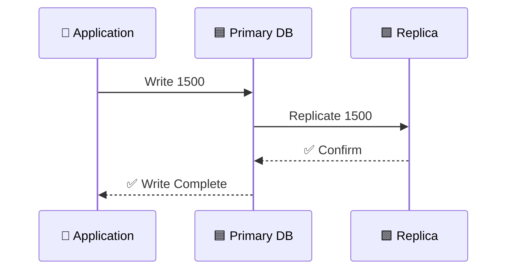
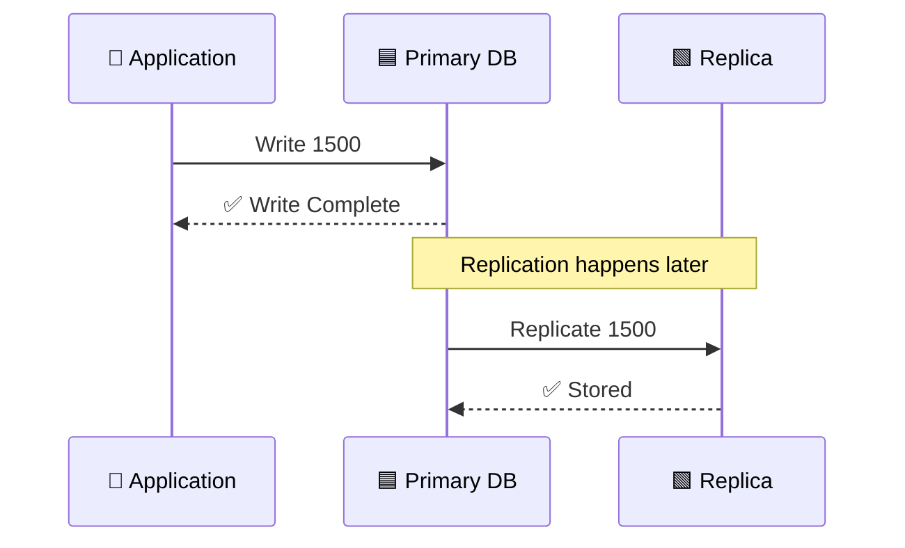
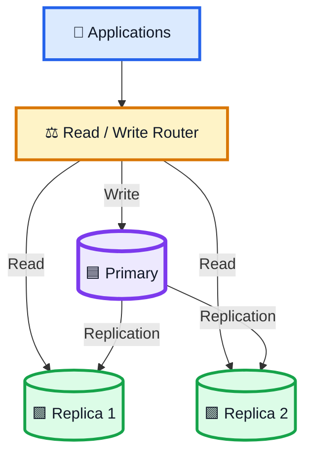
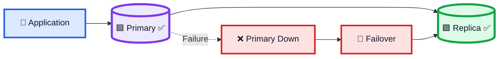
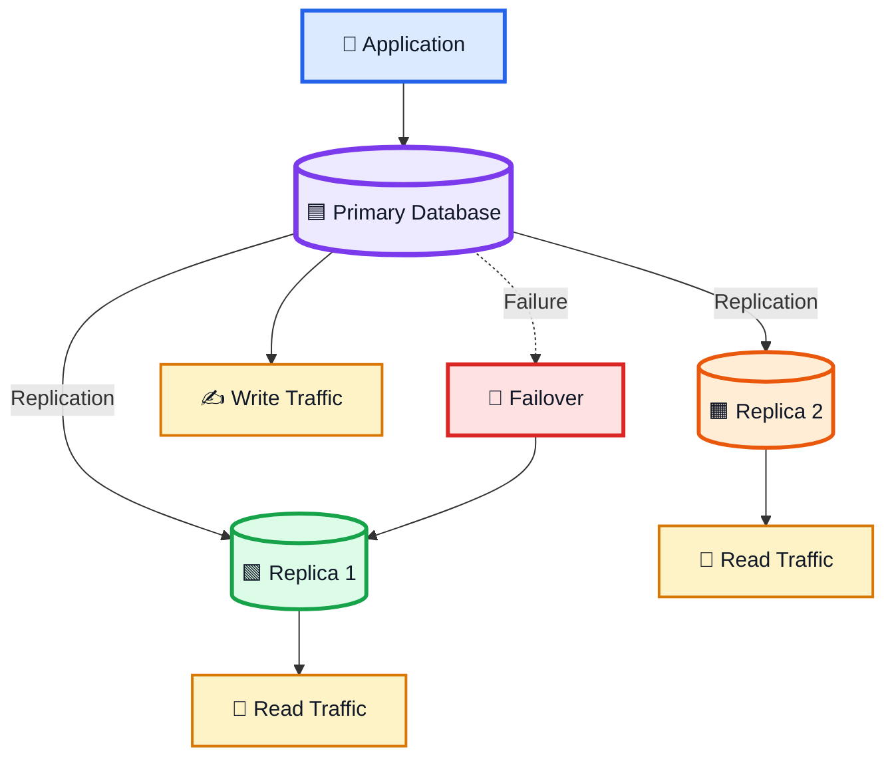

# 🗄️ Replication — System Design Notes

> **Replication হলো একই data-এর এক বা একাধিক copy অন্য database/server-এ maintain করার process।**

Replication-এর প্রধান লক্ষ্য:

```text
High Availability
      +
Lower Latency
      +
Read Scalability / Better Throughput
```

---

# 1. 🔑 Replication কী?

ধরো আমাদের একটি application আছে:

```text
Application
     ↓
Primary Database
```

শুধু একটি database থাকলে সেটি fail করলে পুরো system database-dependent কাজের জন্য unavailable হয়ে যেতে পারে।

তাই database-এর replica রাখা হয়:



এখানে:

```text
Primary = Main Database
Replica = Copy of Primary Data
```

---

# 2. 🚨 Single Database-এর Problem

```text
Application
      ↓
Database ❌
```

Database down করলে:

```text
Database Unavailable
        ↓
Application May Fail
        ↓
Downtime
```

এই database একটি **single point of failure** হতে পারে।

---

# 3. 🛡️ Redundancy

Replication অতিরিক্ত copy তৈরি করে redundancy দেয়।

```text
Primary Database
       +
Replica Database
```

Primary fail করলে:

```text
Primary ❌
    ↓
Replica ✅
```

Application replica-তে failover করতে পারে।

---

# 4. 🔄 Failover কী?

**Failover** হলো primary database fail করলে secondary/replica database-এ switch করা।



এর উদ্দেশ্য:

```text
Less Downtime
+
Better Availability
```

---

# 5. ⚡ Database Performance এবং Replication

System performance database-এর:

```text
Availability
Latency
Throughput
```

এর ওপর অনেকটাই নির্ভর করতে পারে।

### Availability

Database available কি না।

### Latency

Database response পেতে কত সময় লাগে।

### Throughput

Database কত request/query handle করতে পারে।

---

# 6. 🏗️ Standard Primary-Replica Setup

সাধারণ architecture:



Transcript-এর standard setup অনুযায়ী:

> Primary database read এবং write operation handle করতে পারে এবং replica-কে update করে।

---

# 7. 🟦 Primary Database

Primary হলো main/authoritative operational database।

Typical operations:

```text
INSERT
UPDATE
DELETE
SELECT
```

Primary data change করার পরে সেটি replica-তে replicate হতে পারে।

```text
Primary
   ↓
New Data
   ↓
Replica
```

---

# 8. 🟩 Replica Database

Replica হলো primary-এর copied data maintain করা database instance।

Example:

```text
Primary:
User 101 → Rahim
Balance → 5000
```

Replica:

```text
User 101 → Rahim
Balance → 5000
```

Replica use হতে পারে:

```text
Failover
Read Scaling
Geographic Access
```

---

# 9. 🌍 Geographic Replication

Replication শুধু failure recovery-এর জন্য নয়।

এটা geographically distributed users-এর latency কমাতেও সাহায্য করতে পারে।

ধরো:

```text
🇺🇸 USA
🇮🇳 India
🇪🇺 Europe
```

একটি global platform বিভিন্ন region-এ database/replica রাখতে পারে।



Local user কাছের database থেকে data পেলে network distance কমতে পারে।

```text
Nearby Database
      ↓
Lower Network Latency
      ↓
Faster Response
```

---

# 10. 🌐 Geographic Example

ধরো India user-এর request USA database-এ যেতে হচ্ছে:

```text
India User
    ↓
Network
    ↓
USA Database
```

এর পরিবর্তে India replica থাকলে:

```text
India User
    ↓
India Replica
```

ফলে latency কমানো যেতে পারে।

---

# 11. 🔴 Replication Lag

Replica সবসময় primary-এর exact latest state-এ নাও থাকতে পারে।

Example:

```text
Primary = 1500
Replica = 1000
```

Replica পিছিয়ে আছে।

এটাকে বলে:

> **Replication Lag**

কিছু সময় পরে:

```text
Primary = 1500
Replica = 1500
```

---

# 12. 🟦 Synchronous Replication

**Synchronous replication**-এ write completion-এর সঙ্গে replica acknowledgement জড়িত থাকে।

Conceptually:

```text
Write
  ↓
Primary
  ↓
Replica
  ↓
Confirmation
  ↓
Write Complete
```



### Advantage

```text
🟢 Replica freshness বেশি
🟢 Stronger consistency requirement-এর জন্য useful হতে পারে
```

### Disadvantage

```text
🔴 Replica response-এর জন্য wait করতে হতে পারে
🔴 Write latency বাড়তে পারে
```

---

# 13. 🟢 Asynchronous Replication

**Asynchronous replication**-এ primary replica update complete হওয়ার জন্য wait না করেই write acknowledge করতে পারে।

```text
Write
  ↓
Primary
  ↓
Write Complete ✅

Later
  ↓
Replica Updated
```



### Advantage

```text
🟢 Faster write path
🟢 Lower write latency হতে পারে
```

### Disadvantage

```text
🟠 Replication lag
🟠 Replica may temporarily serve stale data
```

---

# 14. ⚖️ Synchronous vs Asynchronous

| বিষয়             | Synchronous                                 | Asynchronous                                         |
| ---------------- | ------------------------------------------- | ---------------------------------------------------- |
| Replica update   | Write-এর সাথে                               | পরে                                                  |
| Write completion | Replica confirmation-এর সাথে যুক্ত হতে পারে | Primary-তেই দ্রুত complete হতে পারে                  |
| Data freshness   | বেশি                                        | কিছু delay থাকতে পারে                                |
| Write latency    | বাড়তে পারে                                  | কম হতে পারে                                          |
| Replication lag  | কম                                          | বেশি হতে পারে                                        |
| Use case         | Stronger consistency/freshness              | Lower latency / geographically distributed workloads |

### Memory Trick

```text
SYNC
= Write → Wait → Confirm → Done

ASYNC
= Write → Done
       ↓
      Later
       ↓
    Replica
```

---

# 15. 🌍 Why Async Can Help Geographically

ধরো:

```text
🇺🇸 Primary
      ↓
🇮🇳 Replica
```

দুই region-এর মধ্যে network round trip বেশি হতে পারে।

Synchronous হলে:

```text
Write
 ↓
USA
 ↓
India
 ↓
Confirmation
 ↓
USA
 ↓
Complete
```

এতে write latency বাড়তে পারে।

Asynchronous হলে:

```text
Write
 ↓
USA Primary
 ↓
Complete ✅

Later
 ↓
India Replica
```

তাই geographically distributed setup-এ asynchronous replication latency trade-off-এর ক্ষেত্রে useful হতে পারে।

---

# 16. 📖 Read Scaling

Replication read-heavy application-এ useful হতে পারে।

ধরো:

```text
Writes = 1,000
Reads  = 100,000
```

সব read primary-তে গেলে:

```text
Primary
   ↓
Huge Read Load
```

Read replicas থাকলে কিছু read distribute করা যায়:



এতে:

```text
Read Load
   ↓
Multiple Replicas
   ↓
Better Read Scalability
```

> Exact read/write routing architecture depends on consistency requirements.

---

# 17. 📚 Read Replica

Common pattern:

```text
Primary
   ↓
Replica 1
Replica 2
Replica 3
```

Primary সাধারণত writes handle করে।

Replicas কিছু read traffic handle করতে পারে।

---

# 18. ⚠️ Replica Stale Data

Async replication ব্যবহার করলে:

```text
Primary = Latest Data
Replica = Previous Data
```

Example:

```text
Primary → Balance = 1500
Replica → Balance = 1000
```

তাই application-কে consider করতে হয়:

> **এই read-এর জন্য stale data acceptable কি না?**

---

# 19. 💥 Data Loss Trade-off

Async replication-এ primary update হওয়ার পরে replica update হওয়ার আগে যদি primary fail করে:

```text
Primary = New Data ✅
Replica = Old Data
```

Replica recovery source হলে recently written data-এর কিছু অংশ সেখানে নাও থাকতে পারে।

তাই:

```text
Async
 ↓
Lower Write Latency
 +
Possible Replication Lag
 +
Potential Recent-Write Loss on Failure
```

Exact durability depends on replication setup and recovery architecture।

---

# 20. 🛒 E-Commerce Example

ধরো একটি online shopping site।

```text
Customer
    ↓
Application
    ↓
Primary DB
    ↓
Replica
```

Product stock:

```text
20
```

Customer product কিনলো:

```text
19
```

Primary:

```text
Stock = 19
```

Replica কিছু সময়ের জন্য:

```text
Stock = 20
```

এটাই replication lag-এর example।

---

# 21. 🌐 Social Media Example

ধরো LinkedIn-এর মতো global platform।

```text
US Users
   ↓
US Database

India Users
   ↓
India Replica
```

Primary data বিভিন্ন region-এ replicate করা হতে পারে।

```text
Primary
   ↓
Regional Replicas
```

Local users nearby replica থেকে read করলে latency কমানো যেতে পারে।

---

# 22. 🆚 Replication vs Backup

দুটো এক নয়।

### Replication

```text
Primary
   ↓
Replica
```

Replica operational availability/read scaling-এর অংশ হতে পারে।

### Backup

```text
Database
   ↓
Backup
```

Backup মূলত disaster/recovery-এর জন্য।

### Easy Memory

```text
Replication = Running Copy

Backup = Recovery Copy
```

একটি replica backup-এর full replacement নয়।

---

# 23. 🚨 Failover Flow



---

# 24. 🔥 Complete Replication Mental Model



---

# 🎯 25. Interview — What is Replication?

### English

> **Replication is the process of maintaining copies of data on multiple database instances or servers. It improves availability and can also reduce latency or increase read scalability. A primary database may handle writes while replicas are updated synchronously or asynchronously.**

### বাংলা

> **Replication হলো একাধিক database instance বা server-এ একই data-এর copy maintain করার process। এটি availability improve করতে, geographic ক্ষেত্রে latency কমাতে এবং read scalability বাড়াতে সাহায্য করতে পারে। Primary database write handle করতে পারে এবং replica synchronous বা asynchronousভাবে update হতে পারে।**

---

# 🎯 26. Interview — Why Replication?

> **Replication is used to avoid a single database becoming a single point of failure, improve availability, support failover, reduce geographic latency, and scale read traffic using replicas.**

---

# 🎯 27. Interview — Synchronous vs Asynchronous

### Synchronous

> Replica update-এর acknowledgement write completion-এর সঙ্গে যুক্ত থাকতে পারে, তাই data freshness বেশি হলেও write latency বাড়তে পারে।

### Asynchronous

> Primary write দ্রুত complete করতে পারে এবং replica পরে update হতে পারে, তাই write latency কম হতে পারে কিন্তু replication lag থাকতে পারে।

---

# 🎯 28. Interview — What is Replication Lag?

> **Replication lag is the delay between a change being applied to the primary database and that change becoming available on a replica.**

Example:

```text
Primary = 1500
Replica = 1000
```

---

# 🎯 29. Interview — What is Failover?

> **Failover is the process of switching traffic from a failed primary system to an available replica or secondary system.**

---

# 🧠 30. 10-Second Explanation

কেউ যদি জিজ্ঞেস করে:

> **“Replication কী?”**

বলবে:

> **Replication হলো database-এর data একাধিক instance-এ copy/maintain করার process। এর মাধ্যমে primary database fail করলে replica থেকে failover করা যায়, read traffic scale করা যায় এবং geographically কাছাকাছি database রেখে latency কমানো যায়। Replication synchronous হলে freshness বেশি কিন্তু write latency বাড়তে পারে; asynchronous হলে write দ্রুত হয় কিন্তু replication lag থাকতে পারে।**

---

# ⭐ 31. সবচেয়ে গুরুত্বপূর্ণ 10টি Point

```text
1. Replication = Maintaining copies of data on multiple database instances.

2. It reduces the risk of a single database becoming a single point of failure.

3. Replicas can support failover and higher availability.

4. Geographic replicas can reduce network latency for nearby users.

5. Replication can scale read-heavy workloads through read replicas.

6. Primary commonly handles writes in a primary-replica design.

7. Synchronous replication waits for required replica confirmation.

8. Asynchronous replication allows the primary to continue before replica update.

9. Async replication can introduce replication lag and possible recent-write
   recovery gaps.

10. Sync vs async should be chosen based on availability, latency, consistency,
    durability, and workload requirements.
```

---

# 🧠 Final Memory Trick

## Replication

```text
PRIMARY
   ↓
REPLICATE
   ↓
REPLICA
```

## Failure

```text
PRIMARY ❌
    ↓
FAILOVER
    ↓
REPLICA ✅
```

## Synchronous

```text
WRITE
 ↓
PRIMARY
 ↓
REPLICA
 ↓
CONFIRM
 ↓
DONE
```

## Asynchronous

```text
WRITE
 ↓
PRIMARY
 ↓
DONE ✅

Later
 ↓
REPLICA
```

## Geographic

```text
🇺🇸 Primary
     ↓
🇮🇳 Replica
     ↓
Lower Latency for nearby users
```

---

# 🏆 One-Line Summary

> **Replication = One Database → Multiple Copies → Higher Availability + Lower Latency + Better Read Scalability**

### Core Trade-off

```text
🟦 Synchronous
More Freshness
       +
Higher Write Latency

🟩 Asynchronous
Faster Writes
       +
Replication Lag
```

> **System Design-এ replication শুধু “একটা database-এর copy” নয়; এটি availability, failover, geographic latency, read scaling এবং consistency trade-off-এর একটি গুরুত্বপূর্ণ architectural strategy।**
> '''
> p.write_text(readme, encoding=
