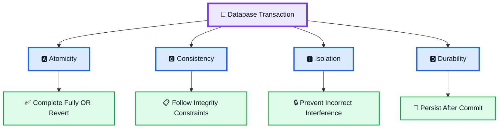
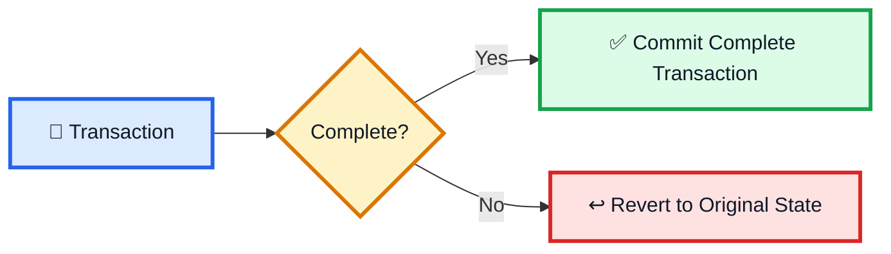
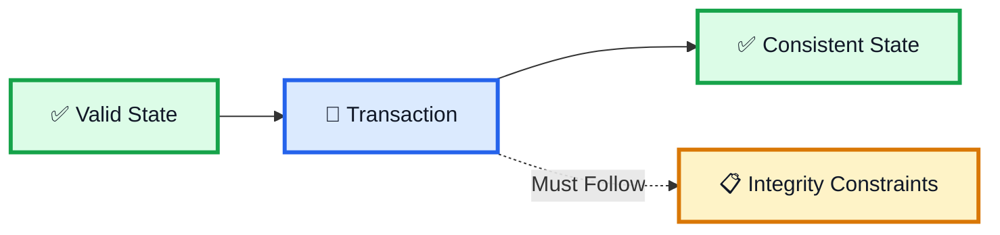
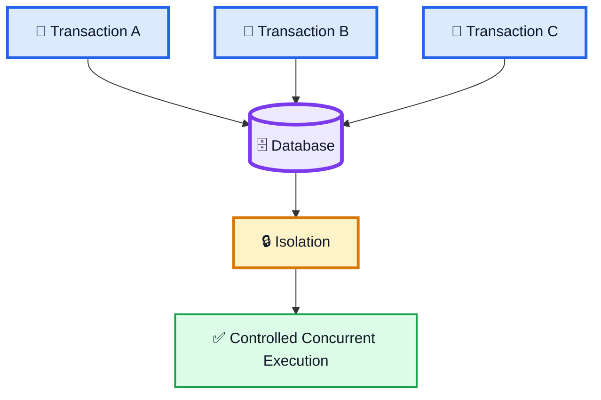
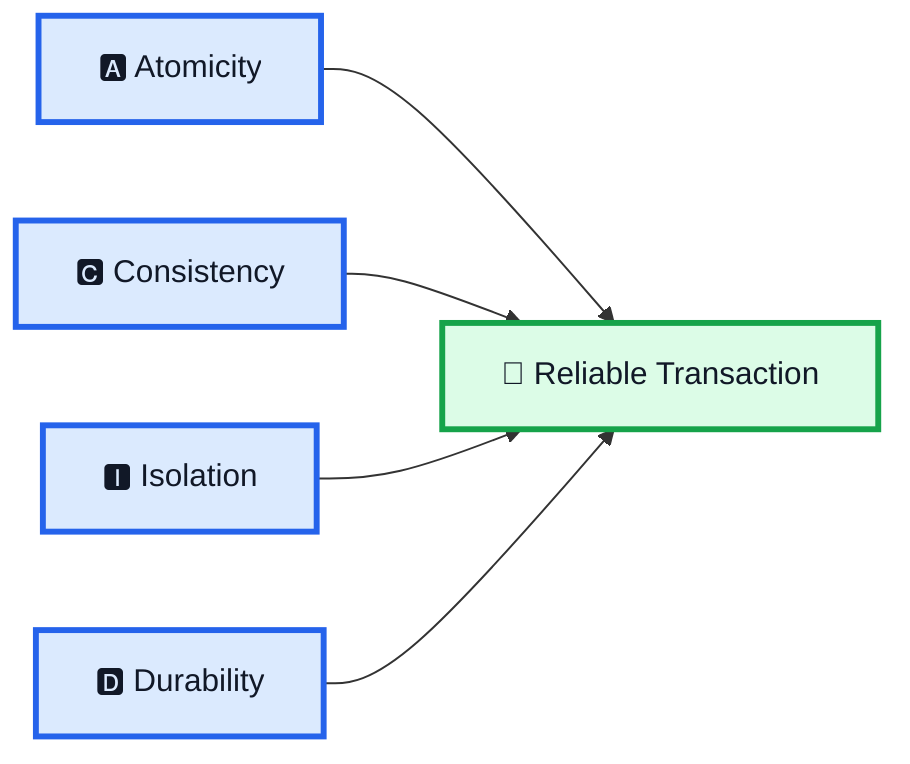
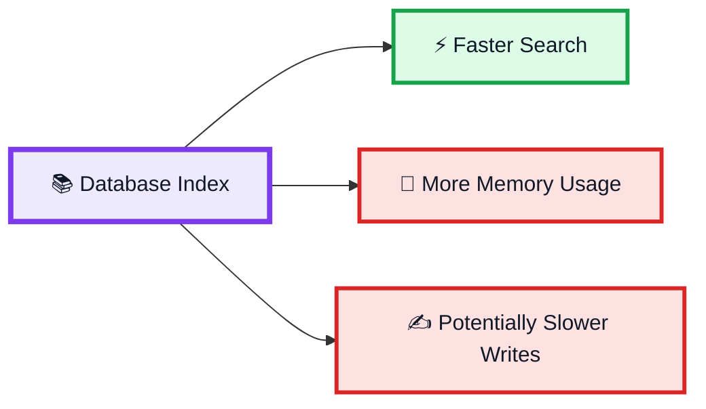
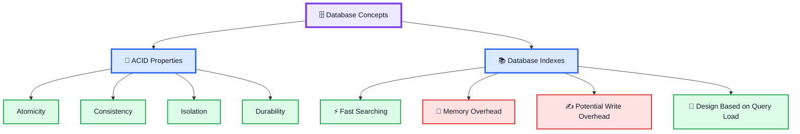

# 🗄️ ACID Properties & Database Indexes — System Design Notes

> This video covers two essential database concepts for System Design interviews:
>
> **1. ACID Properties**
>
> **2. Database Indexes**

---

# 1. 🧾 ACID Properties

**ACID** হলো database transaction-এর চারটি key property:

```text
A → Atomicity
C → Consistency
I → Isolation
D → Durability
```



---

# 2. 🅰️ Atomicity

**Atomicity** ensures that a transaction either:

```text
Completes Fully
      OR
Reverts to Original State
```

সহজভাবে:

> **All or Nothing**



অর্থাৎ transaction-এর কিছু অংশ successfully complete হয়ে কিছু অংশ incomplete অবস্থায় final হওয়া উচিত নয়।

---

# 3. 🅲️ Consistency

**Consistency** ensures that database data follows its **integrity constraints**.

```text
Valid Data
    ↓
Transaction
    ↓
Data Still Follows Integrity Constraints
```

অর্থাৎ transaction-এর ফলে database এমন state-এ যাওয়া উচিত নয় যেখানে defined integrity constraints ভেঙে যায়।



---

# 4. 🅸️ Isolation

**Isolation** prevents concurrent transactions from interfering with one another in an incorrect way.

ধরো একই সময়ে একাধিক transaction চলছে:

```text
Transaction A
Transaction B
Transaction C
```

Isolation-এর goal:

```text
Concurrent Transactions
          ↓
Controlled Interaction
          ↓
No Incorrect Interference
```



---

# 5. 🅳️ Durability

**Durability** ensures that once a transaction is committed, its result is persisted in **non-volatile memory/storage**.

```text
Transaction
     ↓
Commit ✅
     ↓
Persisted Data
```

অর্থাৎ committed transaction-এর data persistent থাকবে।


---

# 6. ⭐ ACID একসাথে

```text
A → Atomicity
    All or Nothing

C → Consistency
    Follow Integrity Constraints

I → Isolation
    Prevent Incorrect Interference

D → Durability
    Committed Data Persists
```



---

# 7. 📚 Database Indexes

ACID-এর পরে ভিডিওতে **Database Indexes** explain করা হয়েছে।

> **Database index হলো একটি auxiliary data structure যা নির্দিষ্ট column-এর উপর fast searching-এর জন্য optimized।**

Basic idea:

```text
Database Table
      +
    Index
      ↓
Fast Search
```


---

# 8. ⚡ Why Use an Index?

Index-এর main purpose:

> **Search performance significantly improve করা।**

ধরো একটি specific column দিয়ে frequently search করা হচ্ছে।

```text
Search Column
      ↓
Index
      ↓
Faster Search
```

অর্থাৎ index search-এর জন্য optimized।

---

# 9. ⚠️ Index-এর Overhead

Index search দ্রুত করে, কিন্তু এর কিছু cost আছে।

প্রধান overhead:

```text
1. Increased Memory Usage
2. Potentially Slower Write Operations
```

---

# 10. 🧠 Memory Usage

Index নিজেই একটি auxiliary data structure।

তাই:

```text
Database Table
      +
Index
      ↓
Additional Resource Usage
```

অর্থাৎ index-এর জন্য অতিরিক্ত memory/resource প্রয়োজন হতে পারে।

```text
More Indexes
     ↓
More Memory Usage
```

---

# 11. ✍️ Write Operations কেন Slow হতে পারে?

যদি indexed column-এর data change হয়, তাহলে index-ও appropriately update করতে হতে পারে।

Conceptually:

```text
INSERT / UPDATE
       ↓
Main Data
       +
Index
```

তাই index থাকার কারণে:

```text
Write Operations
       ↓
Potentially More Overhead
       ↓
Potentially Slower Writes
```

---

# 12. 🎯 Index Carefully Design করতে হবে

ভিডিওর main point:

> **Indexes should be designed carefully based on typical query loads.**

অর্থাৎ কোন ধরনের query সাধারণত বেশি করা হয় সেটা consider করতে হবে।

```text
Typical Query Load
        ↓
Frequently Searched Columns
        ↓
Careful Index Design
```

---

# 13. ⚖️ Index-এর Main Trade-off



অর্থাৎ:

```text
Index
  ↓
Search Performance ↑
  +
Memory Usage ↑
  +
Potential Write Overhead ↑
```

---

# 14. 🗄️ ACID + Indexes

ভিডিওর পুরো overview:



---

# 🎯 15. Interview — What is ACID?

### English

> **ACID is a set of four properties of database transactions: Atomicity, Consistency, Isolation, and Durability.**

### বাংলা

> **ACID হলো database transaction-এর চারটি key property: Atomicity, Consistency, Isolation এবং Durability।**

---

# 🎯 16. Interview — What is Atomicity?

> **Atomicity ensures that a transaction either completes fully or reverts to its original state.**

```text
ALL ✅
   OR
NOTHING ↩️
```

---

# 🎯 17. Interview — What is Consistency?

> **Consistency guarantees that data follows the database's integrity constraints.**

---

# 🎯 18. Interview — What is Isolation?

> **Isolation prevents concurrent transactions from incorrectly interfering with one another.**

---

# 🎯 19. Interview — What is Durability?

> **Durability ensures that committed transactions are persisted in non-volatile memory/storage.**

---

# 🎯 20. Interview — What is a Database Index?

> **A database index is an auxiliary data structure optimized for fast searching on specific columns.**

---

# 🎯 21. Interview — What are the disadvantages of Indexes?

> **Indexes can increase memory usage and potentially slow down write operations because the index may also need to be maintained when data changes.**

---

# 🎯 22. Why should indexes be designed carefully?

> **Because indexes improve search performance but introduce memory and write overhead, so they should be designed according to typical query loads.**

---

# 🧠 23. Final Mental Model

```text
                  DATABASE
                     │
          ┌──────────┴──────────┐
          ↓                     ↓
      🧾 ACID              📚 INDEX
          │                     │
    ┌─────┼─────┐          ┌────┼────┐
    ↓     ↓     ↓          ↓    ↓    ↓
 Atomic  Consis Isolation  Fast Memory Write
    │      │      │        Search   ↑   ↑
    └──────┼──────┘                  │
           ↓                         │
       Durability                    │
                                     │
                     Careful Design Based
                     on Query Load
```

---

# 🔥 24. Final Memory Trick

## ACID

```text
A → Atomicity
    All or Nothing

C → Consistency
    Integrity Constraints

I → Isolation
    No Incorrect Interference

D → Durability
    Commit → Persistent
```

## Index

```text
INDEX
  ↓
FAST SEARCH ⚡
```

But:

```text
FAST SEARCH
     +
MORE MEMORY
     +
POTENTIALLY SLOWER WRITES
```

---

# ⭐ 25. সবচেয়ে গুরুত্বপূর্ণ Point

```text
1. ACID has four properties:
   Atomicity, Consistency, Isolation, Durability.

2. Atomicity = transaction fully completes or reverts.

3. Consistency = data follows integrity constraints.

4. Isolation = concurrent transactions do not incorrectly interfere.

5. Durability = committed transactions are persisted.

6. Database indexes are auxiliary data structures.

7. Indexes are optimized for fast searching on specific columns.

8. Indexes improve search performance.

9. Indexes can increase memory usage.

10. Indexes can potentially slow write operations.

11. Indexes should be designed carefully based on typical query loads.
```

---

# 🏆 One-Line Summary

> **ACID = Reliable Transactions**

> **Index = Faster Search**

```text
ACID
 ↓
Transaction Reliability

INDEX
 ↓
Search Performance
 ↓
+
Memory & Write Overhead
```
