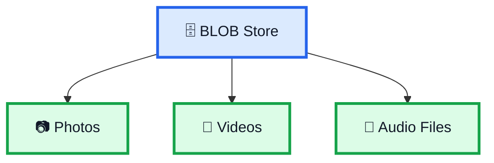
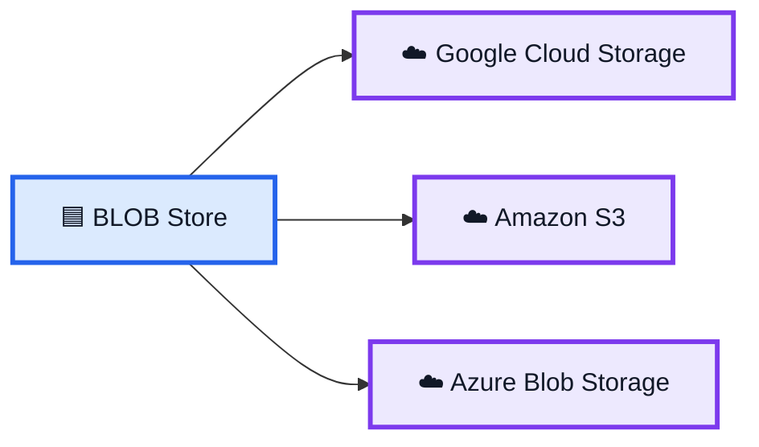
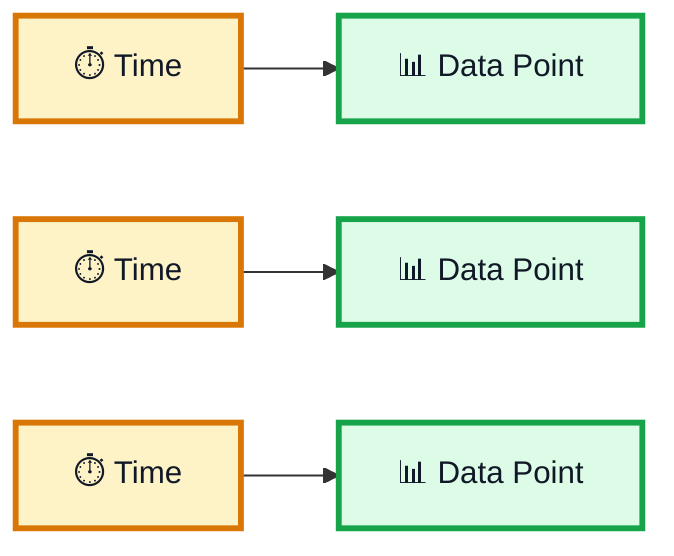
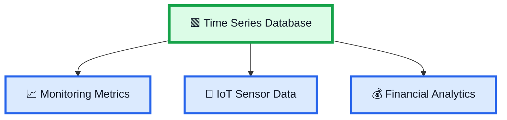
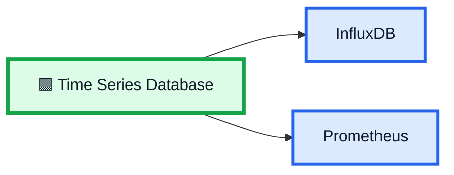
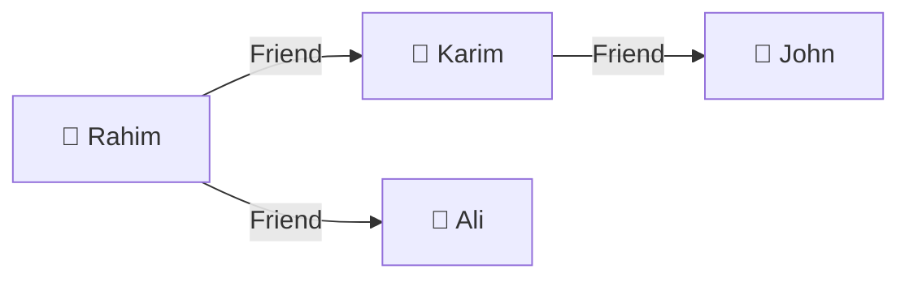

# 🗄️ Storage Series — Specialized Database Types

> এই ভিডিওতে System Design-এর জন্য গুরুত্বপূর্ণ ৩ ধরনের specialized database/storage নিয়ে আলোচনা করা হয়েছে:
>
> **1. BLOB Store**
>
> **2. Time Series Database**
>
> **3. Graph Database**

---

# 1. 🟦 BLOB Store

**BLOB Store** massive amount of **unstructured data** store করার জন্য ব্যবহৃত হয়।

### Unstructured Data-এর উদাহরণ

```text
📷 Photos
🎥 Videos
🎵 Audio Files
```



---

# 2. ☁️ BLOB Store-এর Examples

ভিডিওতে BLOB storage-এর example হিসেবে বলা হয়েছে:

```text
Google Cloud Storage
Amazon S3
Azure Blob Storage
```



---

# 3. 🔑 BLOB Store কীভাবে Access করা হয়?

BLOB stores **keys-এর মাধ্যমে access** করা হয়।

Conceptually:

```text
Key
 ↓
Photo / Video / Audio
```

---

# 4. 🛡️ BLOB Store-এর Main Focus

BLOB stores শুধু latency-এর জন্য optimized নয়।

এগুলো মূলত:

```text
Durability
+
Scalability
```

এর জন্য optimized।

```text
Massive Unstructured Data
            ↓
       BLOB Store
            ↓
   Durability + Scalability
```

---

# 5. 🟩 Time Series Database

দ্বিতীয় specialized database হলো:

> **Time Series Database**

এটি এমন data points-এর জন্য তৈরি যেগুলো **time অনুযায়ী indexed** থাকে।

মূল ধারণা:

```text
Time
 ↓
Data Point
```

---

# 6. ⏱️ Time Series Data

Time-indexed data-এর concept:

```text
10:00 → Data Point
10:01 → Data Point
10:02 → Data Point
10:03 → Data Point
```

অর্থাৎ প্রতিটি data point-এর সঙ্গে time associated থাকে।



---

# 7. 📊 Time Series Database-এর Use Cases

ভিডিওতে বলা হয়েছে:

```text
📈 Monitoring Metrics
📡 IoT Sensor Data
💰 Financial Analytics
```



---

# 8. 🔧 Time Series Database-এর Examples

ভিডিওতে examples:

```text
InfluxDB
Prometheus
```



---

# 9. 🟪 Graph Database

তৃতীয় specialized database হলো:

> **Graph Database**

এটি data points-এর মধ্যে **complex relationships** manage করার জন্য তৈরি।

মূল ধারণা:

```text
Data Points
     ↓
Relationships
```

---

# 10. 🕸️ Graph Data Model

Graph database data এবং তাদের relationship-এর ওপর focus করে।

```text
Person A
   │
   │ Relationship
   ↓
Person B
   │
   │ Relationship
   ↓
Person C
```

এখানে মূল বিষয় হলো:

```text
Data
+
Connections
```

---

# 11. 👥 Social Network Example

Graph database-এর একটি example হলো social network।

যেমন:

```text
Rahim
  │
  │ Friend
  ↓
Karim
  │
  │ Friend
  ↓
John
```

এখানে data points-এর মধ্যে relationship গুরুত্বপূর্ণ।



---

# 12. 🛣️ Shortest Path

Graph database এমন কাজের জন্য useful যেখানে relationships-এর ভিত্তিতে path খুঁজতে হয়।

উদাহরণ:

```text
A
│
├── B
│   └── D
│
└── C
    └── D
```

প্রশ্ন:

> A থেকে D যাওয়ার shortest path কোনটি?

Graph database এই ধরনের relationship-based task-এ ভালো।

---

# 13. 🔗 Network Connectivity

Graph database-এর আরেকটি গুরুত্বপূর্ণ use case:

> **Network Connectivity**

অর্থাৎ কোন data point কোন data point-এর সাথে connected তা বিশ্লেষণ করা।

```text
A ─── B ─── C
│
└── D
```

এখানে বিভিন্ন node-এর মধ্যে connection দেখা যায়।

---

# 14. 🔤 Graph Query Language

ভিডিওতে graph database-এর জন্য একটি query language-এর example দেওয়া হয়েছে:

```text
PGQL
```

এটি graph data query করার জন্য ব্যবহৃত হয়।

---

# 15. 🔧 Graph Database-এর Example

ভিডিওতে prominent industry choice হিসেবে বলা হয়েছে:

```text
Neo4j
```

Conceptually:

```mermaid
flowchart LR
    G[🟪 Graph Database] --> N[Neo4j]
    G --> P[PGQL]

    classDef graph fill:#ede9fe,stroke:#7c3aed,stroke-width:4px,color:#111827;
    classDef item fill:#dbeafe,stroke:#2563eb,stroke-width:3px,color:#111827;

    class G graph;
    class N,P item;
```

---

# 16. 🆚 Three Specialized Database Types

| Database Type            | Main Purpose              | Examples                                            |
| ------------------------ | ------------------------- | --------------------------------------------------- |
| **BLOB Store**           | Massive unstructured data | Google Cloud Storage, Amazon S3, Azure Blob Storage |
| **Time Series Database** | Time-indexed data points  | InfluxDB, Prometheus                                |
| **Graph Database**       | Complex relationships     | Neo4j                                               |

---

# 17. 🧠 Complete Overview

```mermaid
flowchart TD
    S[🗄️ Specialized Storage / Databases]

    S --> B[🟦 BLOB Store]
    S --> T[🟩 Time Series Database]
    S --> G[🟪 Graph Database]

    B --> B1[📷 Photos]
    B --> B2[🎥 Videos]
    B --> B3[🎵 Audio]

    T --> T1[📈 Monitoring Metrics]
    T --> T2[📡 IoT Sensor Data]
    T --> T3[💰 Financial Analytics]

    G --> G1[🕸️ Complex Relationships]
    G --> G2[🛣️ Shortest Paths]
    G --> G3[🔗 Network Connectivity]

    classDef root fill:#fef3c7,stroke:#d97706,stroke-width:4px,color:#111827;
    classDef blob fill:#dbeafe,stroke:#2563eb,stroke-width:3px,color:#111827;
    classDef time fill:#dcfce7,stroke:#16a34a,stroke-width:3px,color:#111827;
    classDef graph fill:#ede9fe,stroke:#7c3aed,stroke-width:3px,color:#111827;

    class S root;
    class B,B1,B2,B3 blob;
    class T,T1,T2,T3 time;
    class G,G1,G2,G3 graph;
```

---

# ⭐ 18. Final Memory Trick

## 🟦 BLOB Store

```text
BLOB
 ↓
Massive Unstructured Data
 ↓
Photos / Videos / Audio
 ↓
Durability + Scalability
```

## 🟩 Time Series Database

```text
TIME
 ↓
DATA POINTS
 ↓
Monitoring / IoT / Financial Analytics
```

## 🟪 Graph Database

```text
DATA POINTS
 ↓
RELATIONSHIPS
 ↓
Shortest Path / Connectivity
```

---

# 🏆 One-Line Summary

> **BLOB Store = Massive Unstructured Data**

> **Time Series Database = Time-Indexed Data**

> **Graph Database = Complex Relationships**
