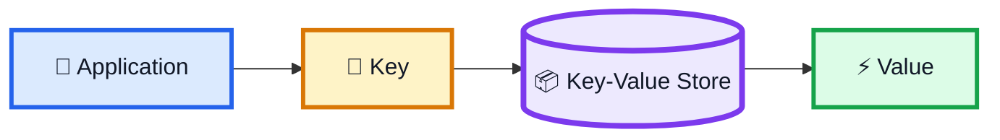
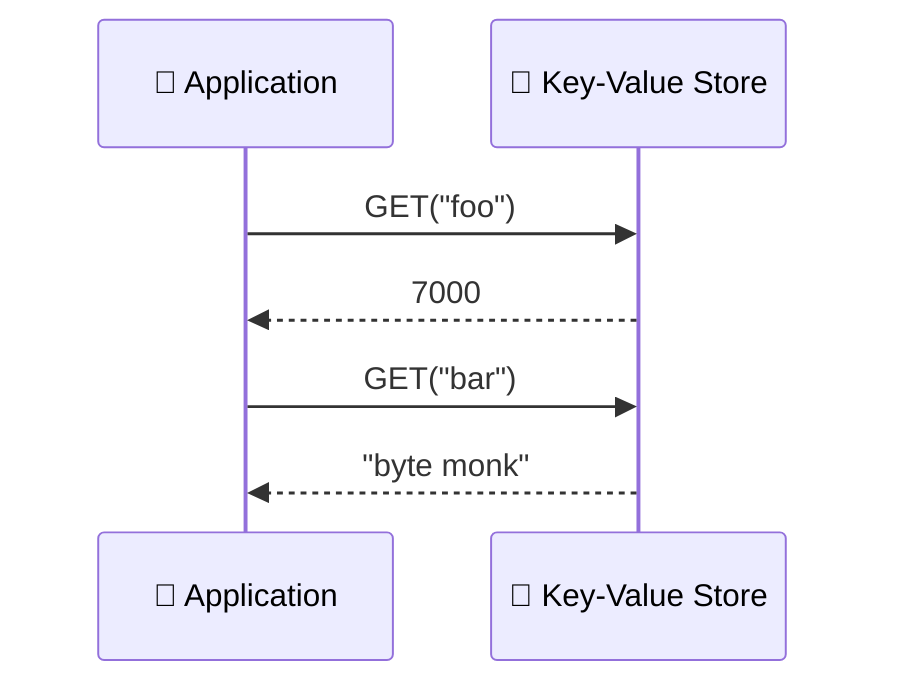
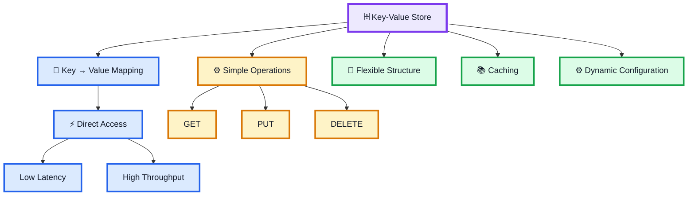

# 🔑 Key-Value Store — System Design Notes

> **A Key-Value Store is a database that maps a key to an arbitrary value.**

```text
Key → Value
```

---

## 1. What is a Key-Value Store?

A key-value store consists of keys such as:

```text
foo
bar
bass
```

mapped to values such as:

```text
7000
byte monk
[1, 2, 3]
```

Example:

```text
foo  → 7000
bar  → byte monk
bass → [1, 2, 3]
```

Keys are typically strings. Values are usually stored as strings, although some key-value stores also allow values such as integers or arrays.

---

## 2. 🗺️ Similar to a Dictionary or Map

The model is very similar to a dictionary or map data structure:

```text
{
    foo: 7000,
    bar: "byte monk",
    bass: [1, 2, 3]
}
```

The basic idea is:

```text
Key
 ↓
Value
```

---

## 3. 🟢 Key-Value Store as a NoSQL Database

Relational databases provide structure through tables and can offer powerful and complex querying capabilities.

However, depending on the use case, that structure can sometimes be more cumbersome than useful.

In such cases, a **non-relational / NoSQL database** may be preferred.

A key-value store is one of the most popular types of non-relational databases.

```text
RELATIONAL
    ↓
Tabular Structure
    ↓
Powerful / Complex Queries

NON-RELATIONAL
    ↓
No Required Tabular Structure
    ↓
Key → Value
```

---

## 4. 🧱 Simple Database Model

A key-value store can be considered one of the most primary and simplest versions of a database.

Its basic model is simply:

```text
KEY
 ↓
VALUE
```

There is a one-way mapping:

```text
Key → Value
```

The lack of imposed structure makes key-value stores extremely flexible.

---

## 5. ⚡ Why are Key-Value Stores Fast?

Values are accessed directly through keys.

Therefore, the system does not need to search through the database sequentially.

```text
Key
 ↓
Direct Access
 ↓
Value
```

This makes key-value stores:

```text
⚡ Extremely Fast
↓
Low Latency
↓
High Throughput
```

---

## 6. 🚀 Caching as a Key-Value Use Case

Caching is a perfect candidate for a key-value store.

When implementing caching, values are typically stored somewhere and accessed using:

```text
Hash
Username
IP Address
```

Conceptually:

```text
Key
 ↓
Cached Value
```

Therefore, key-value stores are typically used for caching.

---

## 7. 🔴 Redis

**Redis** is a popular example of a key-value store used for caching.

Conceptually:

```text
Application
    ↓
 Redis
    ↓
Key → Value
```

Example:

```text
user:101
    ↓
Cached User Data
```

---

## 8. ⚙️ Dynamic Configuration

Another example is **dynamic configurations**.

Different parts of a system may depend on special parameters.

For example:

```text
is_launched
```

can be used as a boolean value to determine system status.

```text
is_launched → true
```

or:

```text
is_launched → false
```

Conceptually:

```text
Configuration Key
       ↓
Configuration Value
```

---

## 9. 🔎 Querying in Key-Value Stores

Unlike an RDBMS, key-value stores usually do not provide a querying language for complex data retrieval.

They generally provide simple operations such as:

```text
GET
PUT
DELETE
```

### GET

```text
GET(key)
   ↓
Value
```

### PUT

```text
PUT(key, value)
   ↓
Store Mapping
```

### DELETE

```text
DELETE(key)
   ↓
Remove Mapping
```

Because there is usually no RDBMS-style query language, data querying or retrieving should be handled manually at the application level.

```text
Application
     ↓
GET / PUT / DELETE
     ↓
Key-Value Store
```

---

## 10. 💽 Different Key-Value Stores Behave Differently

Examples mentioned in the video:

```text
DynamoDB
Redis
Zookeeper
```

These systems may behave differently.

For example:

```text
DynamoDB
    ↓
Writes data to disk for persistence
```

while:

```text
Redis
    ↓
Might write only to memory
```

This represents a trade-off for faster operations.

---

## 11. ⚖️ Consistency Trade-off

Different key-value stores can also provide different consistency models.

Some may provide:

```text
Strong Consistency
```

while others may offer:

```text
Eventual Consistency
```

Therefore, key-value stores can differ in both persistence and consistency behavior.

---

## 12. 🏗️ Key-Value Store Architecture



---

## 13. ⚡ Direct Key Access



---

## 14. 📚 Caching Flow


---

## 15. 🎯 When is a Key-Value Store Useful?

There is no reason to choose a key-value store over an RDBMS for simple business applications where:

```text
Data Management
      ↓
More Important than Performance
```

However, key-value stores are often superior for:

```text
Performance-Driven Applications
```

and:

```text
Non-Hierarchical Data Models
```

---

## 16. 🧠 Complete Mental Model



---

## ⭐ 17. Key Points

```text
1. A key-value store maps keys to arbitrary values.

2. Keys are typically strings.

3. Values may be strings, integers, arrays, or other supported values.

4. The model is similar to a dictionary or map.

5. It is a popular type of non-relational / NoSQL database.

6. It has very little imposed structure, making it highly flexible.

7. Caching is a strong use case for key-value stores.

8. Redis is a popular example for caching.

9. Dynamic configuration is another example.

10. Direct key-based access makes key-value stores extremely fast,
    with low latency and high throughput.

11. They usually provide simple operations such as GET, PUT and DELETE.

12. Complex querying/retrieving is handled at the application level.

13. Examples include DynamoDB, Redis and Zookeeper.

14. Different key-value stores can differ in persistence and consistency.

15. Key-value stores are often useful for performance-driven applications
    and non-hierarchical data models.
```

---

# 🧠 Final Memory Trick

```text
KEY-VALUE STORE

KEY
 ↓
VALUE
```

### Main Operations

```text
GET
PUT
DELETE
```

### Main Benefits

```text
Simple Structure
      ↓
Flexible
      ↓
Fast
      ↓
Low Latency
      ↓
High Throughput
```

### Main Examples

```text
DynamoDB
Redis
Zookeeper
```

### Main Use Cases

```text
Caching
Dynamic Configuration
```

---

# 🏆 One-Line Summary

> **Key-Value Store = Key → Value**

> **It is a simple and flexible non-relational database model where values are accessed directly through keys, providing extremely fast access, low latency, and high throughput.**
