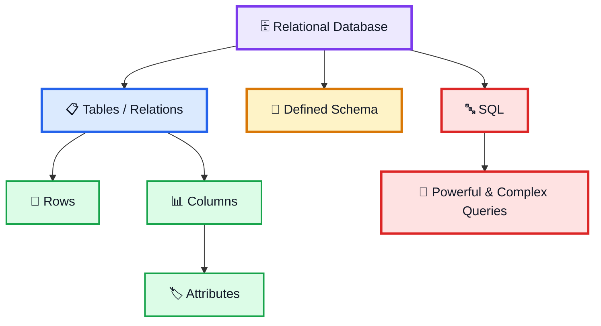

# 🗄️ Database Types — System Design Notes

> This video categorizes databases into two main types based on their data structure:
>
> **1. Relational Database**
>
> **2. Non-Relational Database**

---

# 1. 🗂️ Main Types of Database

```text
                 DATABASE
                    │
          ┌─────────┴─────────┐
          ↓                   ↓
   RELATIONAL            NON-RELATIONAL
```

The classification is based on how data is structured.

---

# 2. 🔵 Relational Database

A **relational database** organizes data into **tables**.

Tables are also known as **relations**.

```text
Table / Relation
```

Each table contains:

```text
Rows
+
Columns
```

---

# 3. 📋 Table Structure

A relational table can be viewed as:

```text
┌────────────┬──────────────┬───────────────┐
│    Row     │    Column    │    Column     │
├────────────┼──────────────┼───────────────┤
│   Entity   │  Attribute   │   Attribute   │
└────────────┴──────────────┴───────────────┘
```

### Row

Each **row** represents a specific entity.

```text
Row → Specific Entity
```

### Column

Columns define the attributes of the data.

For example, payment-related data may contain attributes such as payment details.

```text
Columns
   ↓
Attributes
```

---

# 4. 🧱 Schema

A key requirement of relational databases is a **defined schema**.

> **Schema হলো data কীভাবে store হবে তার set of rules।**

The schema defines the structure that the data must follow.

```text
Schema
   ↓
Rules for Data Storage
   ↓
Consistent Structure
```

---

# 5. ✅ Why Schema is Important

A defined schema helps ensure:

```text
Consistent Data Structure
        ↓
Consistency Across Entries
```

All entries follow the defined rules of the database.

---

# 6. 🔤 SQL

Most relational databases use:

> **SQL = Structured Query Language**

SQL allows the system to perform:

```text
Powerful
+
Complex
+
Data Queries
```

Basic flow:

```text
Application
    ↓
SQL Query
    ↓
Relational Database
    ↓
Data
```

---

# 7. ⚡ SQL and Large-Scale Data

The video emphasizes that SQL is particularly effective for large-scale distributed systems because queries can be performed **directly on the data**.

For very large datasets:

```text
Terabytes of Data
       ↓
Loading Everything into Memory
       ↓
Impractical
```

Instead:

```text
Application
      ↓
   SQL Query
      ↓
Database
      ↓
Query Directly on Data
```

This avoids the need to load vast amounts of information into memory before performing the query.

---

# 8. 🧩 Relational Database — Core Structure



---

# 9. 🆚 Relational and Non-Relational

The video divides databases into two main categories:

```text
DATABASE
    │
    ├── Relational
    │
    └── Non-Relational
```

The main distinction discussed is their **data structure**.

---

# 10. 🧠 Large-Scale Database Concept

For systems dealing with terabytes of data, loading the entire dataset into memory is not practical.

```text
         TERABYTES OF DATA
                 │
                 ↓
      Load Everything in Memory
                 │
                 ↓
             ❌ Impractical
```

SQL allows querying the database directly:

```text
         SQL QUERY
              │
              ↓
      ┌─────────────────┐
      │    DATABASE     │
      │                 │
      │ Query the Data  │
      │    Directly     │
      └─────────────────┘
              │
              ↓
       Required Result
```

---

# 11. 📚 Important Topics Mentioned at the End

The video concludes that these database basics are essential, but two additional topics are also critical for System Design:

```text
ACID Properties
       +
Database Indexing
```

The video only identifies these as important next topics.

---

# ⭐ Final Summary

```text
DATABASE
   ↓
┌───────────────────────────────┐
│                               │
│  RELATIONAL      NON-RELATIONAL
│       │
│       ↓
│    TABLES
│       ↓
│  ROWS + COLUMNS
│       ↓
│  DEFINED SCHEMA
│       ↓
│      SQL
│       ↓
│ POWERFUL / COMPLEX QUERIES
│       ↓
│ LARGE-SCALE DATA
└───────────────────────────────┘
```

> **Relational databases organize data into tables (relations), where rows represent entities and columns define attributes. They require a defined schema for consistent data structure and commonly use SQL for powerful and complex queries. For very large datasets, SQL can query data directly without loading vast amounts of data into memory.**

---

# 🧠 Final Memory Trick

```text
RELATIONAL
    ↓
 TABLE
    ↓
ROWS + COLUMNS
    ↓
 SCHEMA
    ↓
 SQL
    ↓
COMPLEX QUERIES
```

### Important Next Topics

```text
ACID
+
DATABASE INDEXING
```
