# ⚖️ Load Balancer — System Design Notes

> **Load Balancer** হলো এমন একটি component, যা incoming client request-গুলোকে একাধিক backend server-এর মধ্যে distribute করে যাতে কোনো একটি server অতিরিক্ত overloaded না হয় এবং system-এর **scalability, availability, throughput ও performance** উন্নত হয়।

## 1. Load Balancer কী?

সহজভাবে:

> **Load Balancer = Traffic Cop 🚦**

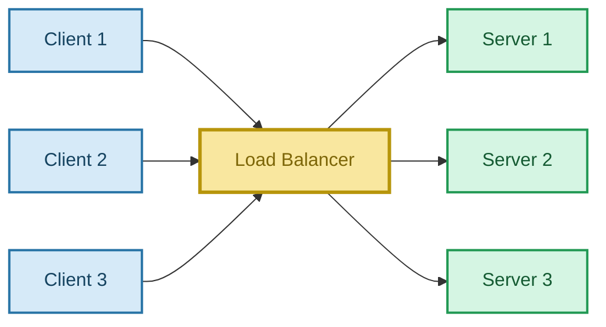

---

## 2. কেন Load Balancer দরকার?

একটি মাত্র server থাকলে user বাড়ার সাথে সাথে load বাড়ে।

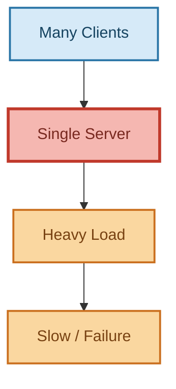

---

## 3. Scaling

### Vertical Scaling

একটি server-কে আরও powerful করা।

```text
4 CPU Core + 8 GB RAM
          ↓
32 CPU Core + 128 GB RAM
```

> **Vertical Scaling = Scale Up**

কিন্তু একটি machine-এর hardware limit আছে।

### Horizontal Scaling

আরও server যোগ করা।

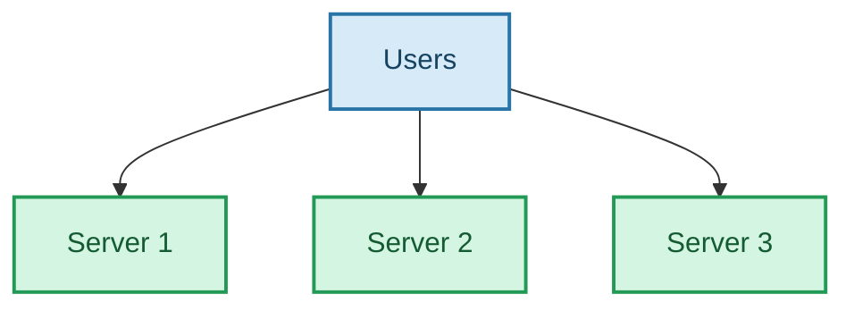

> **Horizontal Scaling = Scale Out**

---

## 4. Horizontal Scaling-এর সমস্যা

Multiple server যোগ করার পর প্রশ্ন হয়:

> **কোন request কোন server-এ যাবে?**

এখানেই Load Balancer দরকার।

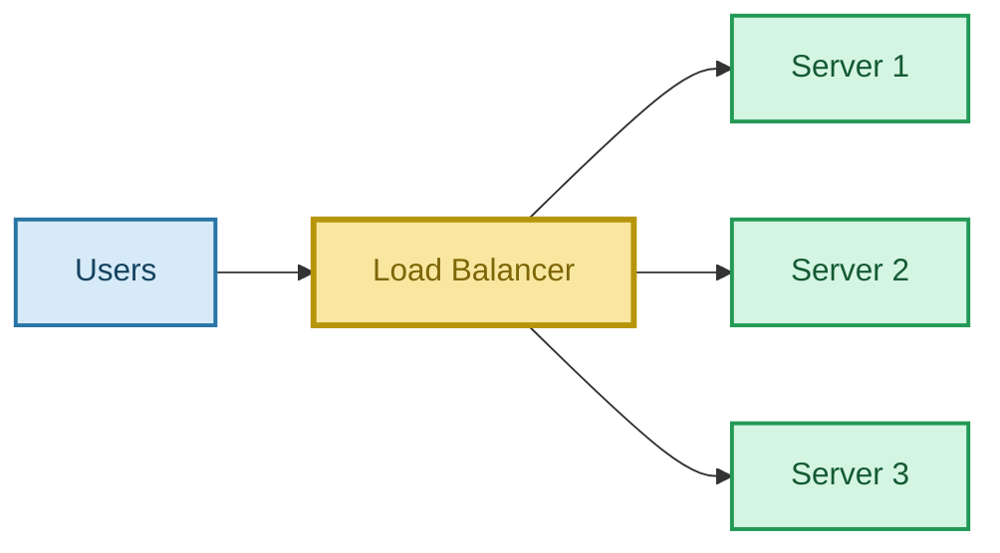

---

## 5. Load Balancer কীভাবে কাজ করে?

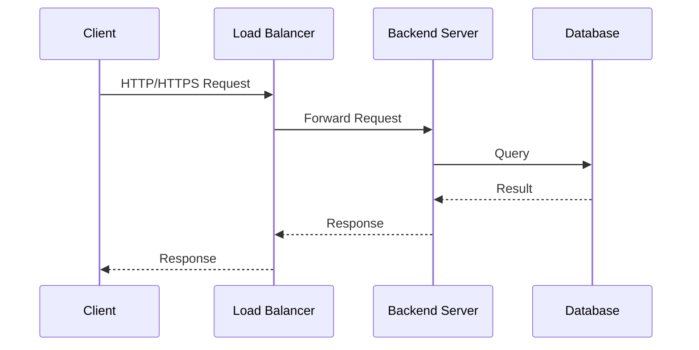

সহজ flow:

```text
Client
  ↓
Load Balancer
  ↓
Server
  ↓
Database
  ↓
Server
  ↓
Load Balancer
  ↓
Client
```

---

## 6. Load Balancer-এর Main Goals

- **Even Load Distribution**
- **Higher Throughput**
- **Lower Latency**-তে সাহায্য করা
- **High Availability**
- **Failover**
- **Horizontal Scaling support**

---

# 7. Server Selection Strategy

Load Balancer-এর সবচেয়ে গুরুত্বপূর্ণ কাজ:

> **কোন request কোন server-এ যাবে?**

Common strategies:

1. Random
2. Round Robin
3. Weighted Round Robin
4. Least/Load Based
5. IP Hashing

---

# 8. Random Selection

Randomly server নির্বাচন করা।

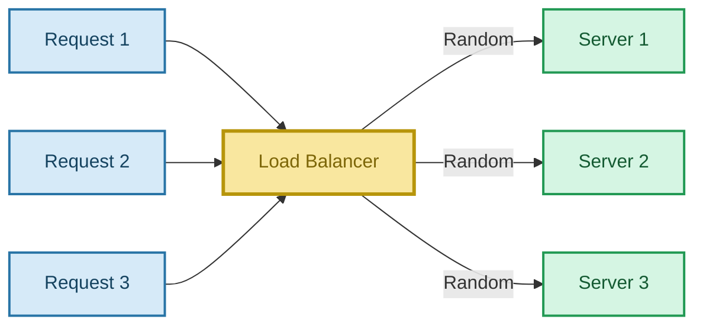

### সমস্যা

Random distribution uneven হতে পারে।

```text
S1 → 10 requests
S2 → 2 requests
S3 → 1 request
```

---

# 9. Round Robin

Serverগুলোকে loop-এর মতো ব্যবহার করা হয়:

```text
S1 → S2 → S3 → S1 → S2 → S3 → ...
```

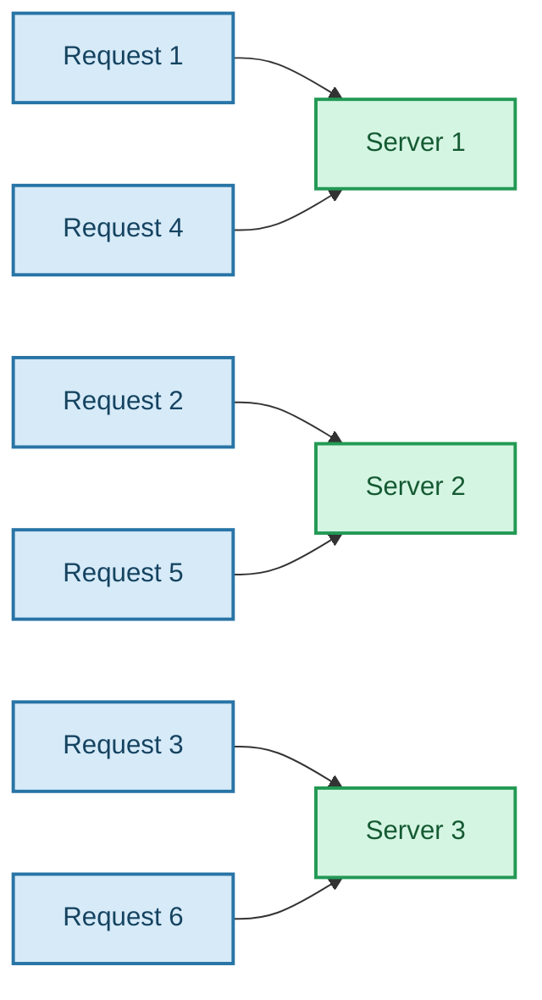

### Example

```text
Request 1 → S1
Request 2 → S2
Request 3 → S3
Request 4 → S1
Request 5 → S2
Request 6 → S3
```

> Simple এবং predictable distribution-এর জন্য useful।

---

# 10. Weighted Round Robin

সব server-এর ক্ষমতা একই না হলে weight দেওয়া যায়।

```text
S1 = Weight 1
S2 = Weight 3
S3 = Weight 1
```

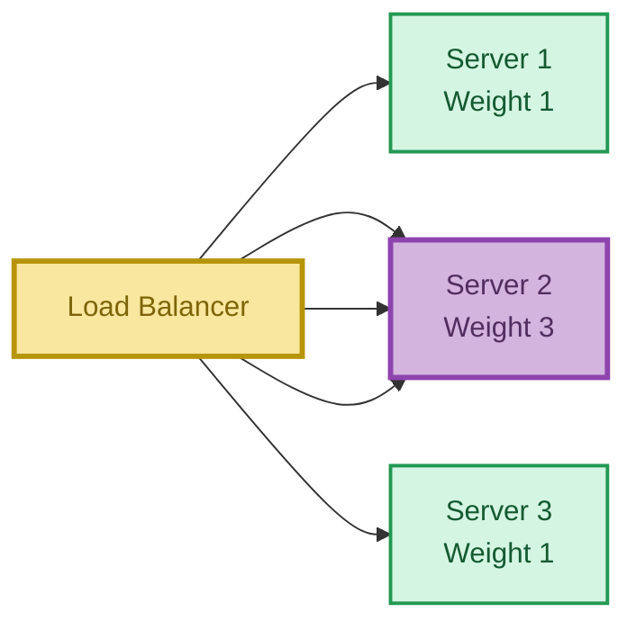

এখানে `S2` বেশি powerful, তাই বেশি traffic পায়।

---

# 11. Health / Load Based Routing

Load Balancer server-এর current condition দেখে decision নিতে পারে।

```text
S1 → CPU 30%
S2 → CPU 95%
S3 → CPU 40%
```

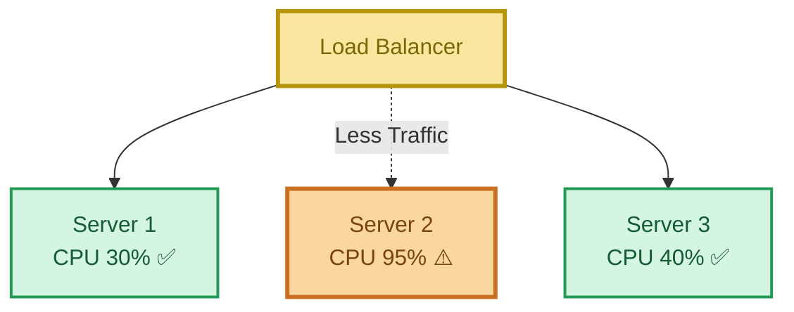

---

# 12. Health Check

Load Balancer নিয়মিত server-এর health check করতে পারে।

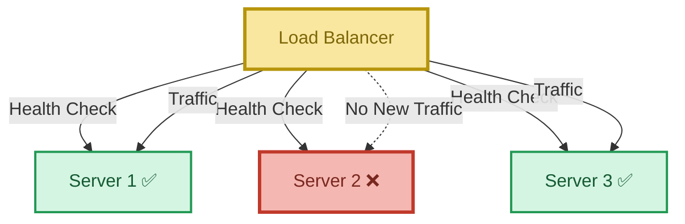

যদি কোনো server down হয়, Load Balancer নতুন traffic সেখানে পাঠানো বন্ধ করতে পারে।

---

# 13. IP Hashing

Client-এর IP address hash করে server নির্বাচন করা যায়।

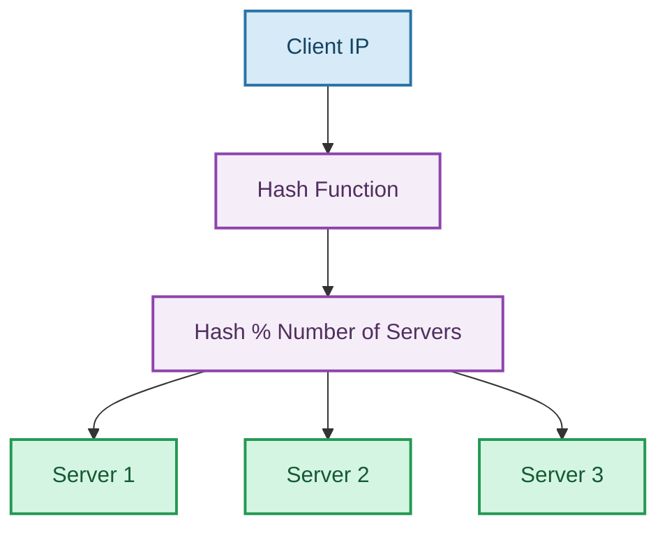

উদাহরণ:

```text
hash(IP) % 3 = 1
```

তাহলে:

```text
Client → Server 1
```

একই mapping rules থাকলে একই client বারবার একই server-এ যেতে পারে।

---

# 14. IP Hashing + Cache

Cache-heavy system-এ এটি useful হতে পারে।

### First Request


### Next Request

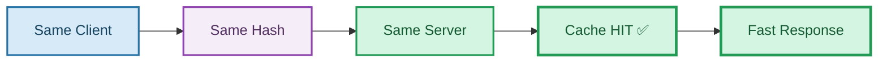

ফলে:

- Cache reuse হয়
- Unnecessary computation কমে
- Response দ্রুত হতে পারে

---

# 15. Load Balancer এবং Throughput

ধরো একটি server handle করতে পারে:

```text
1000 req/sec
```

তিনটি similar server থাকলে idealized capacity:

```text
1000 + 1000 + 1000
≈ 3000 req/sec
```

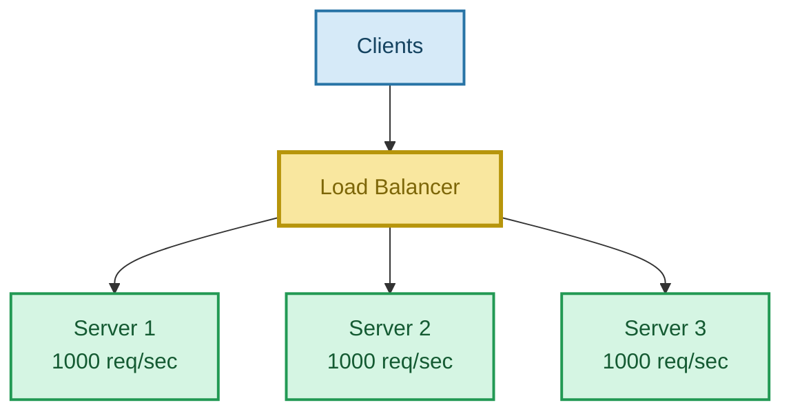

> বাস্তবে throughput perfectly 3× হয় না; database, network, synchronization এবং অন্যান্য bottleneck থাকতে পারে।

---

# 16. Load Balancer এবং Latency

যদি একটি server overloaded হয়:

```text
Queue ↑
  ↓
Waiting Time ↑
  ↓
Latency ↑
```

Load Balancer অন্য server-এ traffic distribute করতে পারে।

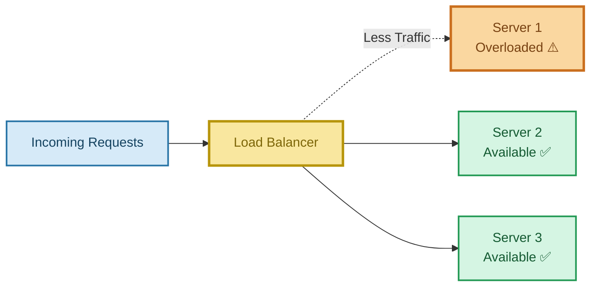

> Load Balancer latency কমাতে **সাহায্য করতে পারে**, কিন্তু সব ক্ষেত্রে latency কমবে—এমন guarantee নেই।

---

# 17. Load Balancer শুধু Client → Server-এর মাঝে নয়

## Server → Database

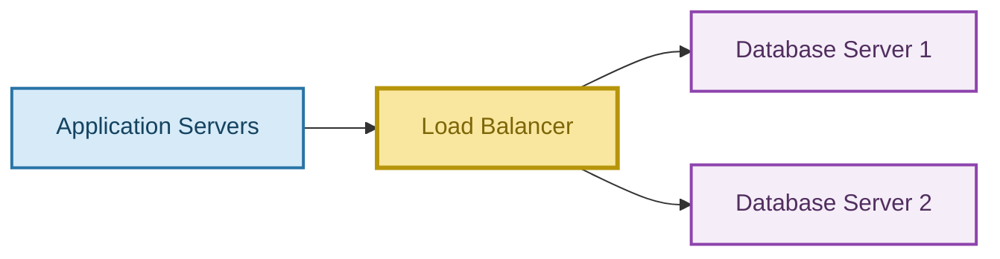

## Service → Service

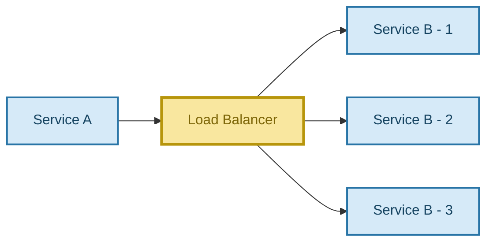

---

# 18. Load Balancer এবং Reverse Proxy

Load Balancer অনেক ক্ষেত্রে Reverse Proxy হিসেবেও কাজ করতে পারে।

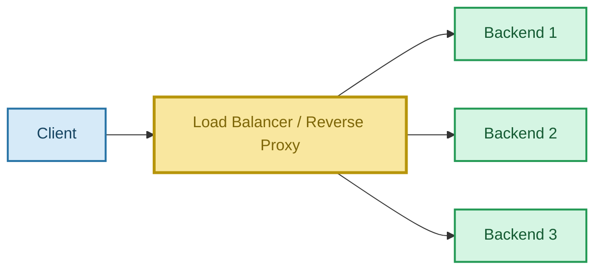

---

# 19. DNS Load Balancing

DNS level-এও traffic distribute করা যেতে পারে।

ধরো:

```text
google.com
```

DNS query-এর response-এ একাধিক IP পাওয়া যেতে পারে।

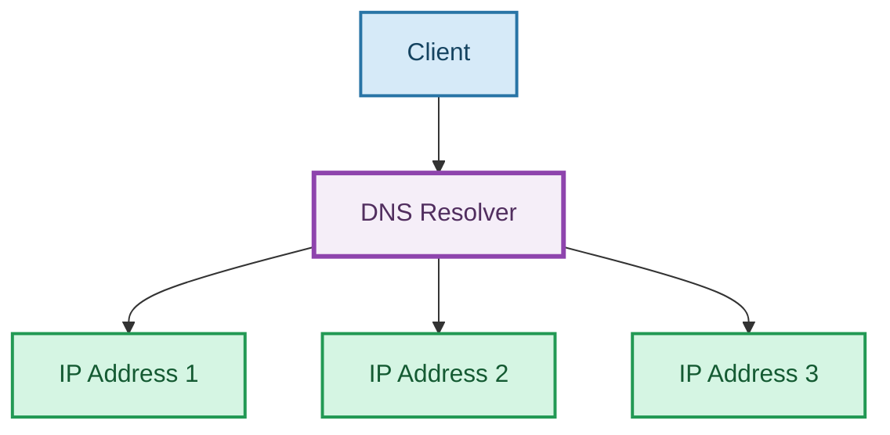

> একটি hostname-এর multiple IP পাওয়া শুধু DNS load balancing-এর কারণেই হবে—এমন নয়। CDN, geographic routing, caching এবং provider infrastructure-এর কারণেও ভিন্ন IP পাওয়া যেতে পারে।

---

# 20. `nslookup` Example

Terminal-এ:

```bash
nslookup google.com
```

এটি DNS query করে IP address দেখতে সাহায্য করে।

Concept:

```text
google.com
    ↓
DNS
    ↓
IP Address
```

একাধিক query-তে ভিন্ন address দেখা যেতে পারে।

---

# 21. Hardware Load Balancer

Dedicated physical device:

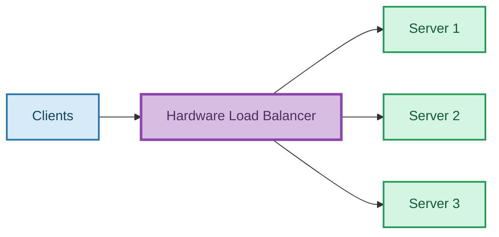

### সুবিধা

- High performance
- Specialized hardware

### অসুবিধা

- Expensive
- Hardware limitation
- Flexibility কম হতে পারে

---

# 22. Software Load Balancer

Software হিসেবে run করে।

Popular examples:

- Nginx
- HAProxy
- Envoy

```mermaid
flowchart LR
    C[Clients] --> S[Software Load Balancer]
    S --> S1[Server 1]
    S --> S2[Server 2]
    S --> S3[Server 3]

    classDef client fill:#D6EAF8,stroke:#2874A6,color:#154360,stroke-width:2px;
    classDef software fill:#FCF3CF,stroke:#B7950B,color:#7D6608,stroke-width:3px;
    classDef server fill:#D5F5E3,stroke:#229954,color:#145A32,stroke-width:2px;
    class C client;
    class S software;
    class S1,S2,S3 server;
```

### সুবিধা

- তুলনামূলকভাবে কম খরচ
- Flexible
- Highly configurable
- Cloud environment-এ জনপ্রিয়

---

# 23. Server Register / Deregister

নতুন server যোগ করলে Load Balancer-কে জানাতে হয়।

### Register

```mermaid
sequenceDiagram
    participant S as New Server
    participant LB as Load Balancer

    S->>LB: Register
    LB-->>S: Accepted
    LB->>S: Start Sending Traffic
```

### Deregister

Server remove করার সময়:

```mermaid
sequenceDiagram
    participant S as Server
    participant LB as Load Balancer

    S->>LB: Deregister / Drain
    LB-->>S: Stop New Traffic
    S-->>LB: Finish Existing Requests
```

---

# 24. Load Balancer + Distributed System

আগে:

```mermaid
flowchart TD
    U[Users] --> S[Single Server]

    classDef user fill:#D6EAF8,stroke:#2874A6,color:#154360,stroke-width:2px;
    classDef server fill:#F5B7B1,stroke:#C0392B,color:#78281F,stroke-width:3px;
    class U user;
    class S server;
```

পরে:

```mermaid
flowchart TD
    U[Users] --> LB[Load Balancer]
    LB --> S1[Server 1]
    LB --> S2[Server 2]
    LB --> S3[Server 3]

    classDef user fill:#D6EAF8,stroke:#2874A6,color:#154360,stroke-width:2px;
    classDef lb fill:#F9E79F,stroke:#B7950B,color:#7D6608,stroke-width:3px;
    classDef server fill:#D5F5E3,stroke:#229954,color:#145A32,stroke-width:2px;
    class U user;
    class LB lb;
    class S1,S2,S3 server;
```

মনে রাখো:

```text
Horizontal Scaling
        +
Load Balancing
        =
More Capacity
+
Better Availability
```

---

# 25. Main Responsibilities — Quick Table

| Responsibility    | কাজ                                 |
| ----------------- | ----------------------------------- |
| Routing           | Request server-এ পাঠানো             |
| Load Distribution | Traffic ভাগ করা                     |
| Health Check      | Server healthy কিনা দেখা            |
| Failover          | Failed server এড়িয়ে চলা             |
| Scaling Support   | নতুন server ব্যবহার করা             |
| Availability      | Service available রাখতে সাহায্য করা |

---

# 26. Strategies — Quick Table

| Strategy             | কীভাবে কাজ করে                 |
| -------------------- | ------------------------------ |
| Random               | Random server                  |
| Round Robin          | একের পর এক server              |
| Weighted Round Robin | Powerful server-এ বেশি traffic |
| Least / Load Based   | কম loaded server               |
| IP Hashing           | Client IP hash করে server      |

---

# 27. Real-Life Analogy

ধরো একটি hospital:

```mermaid
flowchart LR
    P1[Patient 1]
    P2[Patient 2]
    P3[Patient 3]
    R[Reception / Traffic Controller]
    D1[Doctor 1]
    D2[Doctor 2]
    D3[Doctor 3]

    P1 --> R
    P2 --> R
    P3 --> R
    R --> D1
    R --> D2
    R --> D3

    classDef patient fill:#D6EAF8,stroke:#2874A6,color:#154360,stroke-width:2px;
    classDef reception fill:#F9E79F,stroke:#B7950B,color:#7D6608,stroke-width:3px;
    classDef doctor fill:#D5F5E3,stroke:#229954,color:#145A32,stroke-width:2px;
    class P1,P2,P3 patient;
    class R reception;
    class D1,D2,D3 doctor;
```

এখানে:

```text
Patients  = Clients
Reception = Load Balancer
Doctors   = Backend Servers
```

---

# 28. Exam Definition

### English

> **A load balancer is a system component that distributes incoming client requests across multiple backend servers to improve scalability, availability, and performance.**

### বাংলা

> **Load Balancer হলো এমন একটি component, যা incoming client request-গুলোকে একাধিক backend server-এর মধ্যে distribute করে যাতে system-এর scalability, availability এবং performance উন্নত হয়।**

---

# 29. Interview Answer

> **প্রথমে যদি একটি server সব client request handle করে, user বাড়ার সাথে সাথে server bottleneck হয়ে যেতে পারে। তাই আমরা horizontal scaling করে multiple server যোগ করি। এরপর incoming request-গুলোকে সেই serverগুলোর মধ্যে distribute করার জন্য Load Balancer ব্যবহার করি। Load Balancer client এবং backend server-এর মাঝখানে থাকে এবং round robin, weighted round robin, load-based routing বা hashing-এর মতো strategy ব্যবহার করে server নির্বাচন করে। এটি health check-এর মাধ্যমে unhealthy server এড়িয়ে যেতে পারে এবং system-এর scalability, availability ও throughput improve করতে সাহায্য করে।**

---

# 30. 🧠 20-Second Mental Model

```mermaid
flowchart TD
    U[Many Users]
    LB[Load Balancer]
    S1[Server 1]
    S2[Server 2]
    S3[Server 3]
    DB[(Database)]

    U --> LB
    LB --> S1
    LB --> S2
    LB --> S3
    S1 --> DB
    S2 --> DB
    S3 --> DB

    classDef user fill:#D6EAF8,stroke:#2874A6,color:#154360,stroke-width:2px;
    classDef lb fill:#F9E79F,stroke:#B7950B,color:#7D6608,stroke-width:3px;
    classDef server fill:#D5F5E3,stroke:#229954,color:#145A32,stroke-width:2px;
    classDef db fill:#F5EEF8,stroke:#8E44AD,color:#512E5F,stroke-width:3px;
    class U user;
    class LB lb;
    class S1,S2,S3 server;
    class DB db;
```

মনে রাখো:

```text
Many Users
    ↓
Load Balancer
    ↓
Multiple Servers
    ↓
Database
```

---

# ⭐ 31. Final Memory Trick

### Load Balancer = Traffic Cop 🚦

> **Client request আসে → Load Balancer সিদ্ধান্ত নেয় → সঠিক server-এ পাঠায়।**

### Horizontal Scaling

> **আরও server যোগ করো।**

### Load Balancer

> **সেই serverগুলোর মধ্যে request ভাগ করো।**

### Main Strategies

```text
Random
Round Robin
Weighted Round Robin
Least / Load Based
IP Hashing
```

### Main Benefits

```text
Scalability
Availability
Throughput ↑
Latency ↓ (often)
Fault Tolerance
```

## 🔑 সবচেয়ে গুরুত্বপূর্ণ লাইন

> **Horizontal Scaling system-এ server-এর সংখ্যা বাড়ায়, আর Load Balancer incoming traffic-কে সেই serverগুলোর মধ্যে intelligently distribute করে যাতে কোনো একটি server bottleneck না হয়ে যায়।**

> **এক লাইনে: Load Balancer = "Which server should handle this request?" এই decision নেওয়ার component।**
