# 🔄 Forward Proxy vs Reverse Proxy — System Design Notes

## 1. Proxy কী?

**Proxy** হলো একটি intermediary/server, যেটা Client এবং Destination-এর মাঝখানে থেকে request receive করে এবং অন্যদিকে forward করে।

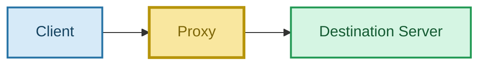

মূল প্রশ্ন:

> **Proxy কার behalf-এ কাজ করছে?**

- **Forward Proxy → Client-এর behalf-এ**
- **Reverse Proxy → Server-এর behalf-এ**

---

# 2. Forward Proxy কী?

> **Forward Proxy Client-এর behalf-এ কাজ করে।**

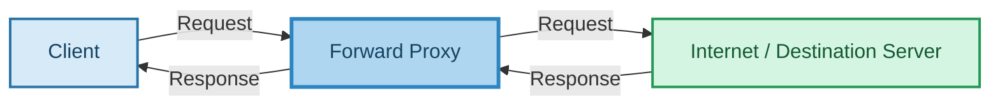

এখানে Client সাধারণত জানে যে সে Proxy ব্যবহার করছে।

### Basic Flow

```text
Client
  ↓
Forward Proxy
  ↓
Internet / Server
```

---

# 3. Forward Proxy-এর Example: VPN

Direct connection:

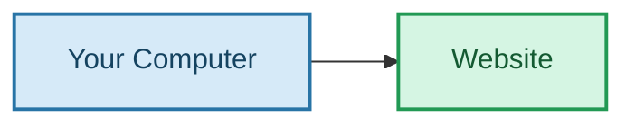

Forward Proxy/VPN ব্যবহার করলে:

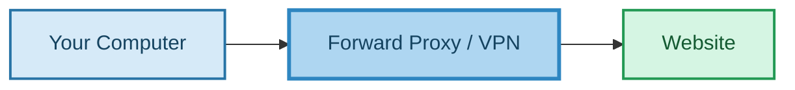

Website সাধারণত proxy/VPN-এর network address দেখতে পারে, client-এর direct network address-এর পরিবর্তে।

> Forward Proxy client-এর identity/location hide করতে সাহায্য করতে পারে, তবে exact behavior proxy/VPN configuration-এর উপর নির্ভর করে।

---

# 4. Forward Proxy কেন ব্যবহার করা হয়?

Common use case:

### Client Privacy / Network Control

```text
Client
  ↓
Forward Proxy
  ↓
Internet
```

### Corporate Proxy

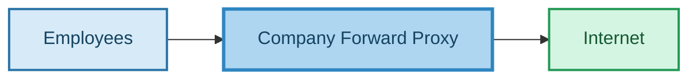

Company Proxy দিয়ে:

- Website filtering
- Access control
- Monitoring
- Traffic policy enforcement

করা যেতে পারে।

### Geographic Access

কিছু proxy/VPN অন্য region-এর network location ব্যবহার করতে পারে, ফলে location-based access policy-তে apparent source region পরিবর্তিত হতে পারে।

---

# 5. Reverse Proxy কী?

> **Reverse Proxy Server-এর behalf-এ কাজ করে।**

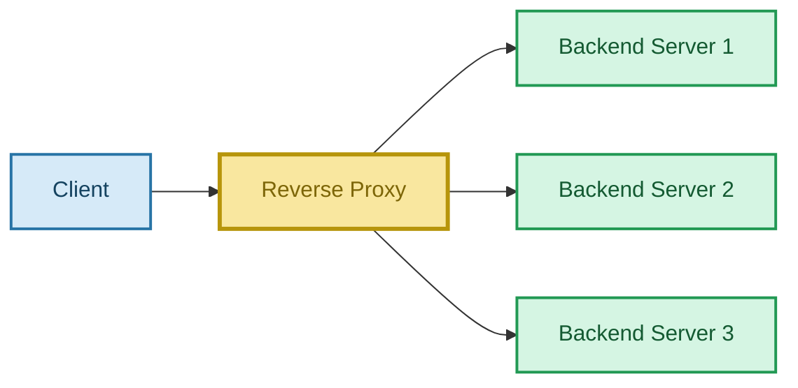

Client সাধারণত backend-এর ভিতরের structure জানে না।

Client শুধু public endpoint-এর সাথে communicate করে।

---

# 6. Reverse Proxy-এর Example

ধরো:

```text
www.example.com
```

Browser request পাঠায়:

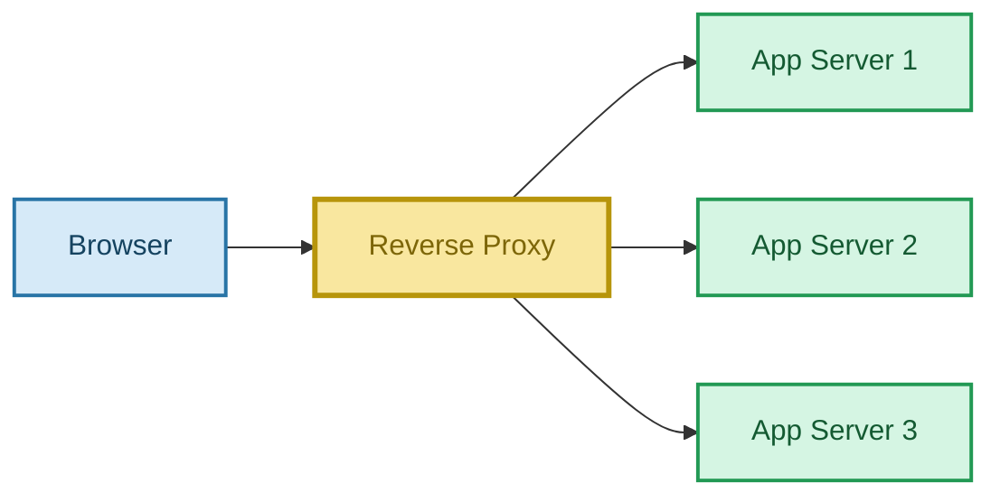

Reverse Proxy decide করতে পারে কোন backend server request handle করবে।

Client backend-এর actual server topology জানে না।

---

# 7. Reverse Proxy-এর প্রধান কাজ

## 7.1 Load Balancing

Reverse Proxy backend server-গুলোর মধ্যে request distribute করতে পারে।

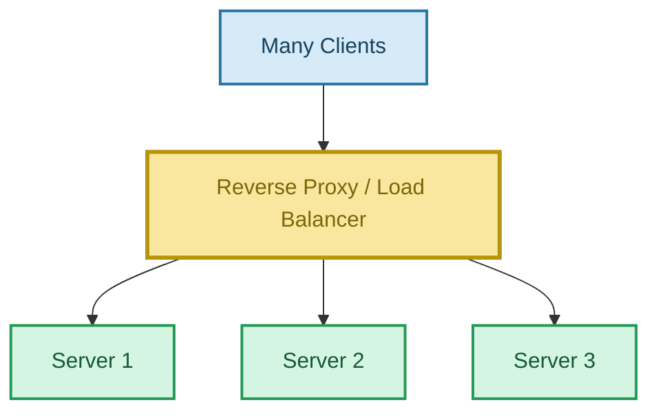

ফল:

- Load distribute করা যায়
- Server overload কমতে পারে
- Availability improve হতে পারে

> **Reverse Proxy এবং Load Balancer একই জিনিস নয়। তবে একটি Reverse Proxy Load Balancing করতে পারে।**

---

## 7.2 Static Asset Caching

Reverse Proxy cache করতে পারে:

- Images
- CSS
- JavaScript
- Fonts
- কিছু static files

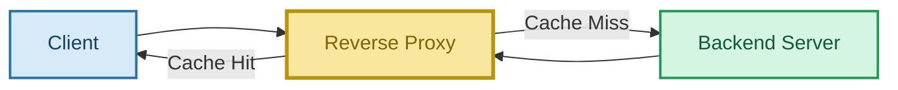

### Cache Hit

```text
Client
  ↓
Reverse Proxy
  ↓
Cache HIT ✅
  ↓
Response
```

### Cache Miss

```text
Client
  ↓
Reverse Proxy
  ↓
Cache MISS
  ↓
Backend Server
  ↓
Response
```

ফলে:

- Backend load কমতে পারে
- Latency কমতে পারে
- Throughput improve হতে পারে

---

## 7.3 Security

Reverse Proxy backend server-গুলোকে direct public exposure থেকে আড়ালে রাখতে পারে।

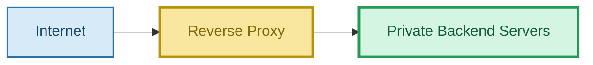

Reverse Proxy-তে থাকতে পারে:

- TLS termination
- Rate limiting
- Request filtering
- Authentication integration
- WAF integration

---

# 8. Forward Proxy vs Reverse Proxy

| বিষয় | Forward Proxy | Reverse Proxy |
|---|---|---|
| কার behalf-এ কাজ করে? | Client | Server |
| অবস্থান | Client-side | Server-এর সামনে |
| Basic Flow | Client → Proxy → Internet | Client → Proxy → Backend |
| Client কি Proxy জানে? | সাধারণত হ্যাঁ | Backend structure সম্পর্কে সাধারণত না |
| Main goal | Client traffic control/privacy | Backend protection/routing |
| Common use case | Corporate Proxy, VPN | Load Balancing, Caching |
| Backend infrastructure hide করে? | Main purpose নয় | হ্যাঁ, করতে পারে |

### সবচেয়ে সহজে

```text
Forward Proxy → Client-এর জন্য
Reverse Proxy → Server-এর জন্য
```

---

# 9. Restaurant Analogy

## Forward Proxy

তুমি অন্য কাউকে দিয়ে restaurant-এ order পাঠালে:

```text
You
 ↓
Messenger
 ↓
Restaurant
```

Messenger তোমার behalf-এ কাজ করছে।

```text
Messenger = Forward Proxy
```

## Reverse Proxy

Restaurant-এর সামনে Receptionist:

```text
You
 ↓
Receptionist
 ↓
Chef 1 / Chef 2 / Chef 3
```

তুমি জানো না কোন chef তোমার food তৈরি করছে।

```text
Receptionist = Reverse Proxy
```

---

# 10. Forward + Reverse Proxy একসাথে

একটি বড় system-এ দুটোই থাকতে পারে:


পুরো flow:

```text
Client
  ↓
Forward Proxy
  ↓
Internet
  ↓
Reverse Proxy
  ↓
Backend Servers
```

---

# 11. Reverse Proxy vs Load Balancer

এটা খুব important:

```text
Reverse Proxy
     │
     ├── Routing
     ├── Caching
     ├── Security
     ├── TLS Termination
     └── Load Balancing
```

অর্থাৎ:

> **Reverse Proxy একটি broader role হতে পারে, আর Load Balancing তার একটি function।**

Nginx, HAProxy, Envoy-এর মতো software reverse proxy এবং load balancing—দুটোই করতে পারে।

---

# 12. Reverse Proxy এবং CDN

CDN edge architecture অনেক ক্ষেত্রে reverse-proxy-like pattern ব্যবহার করে।

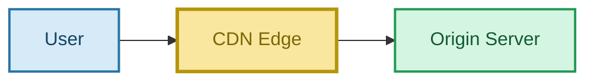

Cache-এ content থাকলে:

```text
User
 ↓
CDN
 ↓
Cache HIT ✅
 ↓
Response
```

Origin server-এ request নাও যেতে পারে।

---

# 13. Interview Answer

### English

> **A forward proxy acts on behalf of the client, while a reverse proxy acts on behalf of the server. A forward proxy is commonly used for client-side privacy, access control, filtering, or routing outbound traffic. A reverse proxy sits in front of backend servers and can hide the backend infrastructure while providing features such as load balancing, caching, TLS termination, and security controls.**

### বাংলা

> **Forward Proxy client-এর behalf-এ কাজ করে, আর Reverse Proxy server-এর behalf-এ কাজ করে। Forward Proxy client-side traffic control, privacy, filtering বা outbound routing-এর জন্য ব্যবহার করা হয়। Reverse Proxy backend server-এর সামনে থাকে এবং backend infrastructure hide করার পাশাপাশি load balancing, caching, TLS termination এবং security-এর মতো কাজ করতে পারে।**

---

# 14. 🧠 10-Second Memory Trick

```text
FORWARD PROXY
      ↓
Client-এর হয়ে বাইরে কথা বলে

REVERSE PROXY
      ↓
Server-এর হয়ে Client-এর সাথে কথা বলে
```

আরও সহজ:

```text
Forward → Client Side
Reverse → Server Side
```

---

# 15. Final Mental Model

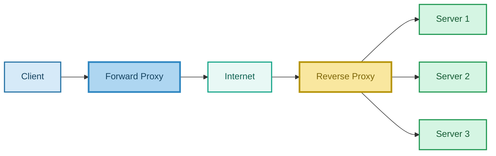

## 🔑 Final Rule

> **Forward Proxy → Client-এর behalf-এ।**

> **Reverse Proxy → Server-এর behalf-এ।**

> **Reverse Proxy load balancing, caching, security এবং routing করতে পারে।**
