# ⚡ Polling vs Streaming — System Design Notes

> **Polling** এবং **Streaming** হলো client ও server-এর মধ্যে নতুন data পাওয়ার দুটি গুরুত্বপূর্ণ communication pattern।
>
> **Polling = Client বারবার জিজ্ঞেস করে:** “নতুন data এসেছে কি?”
>
> **Streaming = Connection খোলা থাকে, তারপর data available হলে server push করতে পারে।**

---

## 📌 1. Core Idea

ধরো একটি client/server application-এ নতুন data আসছে। Client-এর জানতে হবে:

> **“নতুন data এসেছে কি?”**

এর দুটি common approach:

```text
┌──────────────┐
│   Polling    │
│              │
│ Client asks  │
│ repeatedly   │
└──────────────┘

        OR

┌──────────────┐
│  Streaming   │
│              │
│ Open long-   │
│ lived link   │
└──────────────┘
```

---

# 🔵 2. Polling কী?

**Polling** হলো এমন একটি process যেখানে client নির্দিষ্ট সময় পরপর server-কে request পাঠিয়ে জিজ্ঞেস করে নতুন কোনো data এসেছে কি না।

### Basic Flow

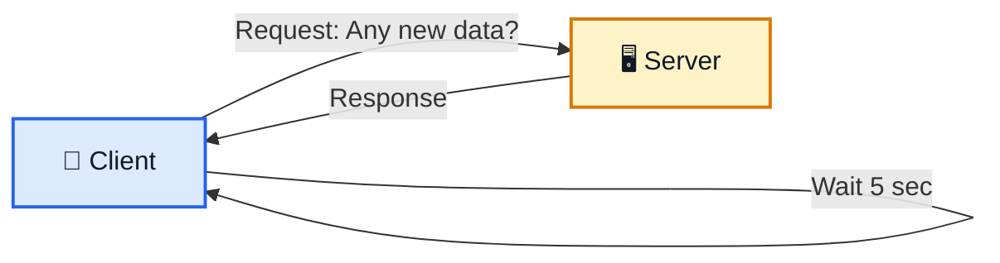

### Simple Example

Client প্রতি 5 seconds:

```text
Client → Server: "Any new data?"
Server → Client: "No"

... 5 seconds ...

Client → Server: "Any new data?"
Server → Client: "No"

... 5 seconds ...

Client → Server: "Any new data?"
Server → Client: "Yes!"
```

অর্থাৎ:

> **Client continuously checks for updates.**

---

# 🏠 3. Real-Life Polling Example

ধরো তুমি office-এ বসে manager-এর জন্য অপেক্ষা করছো।

Polling-এর মতো:

```text
You → "Sir, এসেছেন?"
Manager → "না"

5 minutes later...

You → "Sir, এসেছেন?"
Manager → "না"

5 minutes later...

You → "Sir, এসেছেন?"
Manager → "হ্যাঁ!"
```

এখানে **তুমি নিজে বারবার প্রশ্ন করছো**।

```text
You
 ↓
Ask
 ↓
Manager
 ↓
Wait
 ↓
Ask Again
```

এটাই Polling-এর basic idea।

---

# 🌡️ 4. Polling Example — Temperature

Temperature application-এর ক্ষেত্রে data খুব ঘনঘন change নাও করতে পারে।

```text
Client → "Temperature?"
Server → "30°C"

Wait 1 minute

Client → "Temperature?"
Server → "30°C"

Wait 1 minute

Client → "Temperature?"
Server → "31°C"
```

এখানে polling যথেষ্ট হতে পারে।

### Suitable Use Cases

```text
✅ Weather / Temperature
✅ Periodic Reports
✅ Background Job Status
✅ Occasional Notifications
✅ Data that changes infrequently
```

---

# ⚠️ 5. Polling-এর Problem

Polling-এর প্রধান সমস্যা হলো **interval selection**।

## A. Polling Interval বেশি হলে

ধরো:

```text
Polling Interval = 10 seconds
```

Server-এ data এসেছে:

```text
10:00:00 → New Message
```

Client next poll করবে:

```text
10:00:10
```

তাহলে user update প্রায় 10 seconds পরে দেখতে পারে।

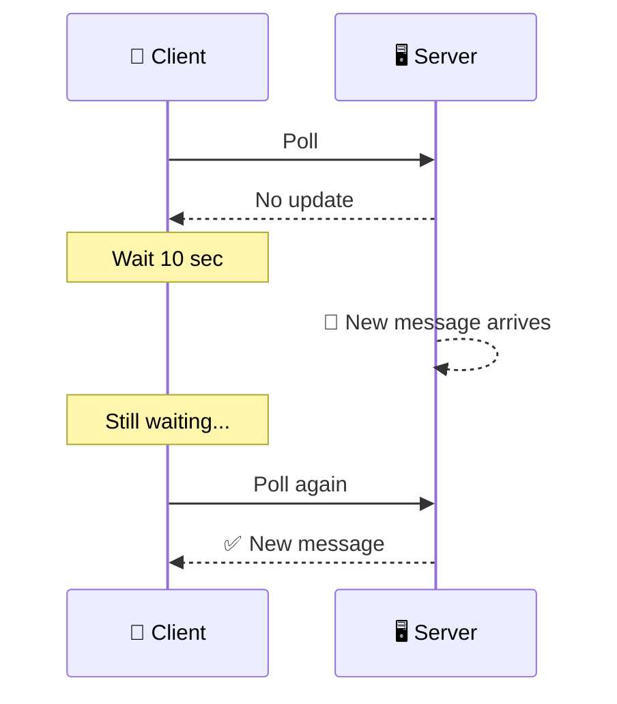

### Result

```text
Large Interval
      ↓
Less Server Load
      ↓
More Delay
```

---

## B. Polling Interval কম হলে

ধরো:

```text
Polling Interval = 1 second
```

তাহলে update দ্রুত পাওয়া যাবে।

কিন্তু 100,000 users থাকলে:

```text
100,000 users
      ↓
1 request / second
      ↓
≈ 100,000 requests / second
```

এমনকি নতুন data না থাকলেও request যেতে থাকবে।

```text
Client → "Any update?"
Server → "No"

Client → "Any update?"
Server → "No"

Client → "Any update?"
Server → "No"
```

### Result

```text
Small Interval
      ↓
More Requests
      ↓
Higher Server Load
```

---

# ⚖️ 6. Polling-এর মূল Trade-off

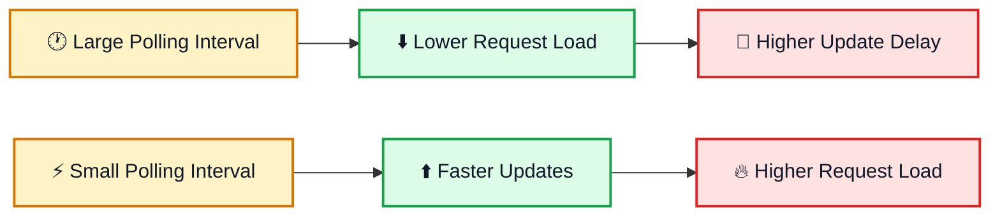

মনে রাখো:

> **Long interval → কম load, বেশি delay**

> **Short interval → কম delay, বেশি load**

---

# 🟢 7. Streaming কী?

**Streaming** হলো এমন একটি communication pattern যেখানে client এবং server-এর মধ্যে একটি **long-lived connection** রাখা হয় এবং data available হলে server সেই connection দিয়ে data পাঠাতে পারে।

Conceptually:

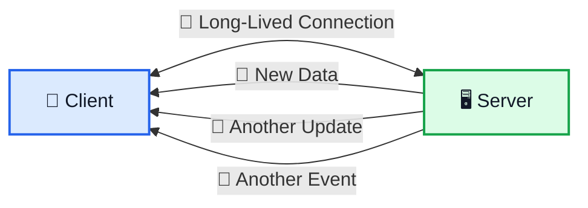

মূল idea:

> Client প্রতিবার নতুন request করে data চাইবে না।

বরং:

```text
Client
   │
   │  Open connection
   │=======================│
   │                       │
   │<──── New Data ─────────│
   │<──── New Data ─────────│
   │<──── New Data ─────────│
```

---

# 📞 8. Real-Life Streaming Example

ধরো তুমি manager-কে বললে:

> **“Sir, আমি বাইরে বসছি। আপনি এলে আমাকে জানাবেন।”**

এখন তুমি প্রতি 5 minutes-এ গিয়ে জিজ্ঞেস করবে না।

Manager নিজেই বলবে:

> **“আমি এসেছি।”**

এটাই streaming-এর basic idea।

```text
You
 │
 │ "Notify me when you arrive"
 │
 ▼
Manager
 │
 │
 │────── "I am here!" ──────►
```

---

# 💬 9. Chat App Example

Chat application streaming-এর খুব সহজ example।

ধরো তুমি WhatsApp-এর মতো system বানাচ্ছো।

তুমি server-এর সাথে connection establish করলে:

```text
Client
   │
   │ 🔗 Open Connection
   │==============================│
   │                              │
   │                              │
   │<──── "Hello" ────────────────│
   │<──── "How are you?" ────────│
   │<──── "See you later" ────────│
```

Rahim message পাঠানোর সাথে সাথে server connection ব্যবহার করে তোমার client-কে push করতে পারে।

Client-কে আবার জিজ্ঞেস করতে হয় না:

```text
"Any new message?"
```

---

# 🔌 10. Socket কী?

Transcript-এর context-এ **socket** হলো client ও server-এর মধ্যে communication-এর একটি endpoint, যার মাধ্যমে তারা data exchange করতে পারে।

Conceptually:

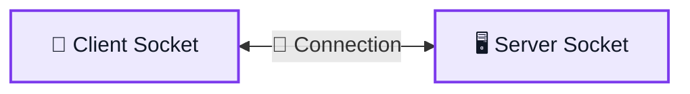

Real-time bidirectional communication-এর জন্য **WebSocket** একটি common technology।

```text
Client
   ⇅
WebSocket Connection
   ⇅
Server
```

---

# ⚡ 11. WebSocket Example

Chat application:

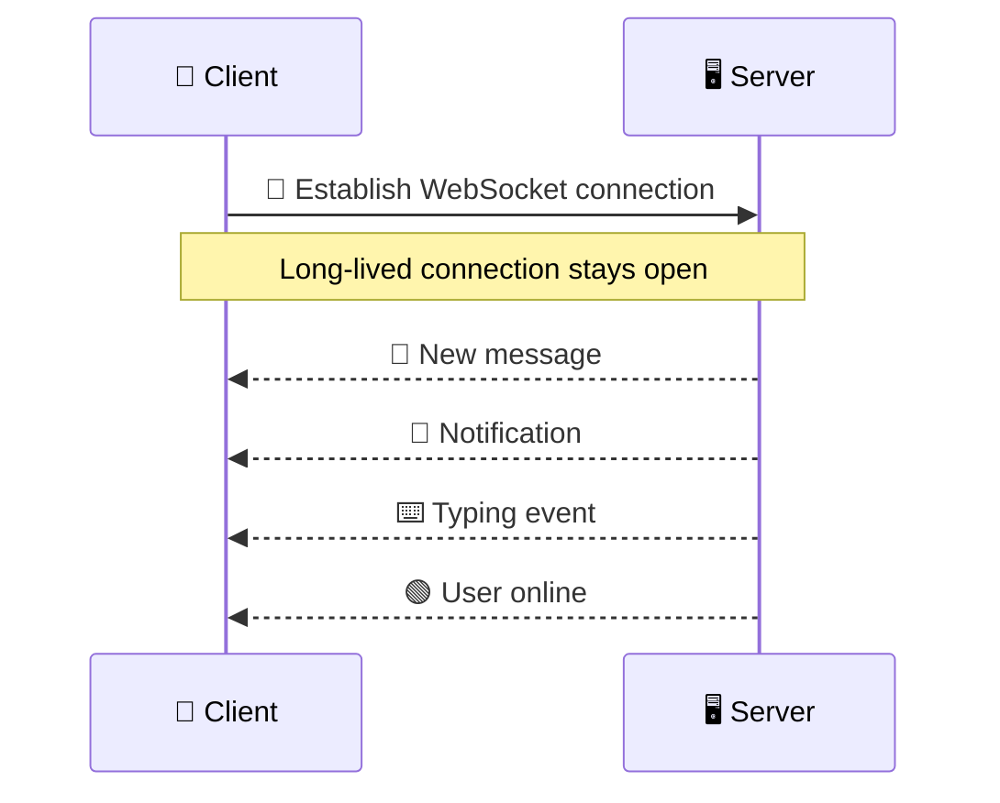

এখানে server-এর কাছে update আসলে open connection ব্যবহার করে client-কে data পাঠাতে পারে।

---

# 🏏 12. Live Score Example

ধরো live cricket score application।

Score:

```text
120/3
```

এরপর:

```text
121/3
```

এরপর:

```text
125/4
```

User চায় change যত দ্রুত সম্ভব দেখতে।

### Polling

```text
Poll
 ↓
Wait
 ↓
Poll
 ↓
Wait
 ↓
Poll
```

### Streaming

```text
Open Connection
      ↓
120/3
      ↓
121/3
      ↓
125/4
      ↓
126/4
```

Streaming এখানে real-time experience-এর জন্য বেশি suitable।

---

# 🛰️ 13. Real-Time Monitoring Example

ধরো server monitoring dashboard:

```text
CPU = 45%
```

কিছুক্ষণ পরে:

```text
CPU = 63%
```

তারপর:

```text
CPU = 81%
```

Streaming ব্যবহার করলে dashboard দ্রুত update পেতে পারে:

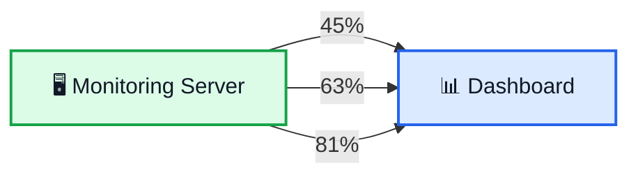

---

# 🔄 14. Polling vs Streaming

সবচেয়ে গুরুত্বপূর্ণ comparison:

| বিষয়                  | Polling                    | Streaming                         |
| --------------------- | -------------------------- | --------------------------------- |
| Basic Idea            | Client repeatedly asks     | Open connection + server can push |
| Request Pattern       | Repeated requests          | Long-lived connection             |
| Data Update           | Client checks periodically | Server sends when available       |
| Real-Time Experience  | Limited by interval        | Better for low-latency updates    |
| Request Overhead      | Can be high                | Usually lower for frequent events |
| Implementation        | তুলনামূলক simple           | তুলনামূলক complex                 |
| Infrequent Updates    | ✅ Good                    | Often unnecessary                 |
| Real-Time Data        | Can be inefficient         | ✅ Good                           |
| Connection Management | Simple                     | More complex                      |

---

# 🧠 15. One Visual Comparison

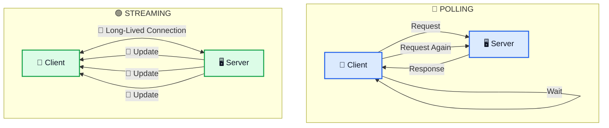

---

# 🧮 16. Request Volume Example

ধরো:

```text
Users = 100,000
Polling Interval = 1 second
```

Approximate request rate:

```text
100,000 users × 1 request/sec

≈ 100,000 requests/sec
```

এমনকি কোনো update না থাকলেও request হতে পারে।

এটাই frequent polling-এর বড় drawback।

Streaming-এ বরং:

```text
100,000 Clients
      ↓
Open Connections
      ↓
Only send events when needed
```

তবে **long-lived connections নিজেও infrastructure resources consume করে**, তাই streaming-এর scaling challenge আলাদা।

---

# 🚦 17. কখন Polling ব্যবহার করবো?

Polling ভালো choice যখন:

```text
✅ Data changes infrequently
✅ Small delay is acceptable
✅ Simplicity is important
✅ Client does not need continuous updates
```

### Examples

```text
🌡️ Temperature
🌤️ Weather
📋 Job Status
📊 Periodic Reports
🔄 Background Task Status
```

---

# 🚀 18. কখন Streaming ব্যবহার করবো?

Streaming ভালো choice যখন:

```text
✅ Data changes frequently
✅ Low latency is important
✅ Real-time user experience is required
✅ Server needs to push updates as they become available
```

### Examples

```text
💬 Chat
🔔 Real-Time Notifications
🏏 Live Sports Score
📈 Real-Time Monitoring
📡 IoT Events
🗺️ Live Location Updates
```

---

# ❌ 19. Polling কি খারাপ?

**না।**

Polling একটি simple এবং practical solution।

যদি data:

```text
Rarely Changes
```

এবং:

```text
A little delay is acceptable
```

তাহলে polling খুব ভালোভাবে কাজ করতে পারে।

সব জায়গায় streaming ব্যবহার করার দরকার নেই।

---

# ❌ 20. Streaming কি সবসময় Better?

**না।**

Streaming-এর জন্য long-lived connections maintain করতে হয়।

Large-scale system-এ চিন্তা করতে হয়:

```text
Connection Management
Resource Usage
Scaling
Reconnect Logic
Failure Handling
```

তাই:

> **Use the simplest approach that satisfies the application's latency and update-frequency requirements.**

---

# 🆚 21. Polling vs Streaming — Decision Guide

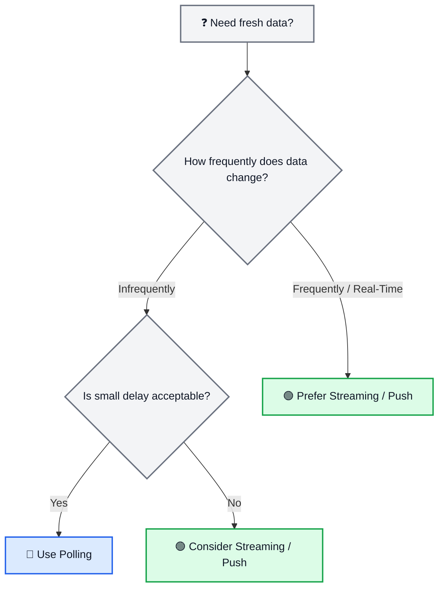

---

# 🔥 22. Polling-এর Complete Flow

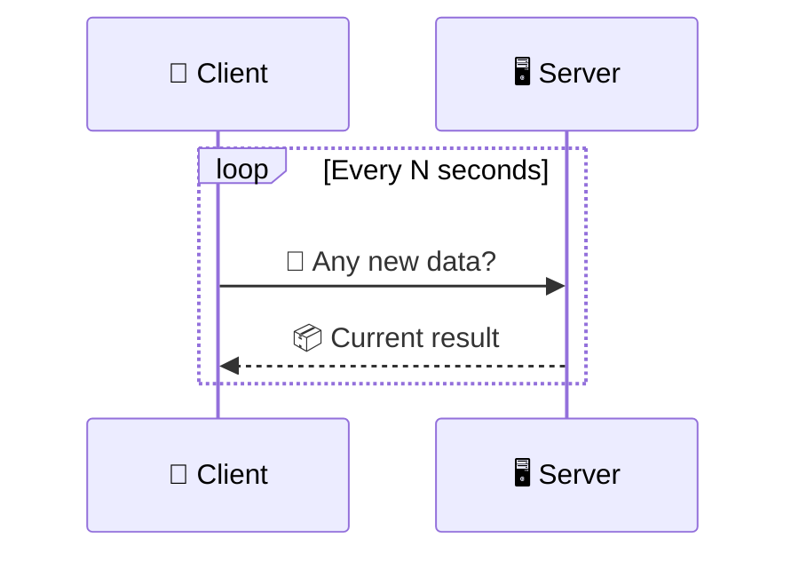

### Mental Model

```text
Client asks
    ↓
Server answers
    ↓
Wait
    ↓
Client asks again
```

---

# 🟢 23. Streaming-এর Complete Flow

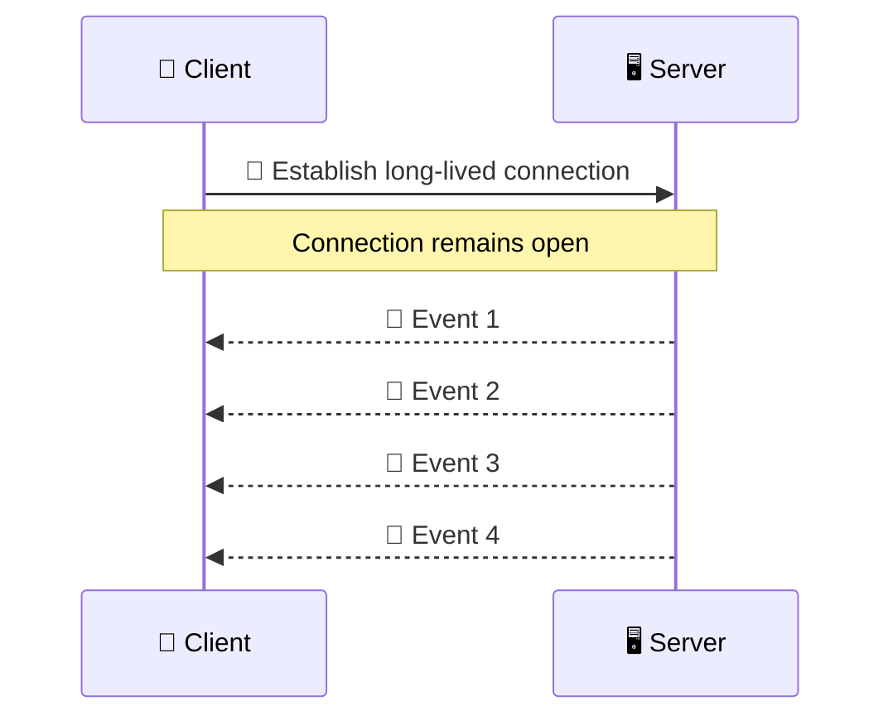

### Mental Model

```text
Connect Once
    ↓
Keep Connection Open
    ↓
Server Pushes Updates
```

---

# 💬 24. Chat App — Polling vs Streaming

## Polling

```text
Message arrives
      ↓
Wait until next poll
      ↓
Client checks server
      ↓
Message appears
```

Possible result:

```text
🐢 Delay
```

## Streaming

```text
Message arrives
      ↓
Server sends through open connection
      ↓
Message appears
```

Possible result:

```text
⚡ Near-instant update
```

---

# 📡 25. Important Detail: Streaming is a Pattern, Not Just One Protocol

“Streaming” is a broad concept.

The exact technology can depend on the requirement.

For browser real-time communication, examples include:

```text
WebSocket
Server-Sent Events (SSE)
```

There are also other streaming/event transport approaches in different architectures.

The important System Design idea is:

> **Do not focus only on the protocol name. First understand the communication requirement.**

---

# 🔐 26. Important Architecture Considerations

Real-time/streaming systems become more challenging when the number of clients grows.

Example:

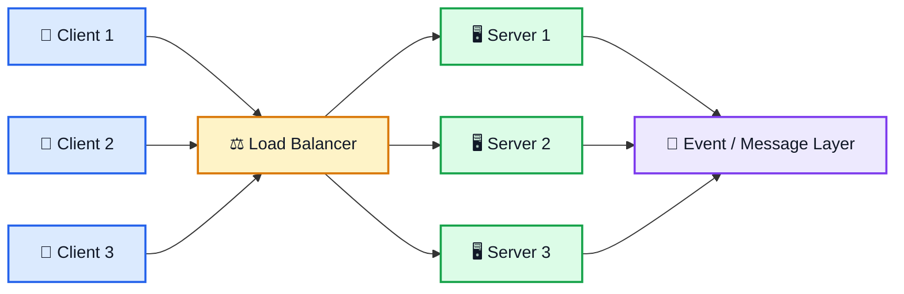

এখানে large-scale design-এর জন্য message/event distribution, connection routing, reconnection এবং failure handling-এর মতো বিষয় গুরুত্বপূর্ণ হতে পারে।

---

# 🧩 27. Polling-এর Common Problems

```text
❌ Update Delay
❌ Unnecessary Requests
❌ Higher Server Load
❌ Wasted Network Traffic
❌ Poor fit for high-frequency real-time data
```

---

# 🧩 28. Streaming-এর Common Challenges

```text
❌ Long-Lived Connection Management
❌ Scaling Many Connections
❌ Reconnection Handling
❌ Failure Handling
❌ Resource Consumption
❌ More Complex Infrastructure
```

---

# 📊 29. Side-by-Side Example

| Scenario                          | Better Choice | Why                            |
| --------------------------------- | ------------- | ------------------------------ |
| Temperature every few minutes     | 🔵 Polling    | Update frequency is low        |
| Daily report status               | 🔵 Polling    | Immediate push not necessary   |
| Chat message                      | 🟢 Streaming  | User expects immediate updates |
| Live score                        | 🟢 Streaming  | Frequent updates               |
| Real-time monitoring              | 🟢 Streaming  | Low latency matters            |
| Background job check every 30 sec | 🔵 Polling    | Small delay acceptable         |

---

# 🎯 30. Interview Question — What is Polling?

### English

> **Polling is a communication technique where a client sends requests to a server at regular intervals to check whether new data is available.**

### বাংলা

> **Polling হলো এমন একটি communication technique যেখানে client নির্দিষ্ট সময় পরপর server-কে request পাঠিয়ে check করে যে নতুন কোনো data available হয়েছে কি না।**

---

# 🎯 31. Interview Question — What is Streaming?

### English

> **Streaming is a communication pattern where a long-lived connection is maintained so that data can be delivered continuously or pushed when it becomes available.**

### বাংলা

> **Streaming হলো এমন একটি communication pattern যেখানে client ও server-এর মধ্যে একটি long-lived connection রাখা হয় এবং data available হলে সেই connection-এর মাধ্যমে data পাঠানো যায়।**

---

# 🎯 32. Interview Question — Polling vs Streaming?

### Answer

> **Polling uses repeated client requests at fixed intervals, while streaming keeps a long-lived connection and allows the server to push updates when data becomes available. Polling is suitable for infrequent updates, whereas streaming is more suitable for real-time or high-frequency updates.**

বাংলায়:

> **Polling-এ client নির্দিষ্ট interval পরপর server-কে request করে। Streaming-এ একটি long-lived connection রাখা হয় এবং data available হলে server update push করতে পারে। তাই infrequent updates-এর জন্য polling এবং real-time/high-frequency updates-এর জন্য streaming বেশি suitable।**

---

# 🧠 33. 10-Second Explanation

কেউ যদি জিজ্ঞেস করে:

> **“Polling আর Streaming-এর difference কী?”**

বলবে:

> **Polling-এ client বারবার server-কে জিজ্ঞেস করে নতুন data এসেছে কি না। ফলে interval বড় হলে delay হয় এবং interval ছোট করলে server load বেড়ে যায়। Streaming-এ client ও server-এর মধ্যে long-lived connection থাকে, তাই data available হলে server push করতে পারে। তাই polling কম frequent updates-এর জন্য এবং streaming real-time updates-এর জন্য বেশি useful।**

---

# ⭐ 34. Final Mental Model

```text
                 ┌─────────────────────┐
                 │     NEED UPDATE?    │
                 └──────────┬──────────┘
                            │
                ┌───────────┴───────────┐
                │                       │
         Infrequent Data          Frequent / Real-Time
                │                       │
                ▼                       ▼
          🔵 POLLING              🟢 STREAMING
                │                       │
                ▼                       ▼
       Client asks repeatedly      Open connection
                │                       │
                ▼                       ▼
          Server responds          Server can push
```

---

# 🧠 35. Final Memory Trick

## 🔵 Polling

```text
CLIENT
  ↓
"Any update?"
  ↓
SERVER
  ↓
"No"

WAIT
  ↓
"Any update?"
  ↓
SERVER
```

### মনে রাখো:

> **Polling = “Are we there yet?”**

---

## 🟢 Streaming

```text
CLIENT
  ↓
"Keep me connected."
  ↓
SERVER
  ↓
"New data!"
  ↓
CLIENT
  ↓
"Another update!"
```

### মনে রাখো:

> **Streaming = “Tell me when it happens.”**

---

# 🏆 36. Most Important 7 Points

```text
1. Polling = Client repeatedly asks for updates.

2. Streaming = Long-lived connection + server can push updates.

3. Large polling interval = more delay.

4. Small polling interval = more request/server load.

5. Polling is good for infrequent updates.

6. Streaming is better suited for real-time/high-frequency updates.

7. Both have trade-offs; choose based on latency, update frequency, and scale.
```

---

# 🔥 One-Line Summary

> **Polling = Ask repeatedly.**

> **Streaming = Stay connected and receive updates.**

```text
🔵 POLLING
Client → Server → Response
Client → Server → Response
Client → Server → Response


🟢 STREAMING
Client ═════════════ Server
          ↓
       New Data
          ↓
       Client
          ↓
       New Data
```

---

# 📚 Final Cheat Sheet

| Concept                  | Easy Meaning                                             |
| ------------------------ | -------------------------------------------------------- |
| Polling                  | বারবার server-কে জিজ্ঞেস করা                             |
| Polling Interval         | কত সময় পরপর request যাবে                                 |
| Streaming                | Long-lived connection রাখা                               |
| Server Push              | Server নিজে update পাঠানো                                |
| Socket                   | Communication endpoint                                   |
| WebSocket                | Real-time bidirectional communication-এর common protocol |
| Cache-like delay problem | Update late হতে পারে                                     |
| Real-time                | Very low-latency updates                                 |
| Polling Advantage        | Simple                                                   |
| Streaming Advantage      | Fast/live updates                                        |
| Polling Drawback         | Delay বা unnecessary requests                            |
| Streaming Drawback       | Connection/scaling complexity                            |

---

# ✅ Final Rule

```text
IF data changes rarely
AND small delay is acceptable
→ 🔵 POLLING

IF data changes frequently
AND low latency is important
→ 🟢 STREAMING
```

> **System Design-এর লক্ষ্য হলো সবসময় “সবচেয়ে advanced” technology ব্যবহার করা নয়; বরং requirement অনুযায়ী সবচেয়ে appropriate communication pattern বেছে নেওয়া।**
