# 📡 Publish-Subscribe (Pub/Sub) — System Design Notes

> **Pub/Sub (Publish-Subscribe)** হলো একটি messaging pattern যেখানে **Publisher** সরাসরি **Subscriber**-কে message পাঠায় না। Publisher একটি **Topic**-এ message publish করে, আর Subscriber সেই Topic থেকে message consume করে।

### 🔑 Core Idea

```text
Publisher → Topic → Subscriber
```

---

# 🧩 1. Pub/Sub-এর 4টি Key Entity

```text
1. Publisher
2. Subscriber
3. Topic
4. Message
```

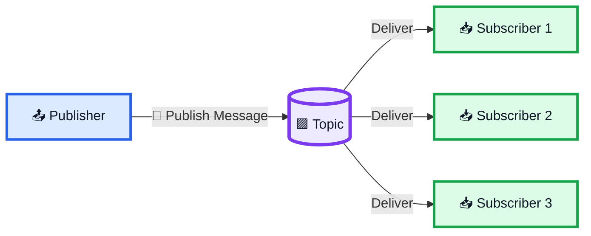

## Publisher

**Publisher** হলো যে service/component message বা event publish করে।

Example:

```text
Order Service
Payment Service
Chat Service
Notification Service
```

## Subscriber

**Subscriber** হলো যে service কোনো Topic-এর message receive বা consume করে।

Example:

```text
Email Service
Inventory Service
Analytics Service
Notification Service
```

## Topic

**Topic হলো Publisher এবং Subscriber-এর মাঝের intermediary/channel।**

## Message

**Message হলো actual data/event যা Publisher Topic-এ publish করে।**

Example:

```json
{
  "orderId": 123,
  "userId": 45,
  "status": "created"
}
```

---

# 🔵 2. Basic Streaming বনাম Pub/Sub

Basic streaming:

```text
Client ←────────→ Server
       Direct Connection
```

Pub/Sub:

```text
Publisher
    ↓
  Topic
    ↓
Subscriber
```

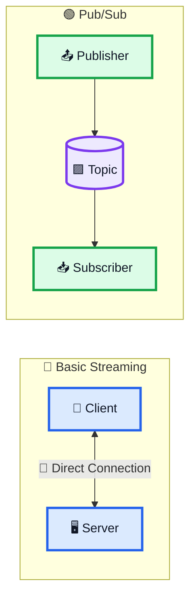

> **Main Difference:** Pub/Sub-এ Topic একটি intermediary হিসেবে কাজ করে।

---

# 🔗 3. Publisher সরাসরি Subscriber-কে পাঠায় না কেন?

ধরো একটি e-commerce system-এ order তৈরি হলো।

একই event-এ interested:

```text
Email Service
Inventory Service
Analytics Service
Notification Service
```

Direct communication হলে:

```text
Order Service
 ├──→ Email Service
 ├──→ Inventory Service
 ├──→ Analytics Service
 └──→ Notification Service
```

এতে Publisher-কে অনেক consumer-এর সাথে direct dependency maintain করতে হয়।

এটা **tight coupling** তৈরি করতে পারে।

---

# 🟢 4. Pub/Sub কীভাবে Decoupling করে?

Pub/Sub-এ:

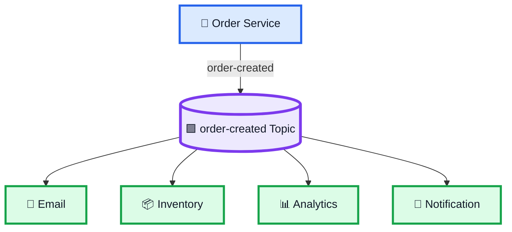

Order Service শুধু জানে:

> **“আমি `order-created` topic-এ publish করবো।”**

Publisher-এর subscriber-এর identity জানার প্রয়োজন নেই।

এটাই:

> **Loose Coupling / Decoupling**

---

# 🌐 5. Distributed Systems-এ কেন গুরুত্বপূর্ণ?

Large-scale distributed system-এ অনেক service একসাথে কাজ করে।

```text
Service A
Service B
Service C
Service D
Service E
```

সব service direct communication করলে complexity দ্রুত বাড়ে।

Pub/Sub:

```text
Services
   ↓
 Topics
   ↓
Services
```

ফলে system আরও modular হতে পারে।

```text
✅ Loose Coupling
✅ Scalability
✅ Flexibility
✅ Easier Integration
```

---

# 🌩️ 6. Network Failure / Server Failure

Distributed system-এ network বা consumer server temporarily fail করতে পারে।

Direct connection-এর ক্ষেত্রে message delivery fail হতে পারে।

Pub/Sub-এ Topic যদি message retain/persist করতে পারে:

```text
Publisher
    ↓
  Topic
    ↓
📦 Message Stored
    ↓
Subscriber ❌
```

Subscriber পরে ফিরে এসে retained message consume করতে পারে।

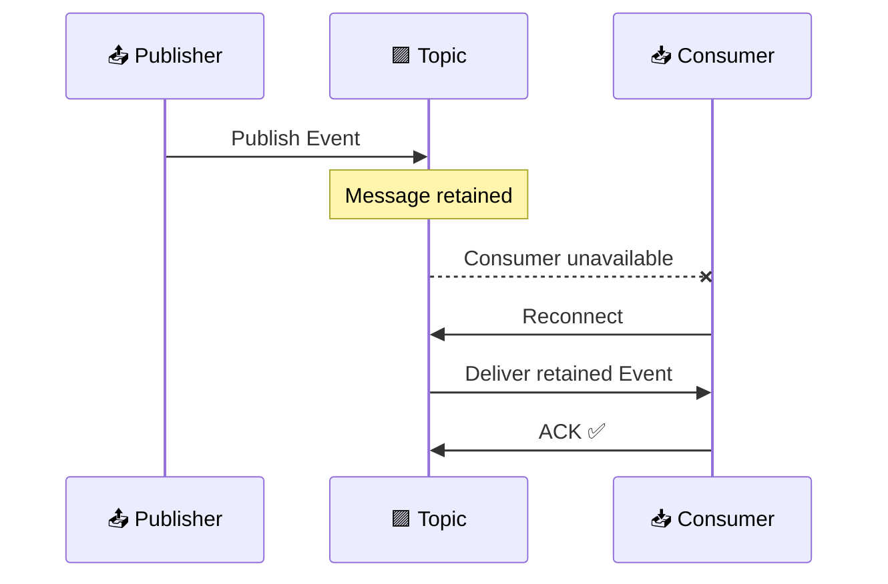

> Exact retention/durability behavior messaging system-এর implementation ও configuration-এর উপর নির্ভর করে।

---

# 📦 7. Message Persistence

Message topic/message store-এ retained থাকতে পারে।

Example:

```text
Topic
 ├── Message 101
 ├── Message 102
 └── Message 103
```

Subscriber temporarily offline:

```text
Subscriber ❌
```

তবুও:

```text
Topic
 ├── Message 101
 ├── Message 102
 └── Message 103
```

Subscriber ফিরে এলে consume করতে পারে—যদি configured retention ও consumer state সেই behavior support করে।

---

# 📍 8. Message ID / Index / Offset

System-কে জানতে হয়:

> **Subscriber কতদূর পর্যন্ত message consume করেছে?**

Example:

```text
Message 101
Message 102
Message 103
Message 104
Message 105
```

Subscriber:

```text
Consumed up to 103
```

Conceptually:

```text
101 ✅
102 ✅
103 ✅
104 ⏳
105 ⏳
```

এই progress message **ID, index, বা offset** দিয়ে track করা যেতে পারে।

---

# ✅ 9. Acknowledgment (ACK)

**ACK = Acknowledgment**

Subscriber যখন message সফলভাবে receive/process করেছে, তখন system-কে জানাতে পারে:

> **“আমি এই message successfully handle করেছি।”**

```text
Topic
  ↓
Message
  ↓
Subscriber
  ↓
ACK ✅
```

---

# 🔄 10. At-Least-Once Delivery

**At-least-once delivery** মানে system চেষ্টা করে message-কে অন্তত একবার deliver করতে।

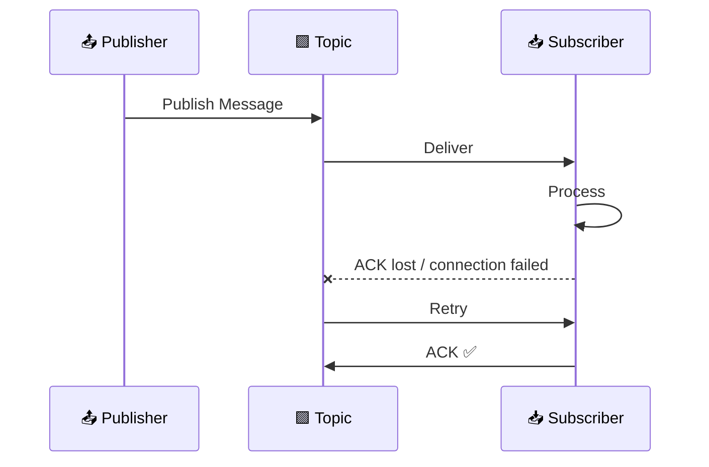

---

# ♻️ 11. Duplicate Message কেন হতে পারে?

Scenario:

```text
Message #101
     ↓
Subscriber
     ↓
Process ✅
     ↓
ACK ❌
     ↓
Connection Lost
     ↓
Retry
     ↓
Message #101 Again
```

তাই:

```text
At-Least-Once
     ↓
Duplicate Possible
```

এটি distributed messaging-এর একটি গুরুত্বপূর্ণ trade-off।

---

# 🛡️ 12. Idempotency কী?

**Idempotency** হলো এমন property যেখানে একই operation multiple times execute হলেও unintended repeated effect তৈরি হয় না।

### Idempotent Example

```text
Set Status = PAID
```

বারবার execute করলেও final state:

```text
PAID
```

### Non-Idempotent Example

```text
Increase Balance by 500
```

```text
1 time  → 1000 → 1500
2 times → 1000 → 2000
```

তাই duplicate message handle করার সময় idempotency গুরুত্বপূর্ণ।

---

# 🛡️ 13. Pub/Sub + Idempotent Consumer

Subscriber message ID track করতে পারে।

```text
Message ID = PAY_123
```

তারপর:

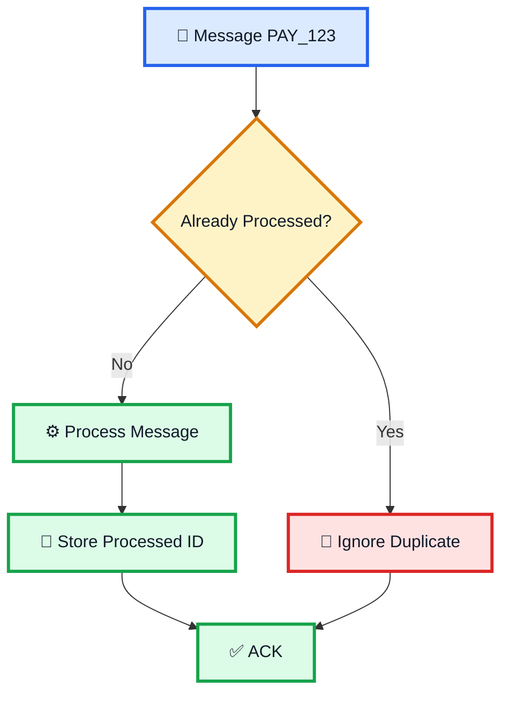

---

# 🔢 14. Message Ordering

Related events-এর order গুরুত্বপূর্ণ হতে পারে।

Example:

```text
M1 = Hello
M2 = How are you?
M3 = Are you free?
```

Expected:

```text
M1 → M2 → M3
```

Order বদলে:

```text
M3 → M1 → M2
```

হলে application logic বা user experience খারাপ হতে পারে।

---

# 📚 15. FIFO — First In, First Out

FIFO:

```text
First  → M1
Second → M2
Third  → M3
```

Consume:

```text
M1
 ↓
M2
 ↓
M3
```

> Exact ordering guarantee messaging technology, partitioning এবং consumer configuration-এর উপর নির্ভর করে।

---

# 💬 16. Chat Example

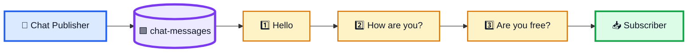

Chat-এর মতো application-এ:

```text
✅ Ordering
✅ Low Latency
✅ Duplicate Handling
✅ Reliable Delivery
```

গুরুত্বপূর্ণ হতে পারে।

---

# 🗂️ 17. Multiple Topics

বড় system-এ আলাদা event type-এর জন্য আলাদা topic রাখা যায়:

```text
order-created
payment-completed
user-signup
notification
stock-update
chat-message
```

এতে separation of concerns improve করা যায়।

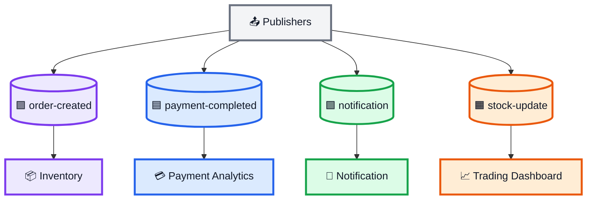

---

# 🔎 18. Content-Based Filtering

একটি topic-এ অনেক message থাকতে পারে।

Example:

```text
AAPL
GOOG
TSLA
MSFT
AMZN
```

একজন subscriber শুধু TSLA নিয়ে interested।

Conceptually:

```text
Topic
  ↓
Many Messages
  ↓
Filter
  ↓
Relevant Messages
```

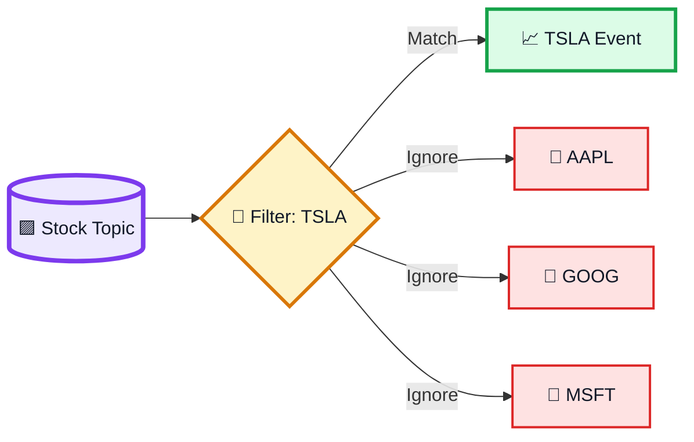

---

# 🛒 19. E-Commerce Example

একটি customer order করলো:

```text
Order #123
```

Order Service event publish করলো:

```text
order-created
```

Subscribers:

```text
Inventory Service
Email Service
Analytics Service
Notification Service
```

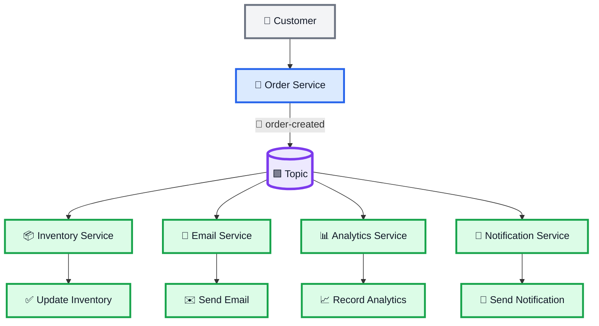

একটি event থেকে অনেক service independently কাজ করতে পারে।

---

# 📈 20. Stock Trading Example

```text
Market Data Publisher
       ↓
 stock-price Topic
       ↓
 ┌────────┼────────┐
 ↓        ↓        ↓
Trading  Dashboard Analytics
```

Example:

```text
AAPL = 100
AAPL = 102
AAPL = 101
```

Related event-এর order গুরুত্বপূর্ণ হতে পারে।

---

# 🚨 21. Complete Failure Flow

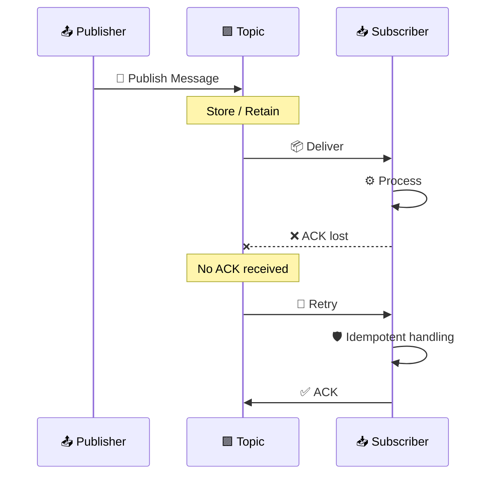

এই flow থেকে মনে রাখো:

```text
No ACK
  ↓
Retry
  ↓
Duplicate Possible
  ↓
Idempotency
```

---

# 🧠 22. Pub/Sub-এর Full End-to-End Flow

```text
Publisher
    ↓
Create Event
    ↓
Create Message
    ↓
Publish to Topic
    ↓
Topic Stores Message
    ↓
Subscriber Receives Message
    ↓
Process Message
    ↓
ACK
    ↓
Consumption Progress Updated
```

---

# 🔥 23. Reliability Chain

```text
PUBLISH
   ↓
STORE
   ↓
DELIVER
   ↓
PROCESS
   ↓
ACK
```

Failure হলে:

```text
ACK Missing
   ↓
Retry
   ↓
Duplicate Possible
   ↓
Idempotent Consumer
```

---

# ⚖️ 24. Pub/Sub vs Direct Communication

| বিষয়                       | Direct Communication | Pub/Sub                   |
| -------------------------- | -------------------- | ------------------------- |
| Communication              | Service → Service    | Service → Topic → Service |
| Coupling                   | Higher               | Lower                     |
| Multiple Consumers         | Harder               | Natural fit               |
| Publisher knows consumers? | Usually yes          | Not necessarily           |
| Failure buffering          | Limited              | Topic retention can help  |
| Flexibility                | Lower                | Higher                    |
| Scalability                | More tightly coupled | Better separation         |

---

# ⚡ 25. Pub/Sub vs Basic Streaming

| বিষয়               | Basic Streaming          | Pub/Sub                      |
| ------------------ | ------------------------ | ---------------------------- |
| Main Idea          | Long-lived connection    | Topic-based messaging        |
| Intermediary       | Not necessarily          | Topic                        |
| Communication      | Direct                   | Indirect                     |
| Persistence        | Implementation-dependent | Can retain messages          |
| Multiple Consumers | Possible                 | Natural fit                  |
| Decoupling         | Lower                    | Higher                       |
| Reliability        | Implementation-dependent | ACK/retry/retention can help |

---

# 🚀 26. Kafka কোথায় আসে?

**Apache Kafka** হলো একটি distributed event streaming platform যা topic-based event/message architecture ব্যবহার করে।

Conceptually:

```text
Producer
   ↓
Kafka Topic
   ↓
Consumers
```

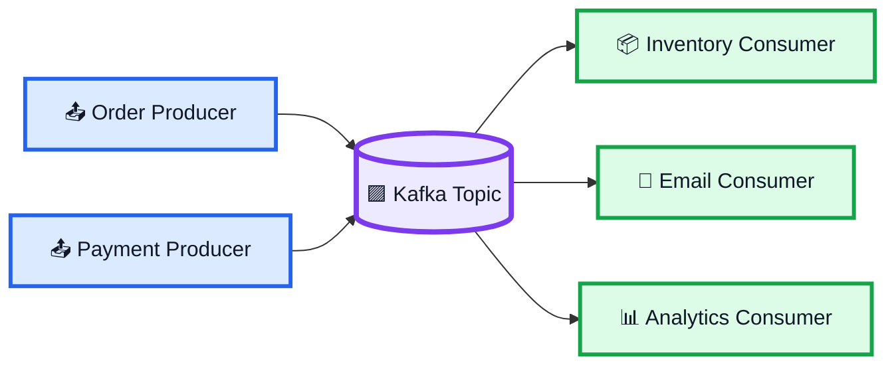

Kafka-কে শুধু “simple queue” না দেখে **durable event streaming/log architecture** হিসেবেও বোঝা ভালো।

---

# 🎯 27. Interview — What is Pub/Sub?

### English

> **Publish-Subscribe is a messaging pattern where publishers send messages to topics, and subscribers consume messages from those topics without requiring direct knowledge of each other.**

### বাংলা

> **Pub/Sub হলো এমন একটি messaging pattern যেখানে publisher সরাসরি subscriber-কে message না পাঠিয়ে topic-এ publish করে, আর subscriber topic থেকে message consume করে। ফলে publisher ও subscriber loosely coupled থাকে।**

---

# 🎯 28. Interview — What is At-Least-Once Delivery?

> **At-least-once delivery means the system attempts to deliver a message at least once. If an acknowledgement is lost, the message may be retried and delivered again.**

বাংলায়:

> **System message অন্তত একবার deliver করার চেষ্টা করে। ACK হারিয়ে গেলে retry-এর কারণে একই message আবার আসতে পারে।**

---

# 🎯 29. Interview — Why is Idempotency Important?

> **Because at-least-once delivery can produce duplicate messages. Idempotency prevents duplicate processing from causing unintended repeated effects.**

---

# 🎯 30. Interview — Why use Multiple Topics?

> Different event types আলাদা রাখার জন্য, separation of concerns improve করার জন্য এবং বিভিন্ন subscriber-কে প্রয়োজনীয় data consume করার সুযোগ দেওয়ার জন্য।

---

# 🧠 31. 10-Second Explanation

কেউ যদি জিজ্ঞেস করে:

> **“Pub/Sub কী?”**

বলবে:

> **Pub/Sub হলো একটি messaging pattern যেখানে publisher message সরাসরি subscriber-কে না পাঠিয়ে topic-এ publish করে। Subscriber topic থেকে message consume করে। এতে publisher ও subscriber loosely coupled থাকে, multiple consumers support করা যায় এবং topic message retain করলে temporary failure-এর পর message consume করার সুযোগ থাকতে পারে। At-least-once delivery-এর কারণে duplicate message হতে পারে, তাই idempotency গুরুত্বপূর্ণ।**

---

# 🧠 32. Final Mental Model

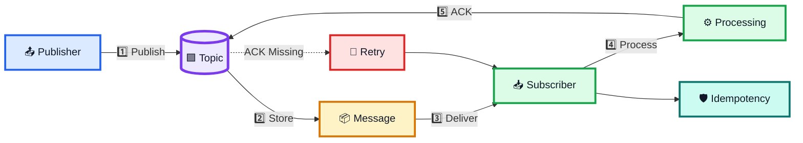

---

# 🔥 33. Final Memory Trick

## Pub/Sub

```text
PUBLISHER
    ↓
  TOPIC
    ↓
 MESSAGE
    ↓
SUBSCRIBER
```

## Reliability

```text
MESSAGE
   ↓
DELIVER
   ↓
PROCESS
   ↓
ACK
```

## Failure

```text
ACK Missing
    ↓
Retry
    ↓
Duplicate Possible
    ↓
Idempotency
```

## Multiple Consumers

```text
          TOPIC
       ┌────┼────┐
       ↓    ↓    ↓
      S1   S2   S3
```

## Core Principle

> **Publisher does not need to know the Subscriber directly.**

```text
Publisher → Topic → Subscriber
```

---

# ⭐ 34. সবচেয়ে গুরুত্বপূর্ণ 10টি Point

```text
1. Pub/Sub = Publish-Subscribe messaging pattern.

2. Four key entities:
   Publisher, Subscriber, Topic, Message.

3. Publisher publishes messages to a Topic.

4. Subscriber consumes messages from a Topic.

5. Publisher and Subscriber can remain loosely coupled.

6. Topic/message retention can help during temporary failures.

7. Consumption can be tracked using IDs, indices, or offsets.

8. ACK confirms successful message handling.

9. At-Least-Once delivery can cause duplicate messages.

10. Idempotency is important for safely handling duplicates.
```

---

# 🏆 One-Line Summary

> **Pub/Sub = Publisher → Topic → Subscriber**

Reliability:

```text
Publish
   ↓
Store
   ↓
Deliver
   ↓
Process
   ↓
ACK
```

Failure:

```text
ACK Missing
   ↓
Retry
   ↓
Duplicate Possible
   ↓
Idempotency
```

> **Pub/Sub-এর আসল শক্তি হলো decoupling + scalable message distribution + reliable event handling।**

---

# 📚 Final Cheat Sheet

| Term           | Easy Meaning                                     |
| -------------- | ------------------------------------------------ |
| Publisher      | যে message publish করে                           |
| Subscriber     | যে message consume করে                           |
| Topic          | Publisher ও Subscriber-এর intermediary/channel   |
| Message        | Actual data/event                                |
| ACK            | Message processing/receipt confirmation          |
| Offset / Index | Consumer কতদূর consume করেছে তার অবস্থান         |
| At-Least-Once  | অন্তত একবার delivery করার চেষ্টা                 |
| Duplicate      | একই message একাধিকবার পাওয়া                      |
| Idempotency    | Duplicate processing-এর unintended effect ঠেকানো |
| Ordering       | Message sequence maintain করা                    |
| Persistence    | Message কিছু সময় durableভাবে রাখা                |
| Filtering      | Relevant message বেছে নেওয়া                      |
| Kafka          | Distributed event streaming platform             |

---

# 🎯 Final Rule

```text
IF many services need the same event
AND direct coupling should be minimized
→ 🟢 USE PUB/SUB

IF messages may need to survive temporary consumer failure
→ 🟢 USE MESSAGE RETENTION / PERSISTENCE

IF delivery can retry
→ 🟡 EXPECT DUPLICATES

IF duplicates are possible
→ 🛡️ DESIGN FOR IDEMPOTENCY

IF event order affects the result
→ 🔵 DESIGN FOR ORDERING
```

> **Pub/Sub = decoupled producers + topics + consumers + reliable message handling.**
