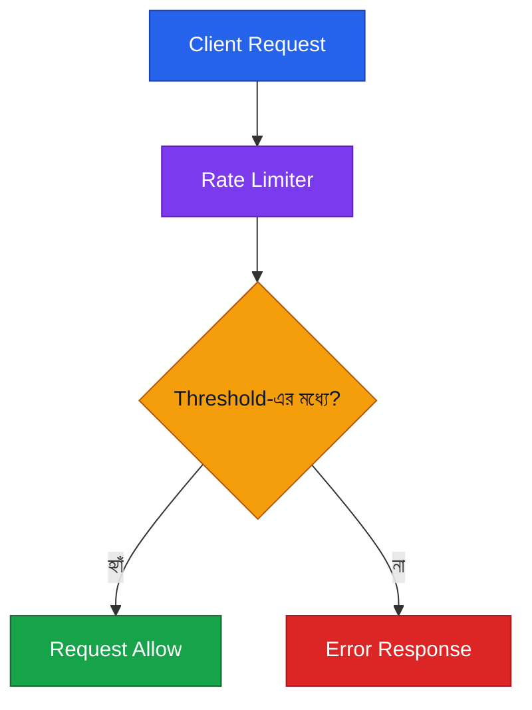
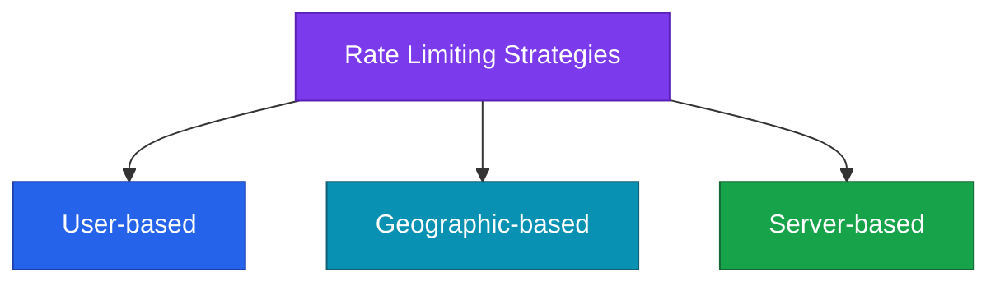
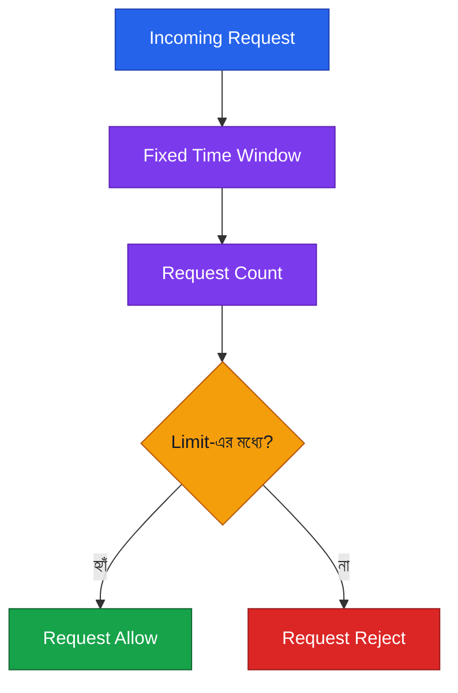
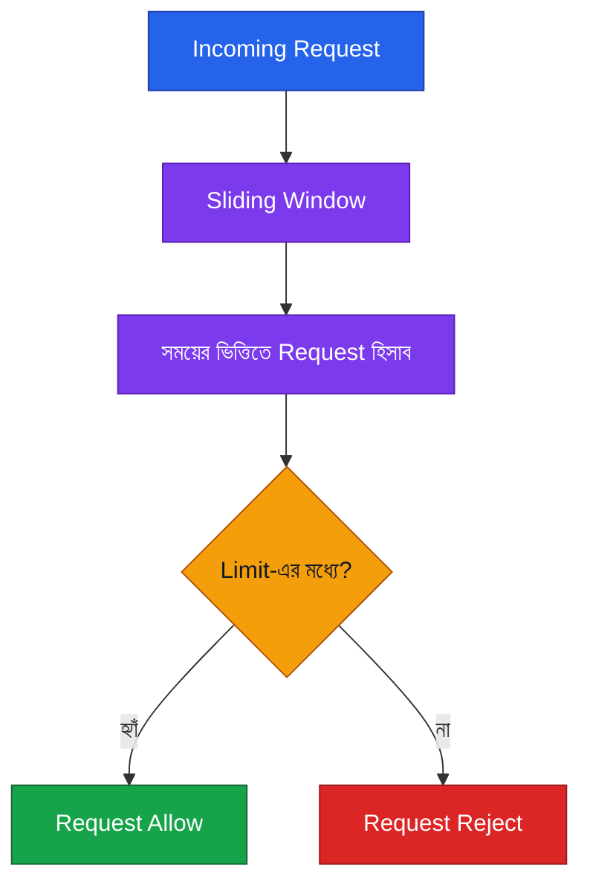
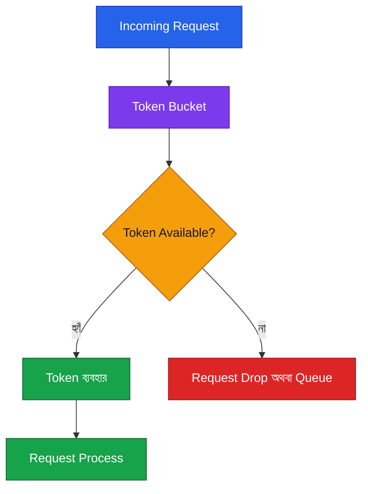
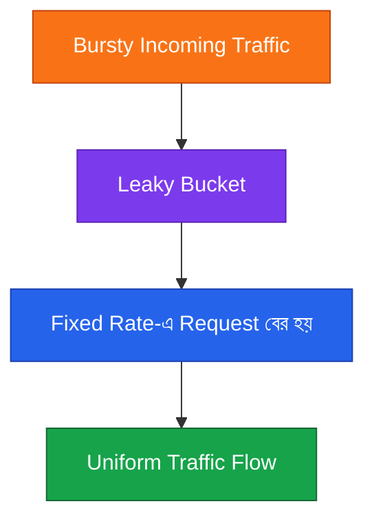

# 🚦 Rate Limiting — System Design Notes (বাংলা)

## 1. Rate Limiting কী?

**Rate Limiting** হলো কোনো service-এ নির্দিষ্ট সময়ের মধ্যে কতগুলো operation বা request করা যাবে, তার limit নির্ধারণ করা। এটি system overload এবং denial-of-service (DoS)-এর মতো malicious attack-এর ঝুঁকি কমাতে সাহায্য করে।

Threshold অতিক্রম করলে window reset হওয়া পর্যন্ত client-কে error response দেওয়া হতে পারে।

## 2. Rate Limiting-এর Strategies

Transcript-এ তিনটি strategy উল্লেখ করা হয়েছে:

- **User-based limiting:** নির্দিষ্ট user-এর request limit করা।
- **Geographic-based filtering:** ভৌগোলিক অবস্থানের ভিত্তিতে request filter করা।
- **Server-based limiting:** server-এর ভিত্তিতে request limit করা।

## 3. Fixed Window

**Fixed Window** নির্দিষ্ট সময়ের window-তে request count করে এবং একটি limit বজায় রাখে।

উদাহরণ: একটি window-তে সর্বোচ্চ 5টি request অনুমোদন করা।

**অসুবিধা:** Window-এর শেষের দিকে অনেক request এবং পরের window-এর শুরুতে আবার অনেক request এলে burst তৈরি হতে পারে।

## 4. Sliding Window

**Sliding Window** Fixed Window-এর approach-কে refine করে, যাতে traffic সময়ের সঙ্গে আরও smoothly handle করা যায়।

**মূল কথা:** Fixed Window নির্দিষ্ট time block ব্যবহার করে; Sliding Window সময়ের সঙ্গে হিসাবকে আরও smoothly পরিচালনা করে।

## 5. Token Bucket

**Token Bucket**-এ bucket-এর মধ্যে token থাকে। Request process করতে একটি token প্রয়োজন হয়।

- Token থাকলে request process হয়।
- Token না থাকলে request drop করা বা queue-তে রাখা হয়।

**মনে রাখো:** Token হলো request process করার অনুমতির মতো।

## 6. Leaky Bucket

**Leaky Bucket** bursty traffic-কে একটি নির্দিষ্ট rate-এ বের করে, যাতে request-এর flow uniform হয়।

## 7. চারটি Algorithm-এর তুলনা

| Algorithm          | মূল ধারণা                           | গুরুত্বপূর্ণ বিষয়                  |
| ------------------ | ----------------------------------- | ---------------------------------- |
| **Fixed Window**   | নির্দিষ্ট সময়ের মধ্যে request count | Window boundary-তে burst হতে পারে  |
| **Sliding Window** | সময়ের সঙ্গে request হিসাব           | Traffic আরও smoothly handle করে    |
| **Token Bucket**   | Request-এর জন্য token দরকার         | Token না থাকলে drop বা queue       |
| **Leaky Bucket**   | Fixed rate-এ request বের হয়         | Bursty traffic-কে uniform flow করে |

## 8. 🧠 Quick Memory Trick

- **Fixed Window** → নির্দিষ্ট সময়ের window
- **Sliding Window** → সময়ের সঙ্গে sliding হিসাব
- **Token Bucket** → Token থাকলে request process
- **Leaky Bucket** → Fixed rate-এ request flow

### Interview Answer

**Rate Limiting** হলো নির্দিষ্ট সময়ের মধ্যে service-এ করা request বা operation-এর সংখ্যা নিয়ন্ত্রণ করার পদ্ধতি। এটি system overload এবং DoS-এর মতো malicious attack-এর ঝুঁকি কমাতে সাহায্য করে। Common algorithms হলো **Fixed Window, Sliding Window, Token Bucket এবং Leaky Bucket**।
