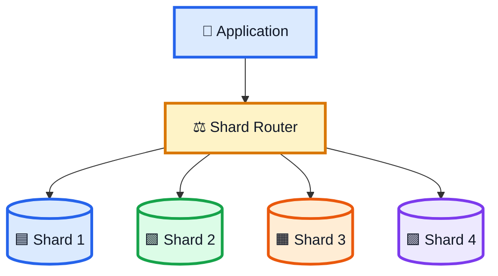
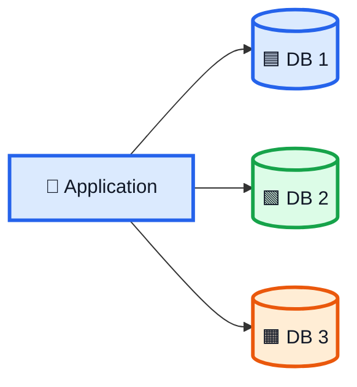
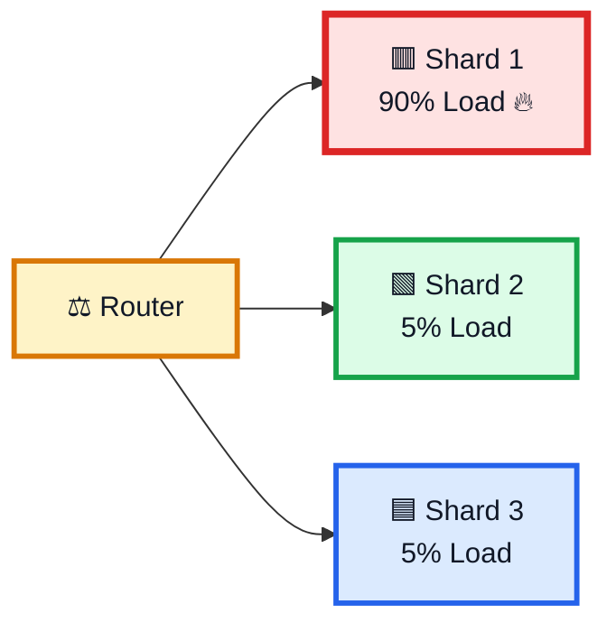
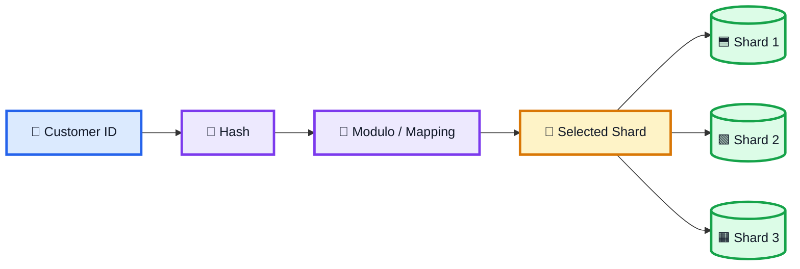
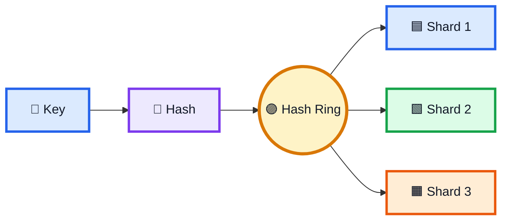
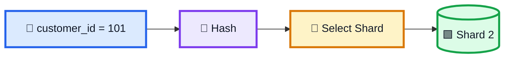
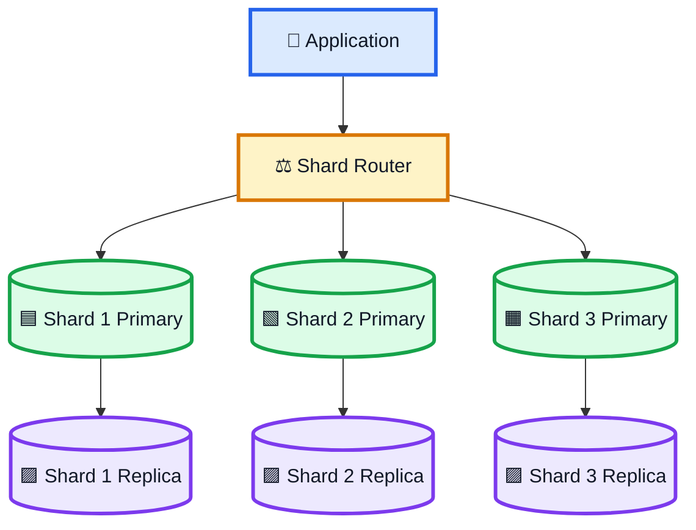
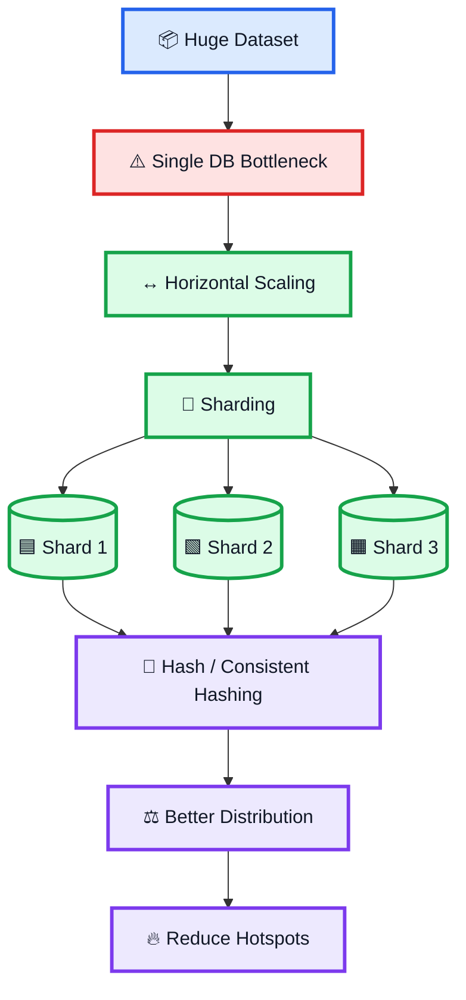

# 🧩 Sharding — System Design Notes

> **Sharding হলো বড় database-এর data-কে একাধিক ছোট database বা partition-এ ভাগ করে রাখার process।**

Sharding মূলত **horizontal scaling** ব্যবহার করে huge dataset ও high traffic-কে multiple database server-এর মধ্যে distribute করার জন্য ব্যবহার করা হয়।

---

# 1. 🔑 Sharding কী?

ধরো একটি system-এ millions বা billions of records আছে। সব data যদি একটি database-এ রাখা হয়, তাহলে একসময় database bottleneck হয়ে যেতে পারে।


Sharding করলে:



এখানে প্রতিটি ছোট database-কে **Shard** বা **Data Partition** বলা হয়।

---

# 2. 📈 কেন Sharding দরকার?

একটি database-এ request বাড়তে থাকলে:

```text
Millions of Requests
        ↓
Single Database
        ↓
High Load
        ↓
Bottleneck
```

Sharding:

```text
Large Database
      ↓
    Split
      ↓
Multiple Shards
      ↓
Distributed Load
      ↓
Better Scalability
```

---

# 3. 🧱 Vertical Scaling-এর Limit

প্রথমে database-কে আরও powerful করা যায়। এটাকে **Vertical Scaling** বলা হয়।

```text
Before:

Database
  ↓
8 CPU + 32 GB RAM
```

Upgrade:

```text
Database
  ↓
32 CPU + 128 GB RAM
```

কিন্তু hardware-এর limit আছে। তাই বড় scale-এ **Horizontal Scaling** দরকার হতে পারে।

---

# 4. ↔️ Horizontal Scaling

Horizontal scaling মানে নতুন database server যোগ করা।

```text
Before:

Application
    ↓
Database
```

After:



Sharding হলো database-এর horizontal scaling-এর একটি গুরুত্বপূর্ণ approach, যেখানে **data-ও split করা হয়**।

---

# 5. 🆚 Replication vs Sharding

এটা খুব important difference।

## Replication = COPY

একই data multiple database-এ থাকে।

```text
DB 1 → A B C D
DB 2 → A B C D
DB 3 → A B C D
```

## Sharding = SPLIT

Different data different shard-এ থাকে।

```text
Shard 1 → A B
Shard 2 → C D
Shard 3 → E F
```

### Memory Trick

```text
Replication = Copy
Sharding    = Split
```

---

# 6. 🚫 কেন শুধু Replication যথেষ্ট নয়?

ধরো:

```text
1 Billion Records
```

তিনটি replica বানালে:

```text
DB 1 → 1 Billion
DB 2 → 1 Billion
DB 3 → 1 Billion
```

একই data বারবার store হয়।

```text
Data Duplication ↑
Storage Cost ↑
```

Sharding-এ:

```text
Shard 1 → Part of Data
Shard 2 → Part of Data
Shard 3 → Part of Data
```

তাই data split হয়, পুরো dataset duplicate হয় না।

---

# 7. 🧭 Shard Key কী?

যে field/value-এর ভিত্তিতে data কোন shard-এ যাবে সেটা determine করা হয়, সেটাকে **Shard Key** বলা হয়।

Examples:

```text
customer_id
user_id
account_id
```

একটি good shard key-এর প্রধান লক্ষ্য:

```text
Even Data Distribution
+
Even Traffic Distribution
```

---

# 8. 🔤 Name-Based Sharding

Customer name অনুযায়ী split করা যেতে পারে।

Example:

```text
Shard 1 → A-F
Shard 2 → G-M
Shard 3 → N-S
Shard 4 → T-Z
```

```text
Alice  → Shard 1
Rahim  → Shard 3
Zahid  → Shard 4
```

### ⚠️ Problem

সব নাম evenly distributed না হলে hotspot হতে পারে।

```text
Shard 1 → 70% traffic 🔥
Shard 2 → 10%
Shard 3 → 10%
Shard 4 → 10%
```

---

# 9. 🌍 Geographic Sharding

Region অনুযায়ী data split করা যায়।

```text
Asia   → Shard 1
Europe → Shard 2
USA    → Shard 3
```

এতে local users কাছের data store থেকে access পেতে পারে।

### ⚠️ Problem

যদি একটি region-এ অনেক বেশি users থাকে:

```text
Asia   → 70% traffic 🔥
Europe → 15%
USA    → 15%
```

আবার hotspot তৈরি হতে পারে।

---

# 10. 🔥 Hotspot কী?

যখন data বা traffic evenly distribute না হয়ে একটি নির্দিষ্ট shard-এ বেশি load পড়ে, তখন **Hotspot** তৈরি হয়।



Result:

```text
Hot Shard
   ↓
High Load
   ↓
High Latency
   ↓
Possible Bottleneck
```

---

# 11. 🔐 Hashing দিয়ে Shard Selection

Sharding-এ uneven distribution কমানোর জন্য hash-based shard selection ব্যবহার করা যায়।

Basic idea:

```text
Shard Key
    ↓
Hash
    ↓
Hash Value
    ↓
Shard Selection
```

Example, 3টি shard থাকলে:

```text
hash(customer_id) % 3
```

যেমন:

```text
hash(101) = 10
10 % 3 = 1

Customer 101 → Shard 1
```

আর:

```text
hash(102) = 14
14 % 3 = 2

Customer 102 → Shard 2
```

### Important

এখানে Hashing-এর full theory দরকার নেই। Sharding context-এ শুধু বুঝবে:

> **Hashing একটি shard key-কে deterministicভাবে একটি shard-এর সাথে map করতে সাহায্য করে।**

---

# 12. 🔄 Hash-Based Sharding Flow



---

# 13. ✅ কেন Hash-Based Sharding ব্যবহার করা হয়?

Name বা region-এর মতো simple range-based partitioning uneven হতে পারে। Hash-based mapping data-কে comparatively more evenly distribute করতে সাহায্য করতে পারে।

Goal:

```text
Shard 1 → Balanced Load
Shard 2 → Balanced Load
Shard 3 → Balanced Load
```

Perfect balance guaranteed নয়; hash function এবং actual workload-এর distribution গুরুত্বপূর্ণ।

---

# 14. 🔵 Consistent Hashing

Simple modulo mapping-এর একটি সমস্যা হলো shard সংখ্যা পরিবর্তন করলে অনেক key-এর mapping change হতে পারে।

Before:

```text
hash(key) % 3
```

After adding a shard:

```text
hash(key) % 4
```

অনেক key নতুন shard-এ চলে যেতে পারে।

---

# 15. ⚠️ Simple Modulo-এর Example

ধরো:

```text
hash(key) = 10
```

3 shards:

```text
10 % 3 = 1
→ Shard 1
```

4 shards:

```text
10 % 4 = 2
→ Shard 2
```

Mapping change হয়ে গেল।

Large-scale system-এ অনেক key-এর mapping একইভাবে change হলে অনেক data move/rebalance করতে হতে পারে।

---

# 16. 🟣 Consistent Hashing-এর Goal

**Consistent hashing-এর মূল লক্ষ্য হলো shard/node add বা remove হলে যতটা সম্ভব কম key remap করা।**

Conceptually:



High-level idea:

```text
Key
 ↓
Hash Position
 ↓
Responsible Shard
```

Shard add/remove হলে ideal goal:

```text
Most Keys → Stay
Some Keys → Move
```

---

# 17. ✍️ Write Flow

ধরো:

```text
customer_id = 101
```

Write করার সময়:

```text
Customer ID
    ↓
Hash
    ↓
Shard Mapping
    ↓
Correct Shard
    ↓
Write Data
```



---

# 18. 📖 Read Flow

একই shard key দিয়ে read করলেও একই routing rule ব্যবহার করতে হবে।

```text
Customer ID
    ↓
Same Hash Rule
    ↓
Same Shard Mapping
    ↓
Correct Shard
    ↓
Read Data
```

```text
Same Key
   ↓
Same Mapping Rule
   ↓
Correct Shard
```

---

# 19. ⚠️ Sharding-এর Challenges

```text
❌ Hotspots
❌ Shard Key Selection
❌ Complex Routing
❌ Cross-Shard Queries
❌ Rebalancing
❌ Data Movement
```

বিশেষ করে **Shard Key Selection** খুব important।

---

# 20. 🎯 Good Shard Key-এর লক্ষ্য

একটি ভালো shard key এমন হওয়া উচিত যাতে:

```text
Data Distribution → Balanced
Traffic Distribution → Balanced
Routing → Predictable
```

Simple rule:

> **Good Shard Key = Less Skew + Less Hotspot**

---

# 21. 🔗 Replication + Sharding একসাথে

Replication এবং Sharding একে অপরের replacement নয়। দুটো একসাথে ব্যবহার করা যায়।



এখানে:

```text
Sharding   → Data Split
Replication → Data Redundancy
```

---

# 22. 🌍 Large-Scale Example

ধরো একটি social platform-এ:

```text
1 Billion Users
```

একটি database-এর পরিবর্তে:

```text
Users
 ↓
Shard 1
Shard 2
Shard 3
...
Shard 100
```

তারপর প্রয়োজন অনুযায়ী প্রতিটি shard-এর replica থাকতে পারে।

---

# 23. 🧠 Complete Sharding Mental Model



---

# 🎯 24. Interview — What is Sharding?

### English

> **Sharding is a horizontal partitioning technique where data is split across multiple database instances called shards. It helps distribute storage and workload so a single database does not become a bottleneck.**

### বাংলা

> **Sharding হলো একটি horizontal partitioning technique যেখানে বড় database-এর data-কে একাধিক database বা shard-এ ভাগ করে রাখা হয়। এতে storage এবং workload distribute করা যায় এবং একটি single database-এর bottleneck কমানো যায়।**

---

# 🎯 25. Interview — Replication vs Sharding

> **Replication copies the same data across multiple databases, while sharding splits different parts of the data across multiple databases.**

সহজভাবে:

```text
Replication = COPY
Sharding    = SPLIT
```

---

# 🎯 26. Interview — What is a Hotspot?

> **A hotspot occurs when too much data or traffic is concentrated on a particular shard, making that shard a bottleneck.**

---

# 🎯 27. Interview — Why use Hashing in Sharding?

> **Hash-based shard selection can distribute shard keys more evenly and reduce predictable skew compared with simple range-based partitioning.**

---

# 🎯 28. Interview — Why Consistent Hashing?

> **Consistent hashing aims to minimize key remapping when shards or nodes are added or removed, reducing unnecessary data movement.**

---

# 🧠 29. 10-Second Explanation

কেউ যদি জিজ্ঞেস করে:

> **“Sharding কী?”**

বলবে:

> **Sharding হলো বড় database-এর data-কে multiple smaller databases বা shards-এ split করার technique। এটি horizontal scaling-এর মাধ্যমে storage ও workload distribute করে। তবে data uneven হলে hotspot তৈরি হতে পারে। তাই shard key carefully select করতে হয় এবং hash-based বা consistent hashing-based mapping ব্যবহার করে data distribution ও remapping problem manage করা যায়।**

---

# 🔥 30. Final Memory Trick

## Replication

```text
ONE DATASET
     ↓
   COPY
     ↓
DB1 + DB2 + DB3
```

## Sharding

```text
ONE DATASET
     ↓
   SPLIT
     ↓
Shard 1 + Shard 2 + Shard 3
```

## Hash-Based Sharding

```text
Shard Key
    ↓
  Hash
    ↓
Shard Selection
```

## Consistent Hashing

```text
Key
 ↓
Hash Ring
 ↓
Responsible Shard
```

---

# ⭐ 31. সবচেয়ে গুরুত্বপূর্ণ 10টি Point

```text
1. Sharding = Horizontal Partitioning.

2. Large database-এর data multiple smaller shards-এ split করা হয়.

3. Each smaller database is called a shard.

4. Sharding distributes storage and workload.

5. Vertical scaling = Same server আরও powerful করা.

6. Horizontal scaling = More servers যোগ করা.

7. Replication = Same data copy করা.

8. Sharding = Different data split করা.

9. Uneven distribution → Hotspot.

10. Hashing/Consistent Hashing shard selection এবং remapping management-এ help করে.
```

---

# 🏆 One-Line Summary

> **Sharding = Huge Database → Split Data → Multiple Shards → Distributed Load → Higher Scalability**

### Core Relationship

```text
Sharding
= Data Distribution

Replication
= Data Redundancy

Hashing
= Shard Selection

Consistent Hashing
= Reduce Remapping During Shard Changes
```

> **সবচেয়ে সহজভাবে: Sharding বলে “data কীভাবে ভাগ করে রাখবো”, আর Hash-based mapping বলে “এই data কোন shard-এ যাবে।”**
