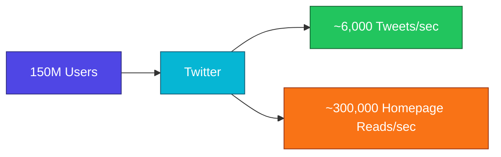
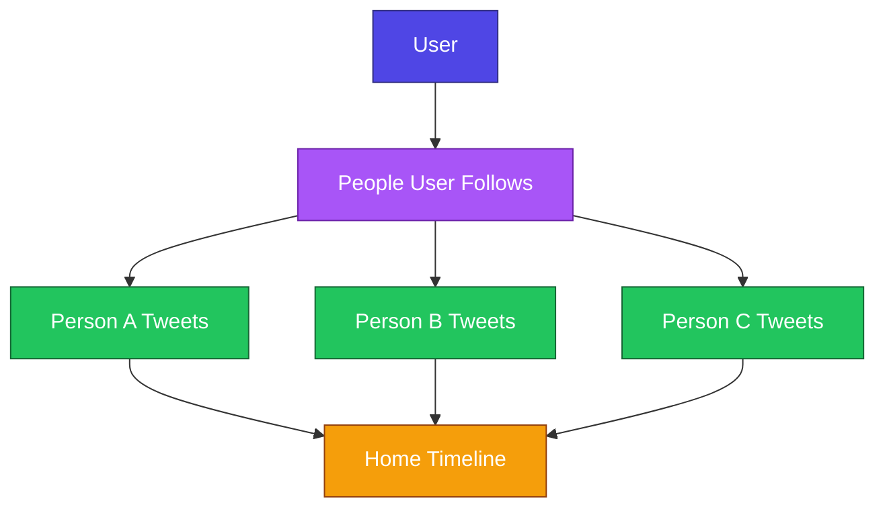
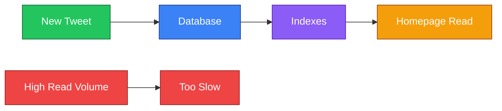
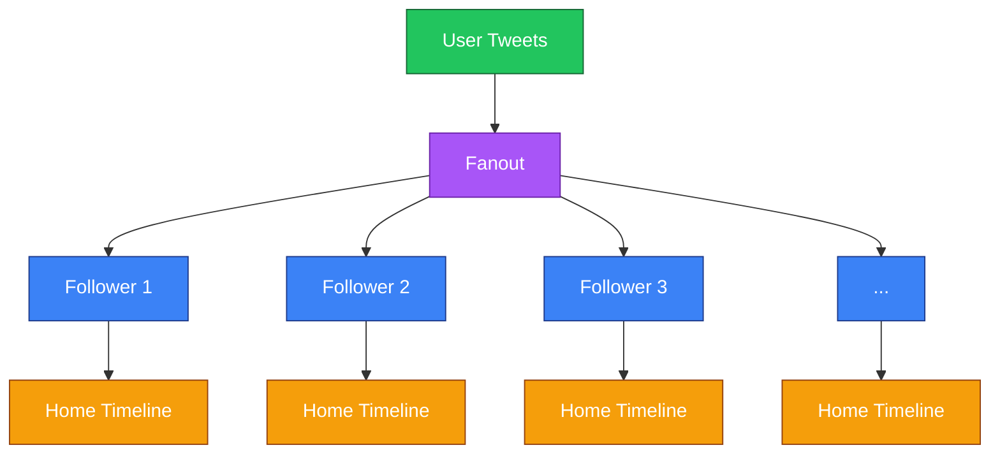
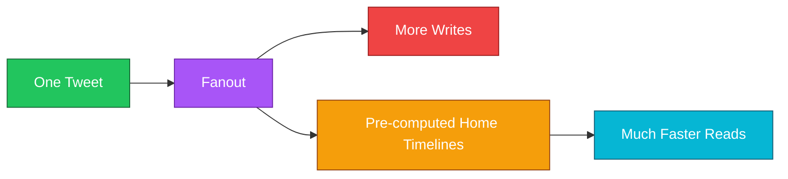
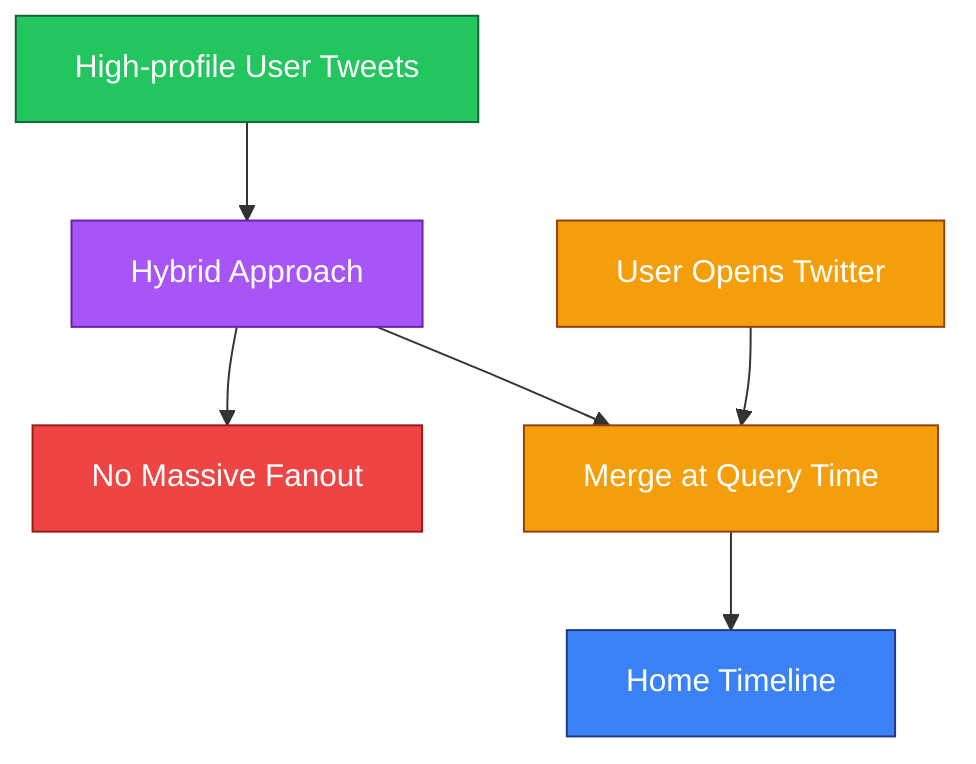
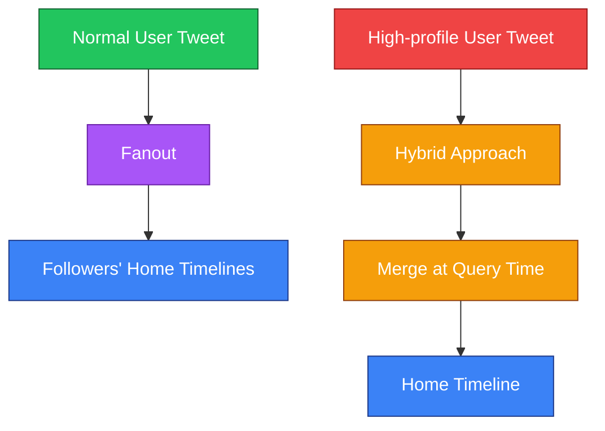
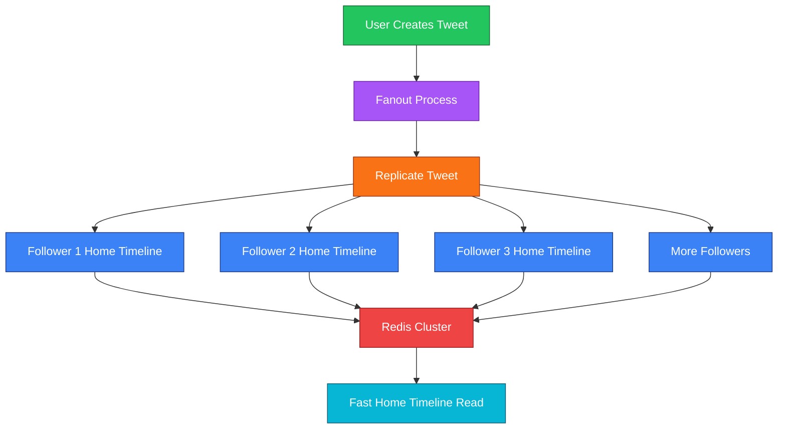

# 🐦 Twitter System Design — Fanout & Timeline

Twitter-এর architecture থেকে **Fanout** concept বোঝা যায় খুব ভালোভাবে। এখানে মূল challenge ছিল tweet লেখা নয়, বরং বিশাল সংখ্যক user-এর জন্য homepage timeline খুব দ্রুত দেখানো।

---

## 1. Twitter-এর মূল সমস্যা

২০১২–২০১৩ সালের দিকে Twitter প্রায়:

- **150 million users**
- প্রায় **6,000 tweets/second**

handle করছিল।

Tweet **write throughput** manageable ছিল, কিন্তু বড় challenge ছিল **reading tweets**।

কারণ homepage query করার সময় প্রায়:

**300,000 read requests/second**

হতো।



---

## 2. User Timeline vs Home Timeline

Twitter দুই ধরনের timeline আলাদা করেছিল।

### 👤 User Timeline

এখানে একজন user-এর **নিজের tweets** থাকে।

```text
Rahim
  ↓
His Tweets
  ↓
User Timeline
```

### 🏠 Home Timeline

এখানে user যাদের follow করে, তাদের tweets থাকে।

```text
Rahim follows:
├── Karim
├── Sakib
└── Nabila

        ↓

Rahim's Home Timeline
= Karim + Sakib + Nabila-এর tweets
```

Mermaid:



---

# 3. প্রথমে কী ভাবা হয়েছিল?

প্রথমে simple database approach চিন্তা করা হয়েছিল।

User-এর timeline-এর জন্য database-এ tweets append করা এবং indexes ব্যবহার করা যায়।

কিন্তু এত বেশি **read volume**-এর জন্য এই approach যথেষ্ট fast ছিল না।



---

# 4. Twitter-এর সমাধান: Pre-computed Home Timeline

Twitter-এর approach ছিল:

**Home Timeline আগে থেকেই তৈরি করে রাখা।**

এজন্য **Redis cluster** ব্যবহার করা হয়েছিল।

অর্থাৎ user যখন Twitter খুলবে, তখন নতুন করে সব tweets খুঁজে timeline বানানোর পরিবর্তে আগে থেকেই তৈরি করা timeline থেকে data নেওয়া যাবে।


---

# 5. Fanout কী?

**Fanout** হলো:

কেউ tweet করলে, সেই tweet-এর copy তার followers-দের **Home Timeline**-এ পাঠিয়ে রাখা।

ধরো:

```text
Rahim tweets
     ↓
   Fanout
     ↓
+----+----+----+----+
|    |    |    |    |
U1   U2   U3   ... U1000
```

অর্থাৎ Rahim-এর 1,000 followers থাকলে tweet করার সময় tweet-টি তাদের Home Timeline-এর জন্য replicate করা হবে।



---

# 6. Fanout-এর মূল Trade-off

Fanout ব্যবহার করলে **writes বেড়ে যায়**।

কারণ একটি tweet শুধু এক জায়গায় রাখলেই হবে না; followers-এর Home Timeline-এও সেটি replicate করতে হবে।

কিন্তু এর বিনিময়ে **read latency অনেক কমে যায়**।

### সহজভাবে:

```text
More Writes
     ↓
Pre-computed Timeline
     ↓
Much Faster Reads
```



---

# 7. High-profile User-এর সমস্যা

এবার ধরো **Lady Gaga**-এর মতো একজন high-profile user-এর **millions of followers** আছে।

সে যদি একটা tweet করে এবং normal fanout করা হয়:

```text
1 Tweet
   ↓
Millions of Followers
   ↓
Millions of Timeline Updates
```

এতে massive fanout delay হতে পারে।

তাই high-profile users-এর জন্য **hybrid approach** ব্যবহার করা হয়।

তাদের tweets সব followers-এর timeline-এ massiveভাবে আগে থেকে fanout না করে, **query time-এ merge** করা হয়।



---

# 8. Normal User বনাম High-profile User



---

# 9. 2022 সালের Architecture

২০২২ সালের দিকে এই architecture **230 million+ users** serve করছিল।

এখানে লক্ষ্য ছিল একটি message যেন একজন user-এর কাছে **5 seconds-এর মধ্যে** পৌঁছে যায়।

Transcript অনুযায়ী flow-এ ছিল:

```text
Load Balancer
      ↓
Flock
      ↓
Redis
      ↓
Pre-computed Cache
      ↓
User
```

এখানে **Flock** হলো Twitter-এর একটি **social graph service**।


---

# 10. পুরো Fanout Flow

একজন normal user tweet করলে পুরো concept:



---

# 11. Fanout কেন ব্যবহার করা হলো?

মূল কারণ ছিল **read performance**।

```text
Database-based approach
        ↓
High Read Volume
        ↓
Too Slow


Fanout + Pre-computed Timeline
        ↓
More Writes
        ↓
Much Faster Reads
```

অর্থাৎ Twitter-এর design-এর মূল idea:

> **Write একটু বেশি করা → Read অনেক দ্রুত করা**

---

# 12. 🧠 Easy Memory Trick

### **Fanout = Tweet ছড়িয়ে দেওয়া**

মনে রাখো:

```text
1 Person Tweets
       ↓
Fanout
       ↓
Many Followers
       ↓
Their Home Timelines
       ↓
Fast Read
```

### এক লাইনে:

**“User tweet করলে Fanout সেই tweet-এর copy followers-এর Home Timeline-এ আগে থেকেই রেখে দেয়, যাতে পরে timeline পড়া দ্রুত হয়।”**
