# 🔌 WebSocket — System Design Notes

> **WebSocket হলো একটি protocol যা real-time, bi-directional web server এবং browser communication-এর জন্য তৈরি।**
>
> এটি একটি **TCP connection**-এর মাধ্যমে একই সময়ে data send এবং receive করতে পারে।

---

# 1. 🔄 WebSocket কী?

WebSocket হলো:

```text
Real-Time
+
Bi-Directional
+
Asynchronous Communication
```

এর মূল ধারণা:

```text
Client
  ⇅
TCP Connection
  ⇅
Server
```

অর্থাৎ client এবং server উভয়েই একই connection-এর মাধ্যমে data পাঠাতে পারে।

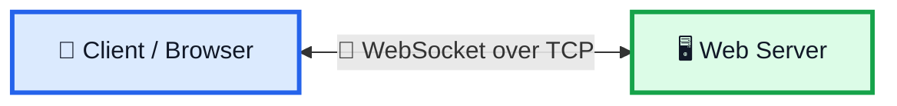

---

# 2. 🌐 Standard HTTP Request

একটি standard HTTP request-এ:

```text
1. Client connection open করে
2. Client server-কে request পাঠায়
3. Server request process করে
4. Server response তৈরি করে
5. Server response client-কে পাঠায়
```

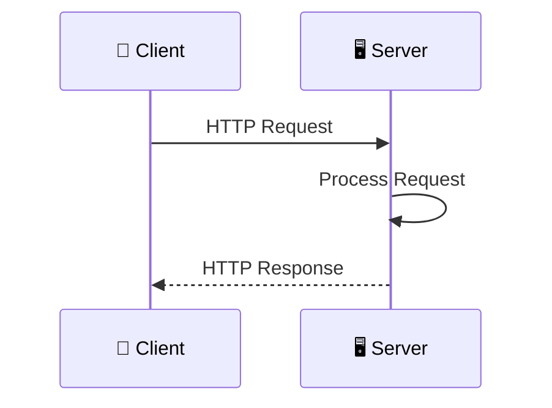

Basic flow:

```text
Client
  ↓
Request
  ↓
Server
  ↓
Process
  ↓
Response
  ↓
Client
```

---

# 3. 🔵 Polling

**Polling** হলো এমন একটি standard technique যেখানে client বারবার server-কে data-এর জন্য request করে।

Basic idea:

```text
Client
  ↓
Request
  ↓
Server
  ↓
Response
  ↓
Wait
  ↓
Request Again
```

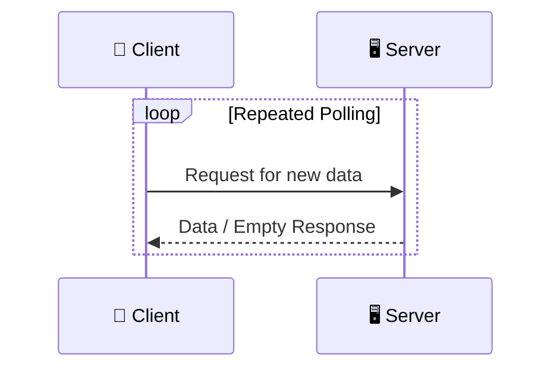

---

# 4. ⚠️ Polling-এর Problem

যদি server-এর কাছে নতুন data না থাকে:

```text
Client → Request
Server → Empty Response
```

তারপর client আবার request করবে।

```text
Client → Request
Server → Empty Response

Client → Request
Server → Empty Response

Client → Request
Server → Empty Response
```

ফলে:

```text
Many New Connections
+
Many Empty Responses
+
HTTP Overhead
```

তৈরি হয়।

---

# 5. 🟠 HTTP Long Polling

Traditional polling-এর একটি variation হলো:

> **HTTP Long Polling**

এখানে client server-কে request করে, কিন্তু server সঙ্গে সঙ্গে response নাও দিতে পারে।

যদি data available না থাকে:

```text
Client
  ↓
Request
  ↓
Server
  ↓
Wait...
```

Server request ধরে রাখে।

এ কারণে এটিকে কখনও:

> **Hanging GET**

বলা হয়।

---

# 6. ⏳ Long Polling কীভাবে কাজ করে?

```text
Client → Request
             ↓
          Server
             ↓
          No Data
             ↓
          Hold Request
             ↓
        Data Available
             ↓
       Complete Response
             ↓
           Client
```

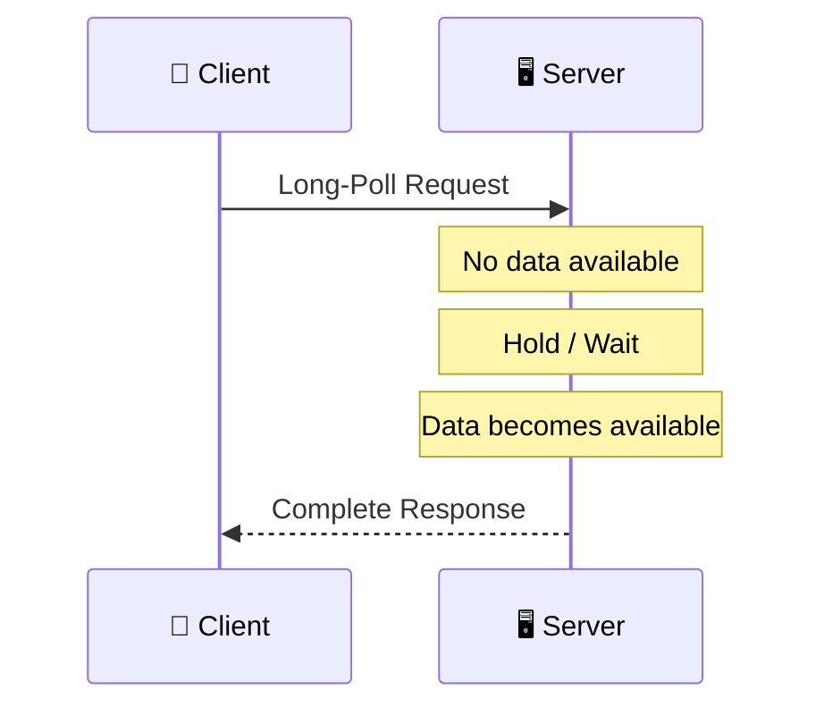

---

# 7. ⏱️ Long Polling-এর Timeout

প্রতিটি long-poll request-এর একটি **timeout** থাকে।

তাই request শেষ হয়ে গেলে client-কে আবার reconnect করতে হয়।

```text
Long Poll Request
      ↓
Wait
      ↓
Data / Timeout
      ↓
Connection Closed
      ↓
Reconnect
      ↓
New Long Poll Request
```

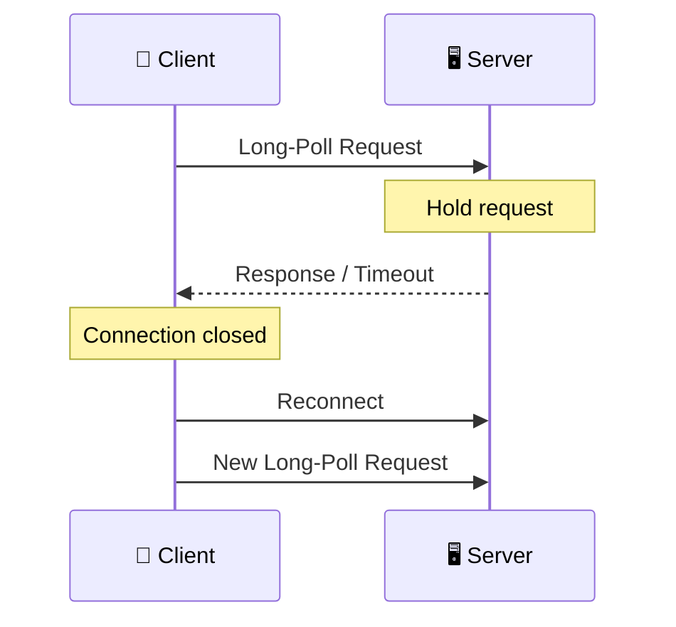

---

# 8. 🟢 WebSocket বনাম Long Polling

Long Polling:

```text
Request
   ↓
Wait
   ↓
Response
   ↓
Connection Closed
   ↓
Reconnect
```

WebSocket:

```text
Handshake
   ↓
One TCP Connection
   ↓
Keep Connection Open
   ↓
Continuous Communication
```

---

# 9. 🔌 WebSocket Connection

WebSocket একটি unique connection open রাখতে পারে।

```text
Client
  │
  │
  │===========================│
  │       TCP Connection      │
  │===========================│
  │                           │
  │                           │
Server
```

এই connection-এর মাধ্যমে:

```text
Client → Server
Server → Client
```

দুই দিকেই data যেতে পারে।

---

# 10. 🔄 Full-Duplex Communication

WebSocket হলো একটি:

> **Full-Duplex Asynchronous Messaging Protocol**

এর মানে client এবং server independently message send করতে পারে।

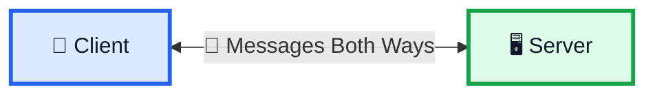

---

# 11. 🤝 WebSocket Handshake

WebSocket connection সাধারণত তিনটি stage-এ কাজ করে।

## Stage 1 — Client Handshake

Client appropriate WebSocket connection-এর জন্য handshake করে।

```text
Client
  ↓
WebSocket Handshake
  ↓
Server
```

## Stage 2 — Server Response

যদি server protocol support করে:

```text
Server
  ↓
Handshake Response Header
  ↓
Client
```

## Stage 3 — WebSocket Connection

Handshake complete হলে একই TCP connection WebSocket connection হিসেবে ব্যবহার হতে থাকে।

তারপর দুই পক্ষ data exchange করতে পারে।

```text
Handshake
   ↓
Handshake Response
   ↓
WebSocket Connection
   ↓
Data Exchange
```

---

# 12. 🤝 Complete Handshake Flow

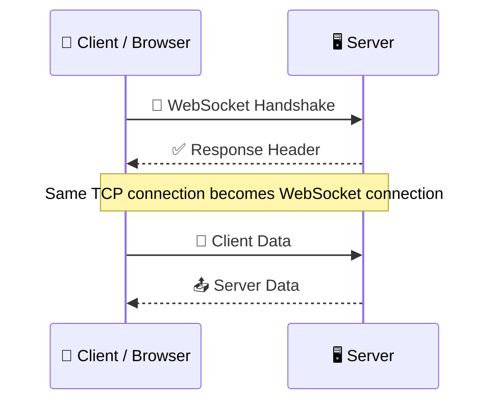

---

# 13. 🖥️ WebSocket Handler

WebSocket ব্যবহার করলে সাধারণত একটি:

> **WebSocket Handler**

থাকতে পারে।

এটি একটি lightweight server machine হিসেবে active users-এর open connections maintain করে।

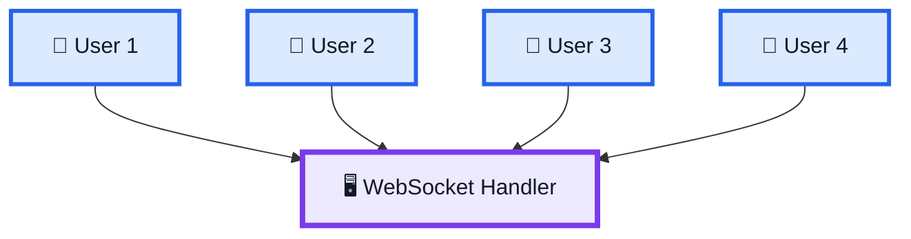

মূল কাজ:

```text
Active Users
     ↓
Open Connections
     ↓
WebSocket Handler
```

---

# 14. 📈 Stock Trading Example

Stock trading website-এ stock price continuously change করতে পারে।

Example:

```text
100
 ↓
101
 ↓
99
 ↓
103
```

WebSocket-এর মাধ্যমে backend server continuously changing data client-এ পাঠাতে পারে।

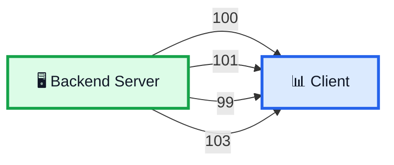

---

# 15. 💬 Chat Application Example

Chat applications-এ long-lived connection ব্যবহার করা যায়।

```text
Client
  ⇅
WebSocket
  ⇅
Server
```

একটি connection establish করার পর messages publish ও broadcast করা যায়।

Example:

```text
Message 1
Message 2
Message 3
Message 4
```

সবগুলো open connection-এর মাধ্যমে exchange হতে পারে।

Transcript অনুযায়ী WhatsApp বা Facebook Messenger-এর মতো messaging apps-এর ক্ষেত্রেও WebSocket ব্যবহার করা যেতে পারে।

---

# 16. 🎮 Gaming Application Example

Gaming applications-এ UI/data automatically refresh হতে পারে।

WebSocket-এর মাধ্যমে:

```text
Backend Server
      ↓
Live Data
      ↓
Game Client
```

নতুন connection establish না করেও data exchange করা যায়।

---

# 17. ⚖️ Polling vs Long Polling vs WebSocket

| Feature                    | Polling           | HTTP Long Polling     | WebSocket                    |
| -------------------------- | ----------------- | --------------------- | ---------------------------- |
| Client repeatedly requests | ✅                | ✅                    | ❌                           |
| Server waits for data      | ❌                | ✅                    | ✅ Connection remains open   |
| Empty response             | অনেক হতে পারে     | কম                    | Polling pattern নেই          |
| Reconnect                  | Repeated requests | Timeout-এর পর         | Long-lived connection        |
| Bi-directional             | ❌                | মূলত request/response | ✅                           |
| Real-time communication    | Limited           | Better                | ✅                           |
| TCP connection             | HTTP connections  | HTTP long request     | ✅ Persistent TCP connection |

---

# 18. 🧠 Visual Comparison

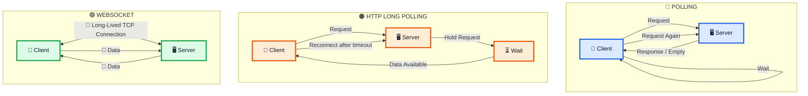

---

# 19. 🚀 Where WebSocket is Used

Transcript অনুযায়ী WebSocket heavily used হয়:

```text
📈 Stock Trading
💬 Chat Applications
🎮 Gaming Applications
```

কারণ এসব ক্ষেত্রে client-side data continuously update হতে পারে।

---

# 20. ❌ কখন WebSocket Overkill?

যদি তোমার প্রয়োজন হয়:

```text
Old Data Fetch
```

অথবা:

```text
Data Only Once
```

তাহলে WebSocket প্রয়োজন নাও হতে পারে।

সেক্ষেত্রে:

```text
Simple HTTP
```

ব্যবহার করা ভালো।

Conceptually:

```text
Fetch Data Once
      ↓
HTTP Request
      ↓
HTTP Response
```

---

# 21. 🔥 WebSocket-এর Main Idea

```text
Client
  ↓
WebSocket Handshake
  ↓
Server Response
  ↓
Same TCP Connection
  ↓
Connection Stays Open
  ↓
Client ↔ Server
  ↓
Real-Time Data
```

---

# 22. 🧠 Final Mental Model

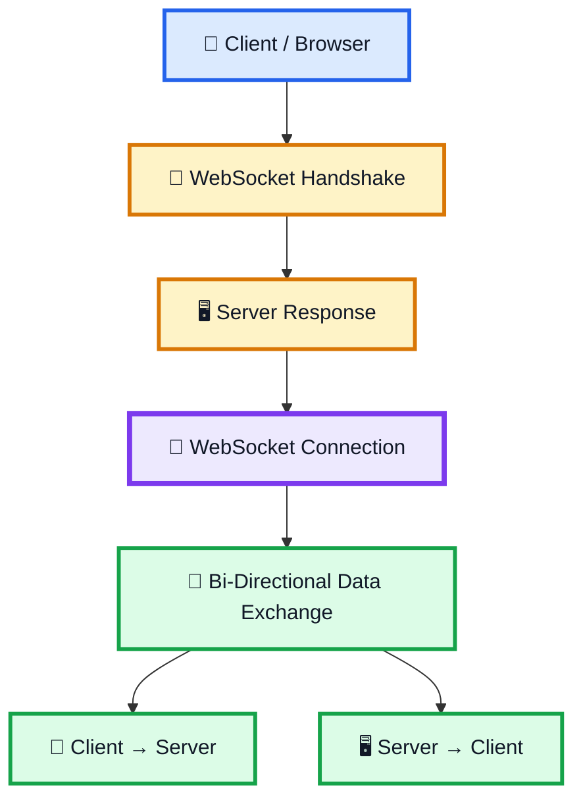

---

# ⭐ 23. সবচেয়ে গুরুত্বপূর্ণ Points

```text
1. WebSocket is a protocol for real-time, bi-directional web communication.

2. WebSocket can send and receive data simultaneously over a TCP connection.

3. Standard HTTP follows request → response.

4. Polling makes the client repeatedly request data.

5. Polling can create many connections and many empty responses.

6. HTTP Long Polling allows the server to hold the request until data is available.

7. Long-poll requests have a timeout, so the client reconnects periodically.

8. WebSocket keeps a unique connection open and avoids the latency problems of
   long polling.

9. WebSocket is a full-duplex asynchronous messaging protocol.

10. WebSocket starts with a handshake, followed by a persistent WebSocket
    connection over the same TCP connection.

11. WebSocket is heavily used in stock trading, chat, and gaming applications.

12. WebSocket can be overkill when data only needs to be fetched once or old
    data needs to be retrieved; simple HTTP is better in that situation.
```

---

# 🏆 Final Memory Trick

## 🔵 Polling

```text
ASK
 ↓
RESPONSE
 ↓
ASK AGAIN
```

## 🟠 Long Polling

```text
ASK
 ↓
WAIT
 ↓
DATA
 ↓
RESPONSE
 ↓
RECONNECT
```

## 🟢 WebSocket

```text
HANDSHAKE
 ↓
ONE TCP CONNECTION
 ↓
KEEP OPEN
 ↓
CLIENT ⇄ SERVER
 ↓
REAL-TIME DATA
```

---

# 🥇 One-Line Summary

> **WebSocket = One long-lived TCP connection + full-duplex asynchronous communication between client and server in real time.**
